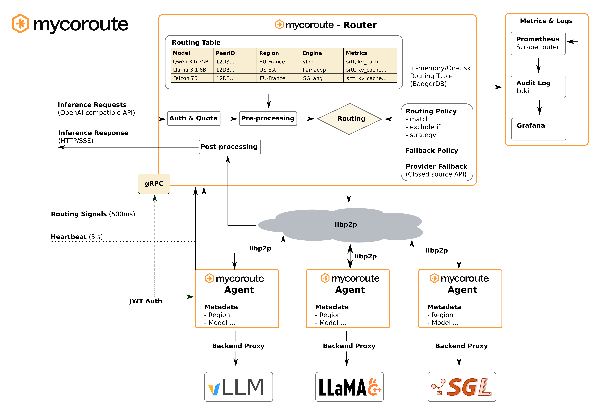

<div align="center">

<picture>
  <source media="(prefers-color-scheme: dark)" srcset="docs/images/hivenet-router-logo-dark.png">
  
</picture>

**One OpenAI-compatible endpoint in front of a fleet of vLLM · Ollama · SGLang · llama.cpp · Infinity backends — with health-, load-, and latency-aware routing.**




</div>

Hivenet Router puts a **single OpenAI-compatible API** in front of a fleet of self-hosted inference servers. A central **router** tracks the health, load, and latency of every **agent** in real time and forwards each request to the best backend — driven by YAML routing policies, dynamic safety gates, fallback chains, and optional failover to OpenAI or Anthropic. One Go binary each for router and agent; runs on bare metal, Docker, or the edge; Kubernetes-agnostic; sub-millisecond routing overhead.

## Why the name?

**Hive** + **net**. A honeybee colony is nature's original decentralized network: thousands of foragers spread across the landscape, each scouting on its own, the swarm collectively steering effort toward the richest sources and away from danger — no central command, no control plane, and tens of millions of years of uptime. Bees coordinate by signal, not by supervisor. We call it prior art.

The metaphor maps embarrassingly well. Your GPU boxes are the foragers — scattered across racks, basements, and edge sites, each reporting back what it can carry. The router reads those signals in real time and sends every request to the forager best placed to serve it. And like a hive, the fleet routes around failure — when a node wilts, work quietly flows to a healthier one. No pager required; the colony never carried one either.

## Why Hivenet Router

If you self-host open models across more than one GPU box, something has to decide *where each request goes*. Hivenet Router is that layer. Reach for it when you want to:

- **Pool many backends behind one endpoint** — clients call a single OpenAI-compatible URL; Hivenet Router spreads load across every vLLM / Ollama / SGLang / llama.cpp / Infinity server you register.
- **Route on live signals, not round-robin** — pick the agent with the lowest queue, freshest KV cache, best latency (RFC 6298 smoothed RTT), or coolest GPU, via declarative YAML policies and metric gates.
- **Degrade gracefully** — per-model wait queues absorb bursts, ordered fallback chains reroute on failure, and a last-resort provider fallback (OpenAI / Anthropic) covers exhausted local capacity.
- **See everything** — per-agent Prometheus metrics, pre-built Grafana dashboards, and one audit-log line per request, out of the box.
- **Stay portable** — no control plane, no Kubernetes required; two static binaries and a shared secret.

Hivenet Router is **not** an inference engine — you keep running vLLM/Ollama/etc. It's the routing, fallback, quota, and observability layer around them.

## Features

- **OpenAI-compatible API** -- drop-in replacement for OpenAI chat completion, embedding, and reranking endpoints
- **Multi-engine support** -- pluggable backend via `--engine` flag: vLLM, Ollama, SGLang, llama.cpp, Infinity, or any OpenAI-compatible server
- **Embedding & reranking** -- Infinity engine support for `POST /v1/embeddings` and `POST /v1/rerank`; agents declare their capability with `--capability llm|embedding|reranker`
- **Policy-based routing** -- YAML-driven routing policies with match filters, dynamic safety gates (KV cache, SRTT, success rate, GPU temperature), and strategy selection
- **Fallback chains** -- ordered fallback steps with independent filters and try budgets; optional closed-source provider failover (OpenAI, Anthropic)
- **Per-model wait queue** -- bounded capacity queue absorbs burst traffic before escalating to fallbacks
- **RFC 6298 latency tracking** -- asymmetric EWMA smoothed RTT per agent, persisted across restarts
- **Hardware-aware routing** -- real-time GPU utilization, VRAM, temperature, and power metrics via NVML; CPU and memory metrics on all nodes
- **Engine metrics** -- KV cache utilization, running/waiting requests, TTFT, ITL scraped from vLLM and SGLang at 500ms intervals
- **Dual-channel metric push** -- 500ms routing signals for metric freshness + 5s heartbeat for health keepalive
- **Per-tenant quota enforcement** -- requests-per-minute (RPM) and tokens-per-day (TPD) limits per API key; optional BadgerDB persistence across restarts; `X-RateLimit-*` response headers
- **Structured audit logging** -- one JSON line per request written to a dedicated file; Promtail ships to Loki; pre-built Grafana audit dashboard with tenant/model/status filters
- **Prometheus observability** -- full metric export with per-agent counters, hardware gauges, engine gauges, and policy routing counters; pre-built Grafana dashboard
- **JWT authentication** -- HMAC-SHA256 with HKDF-derived gRPC TLS; automatic session re-auth before expiry
- **BadgerDB storage** -- dual-instance: in-memory for ephemeral state, persistent on disk for lifetime counters and latency history
- **Daemon agent** -- starts without the backend running, auto-discovers models, and reconnects on any failure
- **Structured logging** -- subsystem-level log control via `GOLOG_LOG_LEVEL`

## Architecture

The Router is the central hub exposing an HTTP API (default :8080), a gRPC auth endpoint (default :50051), a libp2p P2P data plane (default :9000), and a Prometheus metrics endpoint (default :2112). Agents authenticate over gRPC, connect via libp2p, and register themselves. The Router forwards client inference requests to agents using libp2p HTTP NamespacedClient, selecting agents through a three-layer policy pipeline: static metadata filtering, dynamic metric gates, and a ranking strategy. All agent state (health, load, latency, hardware, engine metrics) is tracked in real time and exposed via Prometheus and a REST admin API.

## Quickstart

```bash
# Clone and build
git clone https://github.com/HivenetOSS/hivenet_router.git
cd hivenet_router
go build -o bin/hivenet-router ./cmd/router/
go build -o bin/hivenet-agent ./cmd/agent/

# Generate a shared JWT secret
openssl rand -hex 32 > jwt.secret

# Start the router
./bin/hivenet-router --jwt-secret-file jwt.secret

# Start an LLM agent (vLLM backend on localhost:8888)
./bin/hivenet-agent \
  --engine vllm \
  --backend-url http://localhost:8888 \
  --llm-pretty-name "Llama 3.1 8B" \
  --jwt-secret-file jwt.secret

# Start an embedding agent (Infinity backend on localhost:7997)
./bin/hivenet-agent \
  --engine infinity \
  --capability embedding \
  --backend-url http://localhost:7997 \
  --jwt-secret-file jwt.secret

# Start a reranking agent (Infinity backend on localhost:7998)
./bin/hivenet-agent \
  --engine infinity \
  --capability reranker \
  --backend-url http://localhost:7998 \
  --jwt-secret-file jwt.secret

# Send a chat request
curl -X POST http://localhost:8080/v1/chat/completions \
  -H "Content-Type: application/json" \
  -d '{"model": "meta-llama/Llama-3.1-8B-Instruct", "messages": [{"role": "user", "content": "Hello"}]}'

# Send an embedding request
curl -X POST http://localhost:8080/v1/embeddings \
  -H "Content-Type: application/json" \
  -d '{"model": "BAAI/bge-m3", "input": "The quick brown fox"}'

# Send a reranking request
curl -X POST http://localhost:8080/v1/rerank \
  -H "Content-Type: application/json" \
  -d '{"model": "BAAI/bge-reranker-v2-m3", "query": "capital of France", "documents": ["Paris is the capital.", "Berlin is the capital of Germany."]}'
```

## Documentation

The complete documentation is available at **[routerdocs.hivenet.com](https://routerdocs.hivenet.com)**. Its source lives in [`docs/`](docs/).

**Get started**

[Introduction](https://routerdocs.hivenet.com/getting-started/introduction) · [Quickstart](https://routerdocs.hivenet.com/quickstart) · [Architecture overview](https://routerdocs.hivenet.com/getting-started/architecture-overview) · [Why Hivenet Router](https://routerdocs.hivenet.com/getting-started/why-hivenet-router)

**Deploy Hivenet Router**

[Docker quickstart](https://routerdocs.hivenet.com/deploy/docker-quickstart) · [Docker Compose](https://routerdocs.hivenet.com/deploy/docker-compose) · [Bare metal](https://routerdocs.hivenet.com/deploy/bare-metal) · [vLLM](https://routerdocs.hivenet.com/deploy/agents/vllm) · [Ollama](https://routerdocs.hivenet.com/deploy/agents/ollama) · [SGLang](https://routerdocs.hivenet.com/deploy/agents/sglang) · [llama.cpp](https://routerdocs.hivenet.com/deploy/agents/llama-cpp) · [Infinity](https://routerdocs.hivenet.com/deploy/agents/infinity) · [Custom engines](https://routerdocs.hivenet.com/deploy/agents/custom-engine)

**Use the API**

[Chat completions](https://routerdocs.hivenet.com/use-the-api/chat-completions) · [Embeddings](https://routerdocs.hivenet.com/use-the-api/embeddings) · [Reranking](https://routerdocs.hivenet.com/use-the-api/reranking) · [Models](https://routerdocs.hivenet.com/use-the-api/models) · [Admin endpoints](https://routerdocs.hivenet.com/use-the-api/admin-endpoints)

**Routing and policies**

[Routing concepts](https://routerdocs.hivenet.com/routing/routing-concepts) · [Policy YAML reference](https://routerdocs.hivenet.com/routing/policy-yaml-reference) · [Fallback chains](https://routerdocs.hivenet.com/routing/fallback-chains) · [Provider fallback](https://routerdocs.hivenet.com/routing/provider-fallback) · [Policy gates](https://routerdocs.hivenet.com/routing/policy-gates) · [Admission control](https://routerdocs.hivenet.com/routing/admission-control)

**Security and authentication**

[Authentication overview](https://routerdocs.hivenet.com/security/authentication-overview) · [API keys](https://routerdocs.hivenet.com/security/api-keys) · [`auth.yaml` reference](https://routerdocs.hivenet.com/security/auth-yaml-reference) · [Model restrictions](https://routerdocs.hivenet.com/security/model-restrictions) · [Key rotation](https://routerdocs.hivenet.com/security/key-rotation)

**Observability**

[Overview](https://routerdocs.hivenet.com/observability/observability-overview) · [Prometheus metrics](https://routerdocs.hivenet.com/observability/prometheus-metrics) · [Grafana dashboards](https://routerdocs.hivenet.com/observability/grafana-dashboards) · [Audit logging](https://routerdocs.hivenet.com/observability/audit-logging) · [Hardware metrics](https://routerdocs.hivenet.com/observability/hardware-metrics) · [Engine metrics](https://routerdocs.hivenet.com/observability/engine-metrics) · [Admission-control metrics](https://routerdocs.hivenet.com/observability/admission-control-metrics)

**Integrations**

[Claude Code](https://routerdocs.hivenet.com/integrations/claude-code) · [OpenCode](https://routerdocs.hivenet.com/integrations/open-code) · [Pi](https://routerdocs.hivenet.com/integrations/pi) · [Open WebUI](https://routerdocs.hivenet.com/integrations/open-web-ui) · [Use from code](https://routerdocs.hivenet.com/integrations/use-from-code)

**Reference**

[Detailed architecture](https://routerdocs.hivenet.com/reference/detailed-architecture) · [Configuration reference](https://routerdocs.hivenet.com/reference/configuration-reference) · [Error codes](https://routerdocs.hivenet.com/reference/error-codes) · [Performance characteristics](https://routerdocs.hivenet.com/reference/performance-characteristics)

## Contributing

Contributions are welcome! See [CONTRIBUTING.md](CONTRIBUTING.md) for how to build, test, and open a pull request, and please follow our [Code of Conduct](CODE_OF_CONDUCT.md).

## License

Licensed under the [Apache License 2.0](LICENSE).
