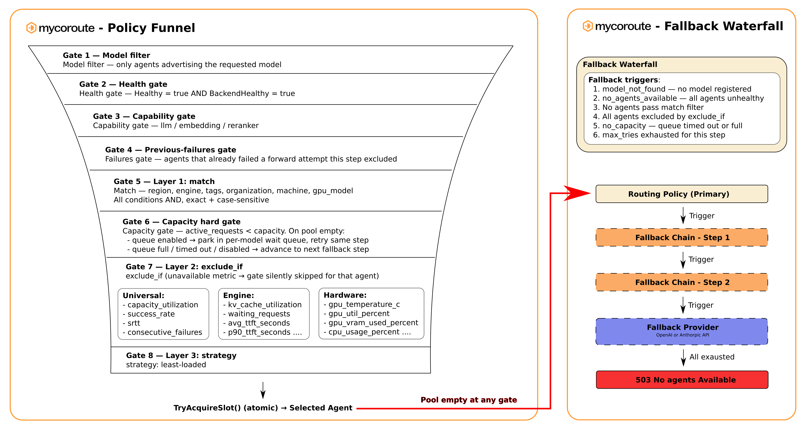

# Routing Concepts

Hivenet Router routes requests through a 3-layer policy pipeline, with fallback chains for high availability.

## The 3-Layer Pipeline

Every request passes through three sequential layers, with a fallback waterfall when the primary pool is exhausted:



### Layer 1: Match (Static Filter)

Filters agents by static metadata. All conditions must be true (AND logic).

| Field | Description | Example |
|-------|-------------|---------|
| `region` | Geographic region | `"EU-France"` |
| `engine` | Backend engine type | `"vllm"`, `"ollama"` |
| `tags` | Custom labels | `["production", "gpu-a100"]` |
| `organization` | Team/owner | `"ml-team"` |
| `machine` | Hostname | `"gpu-worker-1"` |
| `gpu_model` | GPU type | `"RTX4090"` |

All comparisons are **exact and case-sensitive**. `region: "EU"` will not match an agent with region `"EU-France"`.

```yaml
match:
  region: "EU-France"
  engine: "vllm"
  tags: ["production"]
```

### Layer 2: Exclude If (Dynamic Gates)

Excludes agents based on real-time metrics. Any failing condition removes the agent from the pool.

A gate whose metric is **unavailable** for a given agent is silently skipped — the agent is not excluded.

**Unit conventions:**
- `srtt` is in **milliseconds**
- `gpu_temperature_c` is in **degrees Celsius** (absolute)
- All other fraction/percent fields are normalised to **0.0–1.0** by the router (regardless of the raw 0–100 values shown in Prometheus gauges)

#### Universal gates (all agents)

| Field | Description | Example |
|-------|-------------|---------|
| `capacity_utilization` | `active_requests / capacity` (0.0–1.0) | `{ gt: 0.8 }` |
| `success_rate` | Lifetime success fraction (0.0–1.0) | `{ lt: 0.95 }` |
| `srtt` | RFC 6298 smoothed RTT in **milliseconds** | `{ gt: 500 }` |
| `consecutive_failures` | Forward failures since last success (count) | `{ gte: 3 }` |

#### Engine gates (vLLM / SGLang agents only)

| Field | Description | Example |
|-------|-------------|---------|
| `kv_cache_utilization` | GPU KV-cache in use (0.0–1.0) | `{ gt: 0.85 }` |
| `running_requests` | Requests being processed (count) | `{ gt: 50 }` |
| `waiting_requests` | Requests queued in engine scheduler (count) | `{ gt: 10 }` |
| `avg_ttft_seconds` | Running average TTFT in seconds | `{ gt: 2.0 }` |
| `p90_ttft_seconds` | P90 TTFT in seconds | `{ gt: 5.0 }` |
| `avg_itl_seconds` | Running average inter-token latency in seconds | `{ gt: 0.1 }` |
| `p90_itl_seconds` | P90 inter-token latency in seconds | `{ gt: 0.2 }` |

#### Hardware gates

| Field | Description | Example |
|-------|-------------|---------|
| `gpu_temperature_c` | Hottest GPU temperature in Celsius | `{ gt: 82 }` |
| `gpu_util_percent` | Highest GPU compute utilization (0.0–1.0) | `{ gt: 0.95 }` |
| `gpu_vram_used_percent` | Highest GPU VRAM used fraction (0.0–1.0) | `{ gt: 0.9 }` |
| `memory_used_percent` | System memory used fraction (0.0–1.0) | `{ gt: 0.9 }` |
| `cpu_usage_percent` | Node CPU utilization fraction (0.0–1.0) | `{ gt: 0.9 }` |

**Operators:** `gt`, `lt`, `gte`, `lte`

```yaml
exclude_if:
  kv_cache_utilization: { gt: 0.85 }
  gpu_temperature_c: { gt: 82 }
  success_rate: { lt: 0.95 }
  srtt: { gt: 500 }
```

### Layer 3: Strategy (Ranking)

Ranks remaining agents. Currently only `least-loaded` is implemented.

| Strategy | Status | Ranks By |
|----------|--------|----------|
| `least-loaded` | ✅ | `active_requests / capacity` |
| `lowest-srtt` | 📋 Planned | Smoothed RTT (ms) |
| `round-robin` | 📋 Planned | Rotating index |
| `prefix-aware` | 📋 Planned | CHWBL consistent hashing |

```yaml
strategy: "least-loaded"
```

## Fallback Chains

When no agents pass the policy, fallback chains provide ordered alternatives.

```yaml
routing_policy:
  match:
    region: "EU-France"
  strategy: "least-loaded"

fallback_chain:
  - name: "any-region"
    match: {}  # No filter
    strategy: "least-loaded"
    max_tries: 3

fallback_provider:
  engine: "openai"
  model: "gpt-4o-mini"
```

**Fallback triggers — a step advances to the next when:**

1. No agents are registered for the requested model (`model_not_found`)
2. All agents for the model are unhealthy or have a failed backend (`no_agents_available`)
3. No agents pass the `match` filter
4. All filter-passing agents are excluded by `exclude_if` gates
5. All healthy agents are at full capacity and the wait queue timed out or is full (`no_capacity`)
6. `max_tries` forward failures exhausted for the current step (see [Stale-Connection Recovery](#stale-connection-recovery) — connection-level failures do not count against this budget)

`fallback_provider` is a top-level field (not a step inside `fallback_chain`). It is invoked as the last resort after all `fallback_chain` steps are exhausted. Set `HIVENET_ROUTER_OPENAI_API_KEY` or `HIVENET_ROUTER_ANTHROPIC_API_KEY` in the environment to supply credentials.

## Stale-Connection Recovery

The router forwards to agents over a long-lived libp2p connection. That connection can be silently cut (a NetworkPolicy reconcile, a NAT/conntrack drop, a pod reschedule) without either side being notified — leaving the router holding a dead connection while the agent keeps heartbeating and still appears healthy.

To self-heal, the router distinguishes two kinds of forward failure:

- **Connection-level** (`agent_disconnected`): the libp2p path is dead — the agent never produced a response. The router **drops the connection** (so the next attempt re-dials a fresh one) and retries **without charging the `max_tries` budget**. This re-dial is capped at one per agent per request; if it also fails, the request falls through to normal escalation, so a genuinely unreachable agent still exhausts its tries instead of looping.
- **Application-level** (e.g. `context_length_exceeded`, `backend_error`): the agent responded, so the connection is healthy and is left intact. These consume `max_tries` as usual.

This means `max_tries` stays reserved for *genuine* agent failures (backend errors, overload), and a transient connection cut recovers within the same request rather than failing until the router is restarted. Each eviction increments `hivenet_router_agent_connection_resets_total` — a sustained rate indicates the network is repeatedly cutting router→agent links. The behavior is always on and requires no policy configuration.

## Capacity Wait Queue

Before escalating to fallback, requests enter a per-model wait queue when all agents are at capacity:

- **Default depth:** 30 requests per model
- **Purpose:** Absorb burst traffic before falling back
- **Timeout:** Subject to global `--request-timeout` (default 60s)

```
Request → Queue (depth 30) → Slot Acquisition → Forward
                              │
                              └─ max_tries exceeded → Next fallback step
```

## Model-Based Routing (Hard Constraint)

Models are a hard filter — agents only receive requests for models they advertise.

```
Agent registers: ["meta-llama/Llama-3.1-8B-Instruct"]
Request for:     "meta-llama/Llama-3.1-8B-Instruct" → ✅ Routed
Request for:     "gpt-4"                           → ❌ Not sent to this agent
```

**Model discovery:**
- vLLM/SGLang: `GET /v1/models`
- Ollama: `GET /api/tags` (strips `:latest` suffix)
- Custom: `--model` flag required

## Policy Evaluation Order

For each policy step, the router evaluates agents in this exact order:

1. **Extract model** from request body
2. **Filter by model** — only agents advertising the requested model are considered
3. **Health gate** — unhealthy agents and agents with a failed backend are dropped (before any policy config)
4. **Capability gate** — agents not matching the request type (`llm` / `embedding` / `reranker`) are dropped
5. **Previous-failures gate** — agents that already failed a forward attempt in the current step are excluded (a [connection-level](#stale-connection-recovery) re-dial does *not* mark the agent failed, so it stays eligible)
6. **Apply Layer 1** (`match`) — static metadata filter
7. **Capacity hard gate** — agents where `active_requests >= capacity` are excluded from the candidate pool
8. **Apply Layer 2** (`exclude_if`) — dynamic metric gates
9. **Apply Layer 3** (`strategy`) — rank surviving candidates
10. **Try slot acquisition** — atomic `TryAcquireSlot()` on the selected agent; retries immediately within the same step on a race
11. **Queue** if `ErrNoCapacity` and queue depth > 0, then retry from step 7
12. **Advance to next fallback step** if no candidates or `max_tries` exhausted ([connection-level failures](#stale-connection-recovery) trigger a budget-exempt re-dial instead of advancing)

## Example: Production Policy

```yaml
# Primary: EU vLLM agents, healthy GPU, balanced load
routing_policy:
  match:
    region: "EU-France"
    engine: "vllm"
    tags: ["production"]
  exclude_if:
    kv_cache_utilization: { gt: 0.85 }
    gpu_temperature_c: { gt: 82 }
    success_rate: { lt: 0.95 }
    srtt: { gt: 500 }
  strategy: "least-loaded"
  max_tries: 3

# Fallback 1: Any region, relaxed filters
fallback_chain:
  - name: "any-region"
    match:
      engine: "vllm"
    exclude_if:
      success_rate: { lt: 0.90 }
    strategy: "least-loaded"
    max_tries: 2

# Last resort: OpenAI (set HIVENET_ROUTER_OPENAI_API_KEY in environment)
fallback_provider:
  engine: "openai"
  model: "gpt-4o-mini"
```

## See Also

- [Policy YAML Reference](02-Policy-YAML-Reference.md) - Complete schema
- [Fallback Chains](03-Fallback-Chains.md) - Detailed fallback configuration
- [Provider Fallback](04-Provider-Fallback.md) - OpenAI/Anthropic integration
- [Detailed Architecture](../Reference/00-Detailed-Architecture.md) - Request lifecycle
