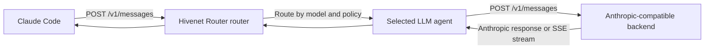

Claude Code can use Hivenet Router as an Anthropic-format inference gateway.

Claude Code sends requests to the router’s:

```text
POST /v1/messages
```

endpoint. Hivenet Router authenticates the client, checks model access and quotas, selects an eligible `llm` agent, and forwards the original request to the backend at the same path.



<Warning>
  Hivenet Router does not translate OpenAI Chat Completions into the Anthropic Messages format.

  The inference backend must serve `/v1/messages` itself. The model and backend must also support the tool-calling behavior Claude Code needs.

  Anthropic documents how Claude Code connects to gateways, but does not provide support for running Claude Code against non-Claude models through them.
</Warning>

## Prerequisites

Before configuring Claude Code, you need:

- a reachable Hivenet Router router
- a Hivenet Router client API key
- at least one healthy agent registered with the `llm` capability
- a backend that implements the Anthropic Messages API
- a model with reliable structured tool calling
- HTTPS when the router is reached over an untrusted network

The backend should support:

```text
POST /v1/messages
POST /v1/messages/count_tokens
```

Token counting is optional in the Claude Code gateway protocol, but implementing it gives Claude Code exact context measurements and avoids relying on local estimates.

## Prepare a compatible backend

vLLM supports the Anthropic Messages API and can serve tool-capable open models to Claude Code.

A typical command resembles:

```bash
vllm serve <model-source> \
  --host 0.0.0.0 \
  --port 8888 \
  --served-model-name hivenet-router-code-model \
  --enable-auto-tool-choice \
  --tool-call-parser <model-specific-parser>
```

Replace:

```text
<model-source>
```

with the model you are loading, and:

```text
<model-specific-parser>
```

with the tool-call parser required by that model.

Tool-call configuration differs by model family. Check that the selected parser is supported by the exact model and vLLM version you deploy.

### Use a stable served-model alias

Prefer a short, stable alias for the model Claude Code will request:

```text
hivenet-router-code-model
```

Current vLLM guidance recommends avoiding slash-containing Hugging Face IDs in this integration path.

The alias also separates the client-facing model name from the underlying model repository:

```bash
vllm serve Qwen/<model-repository> \
  --served-model-name hivenet-router-code-model \
  ...
```

Make the Hivenet Router agent register the same value:

```bash
./bin/hivenet-agent \
  --engine vllm \
  --backend-url http://localhost:8888 \
  --model hivenet-router-code-model \
  --router-grpc <router-host>:50051 \
  --jwt-secret-file /etc/hivenet-router/jwt.secret
```

The value must match across:

- vLLM’s `--served-model-name`
- the Hivenet Router agent’s registered model
- the Claude Code model mapping
- the API key’s model restrictions or per-model quotas

## Test the backend directly

Before adding Hivenet Router or Claude Code to the path, confirm that the backend accepts an Anthropic-format request:

```bash
curl -X POST \
  http://localhost:8888/v1/messages \
  -H "Content-Type: application/json" \
  -H "anthropic-version: 2023-06-01" \
  -d '{
    "model": "hivenet-router-code-model",
    "max_tokens": 32,
    "messages": [
      {
        "role": "user",
        "content": "Reply with one short sentence."
      }
    ]
  }'
```

The response should use the Anthropic Messages format rather than the OpenAI Chat Completions format.

Test token counting as well:

```bash
curl -X POST \
  http://localhost:8888/v1/messages/count_tokens \
  -H "Content-Type: application/json" \
  -H "anthropic-version: 2023-06-01" \
  -d '{
    "model": "hivenet-router-code-model",
    "messages": [
      {
        "role": "user",
        "content": "Count the tokens in this request."
      }
    ]
  }'
```

A successful response resembles:

```json
{
  "input_tokens": 10
}
```

The exact count depends on the tokenizer.

## Test the Hivenet Router path

List the models visible to the Claude Code API key:

```bash
curl \
  -H "Authorization: Bearer <hivenet-router-api-key>" \
  https://router.example.com/v1/models \
  | jq -r '.data[].id'
```

Confirm that the list contains:

```text
hivenet-router-code-model
```

Then test the Messages endpoint through Hivenet Router:

```bash
curl -X POST \
  https://router.example.com/v1/messages \
  -H "Authorization: Bearer <hivenet-router-api-key>" \
  -H "Content-Type: application/json" \
  -H "anthropic-version: 2023-06-01" \
  -d '{
    "model": "hivenet-router-code-model",
    "max_tokens": 32,
    "messages": [
      {
        "role": "user",
        "content": "Reply with one short sentence."
      }
    ]
  }'
```

This verifies:

- client authentication
- model access
- routing
- agent connectivity
- backend Messages support
- response forwarding

<Note>
  `max_tokens` is required by the Anthropic Messages request format.

  A hand-written request without it may be rejected by the backend even though the equivalent Chat Completions request succeeds.
</Note>

## Install Claude Code

<Tabs>
  <Tab title="macOS, Linux, or WSL">
    ```bash
    curl -fsSL https://claude.ai/install.sh \
      | bash
    ```
  </Tab>
  <Tab title="Windows PowerShell">
    ```powershell
    irm https://claude.ai/install.ps1 \
      | iex
    ```
  </Tab>
</Tabs>

Verify the installation:

```bash
claude --version
```

Use current Claude Code and inference-backend releases.

Pin a client or backend version only after reproducing a specific compatibility regression in your deployment. Treat old version pins from earlier setup notes as historical workarounds rather than permanent requirements.

## Configure Claude Code

Set the router URL, client credential, and model aliases before launching Claude Code:

```bash
unset ANTHROPIC_API_KEY

export ANTHROPIC_BASE_URL="https://router.example.com"
export ANTHROPIC_AUTH_TOKEN="<hivenet-router-api-key>"

export ANTHROPIC_DEFAULT_FABLE_MODEL="hivenet-router-code-model"
export ANTHROPIC_DEFAULT_OPUS_MODEL="hivenet-router-code-model"
export ANTHROPIC_DEFAULT_SONNET_MODEL="hivenet-router-code-model"
export ANTHROPIC_DEFAULT_HAIKU_MODEL="hivenet-router-code-model"

claude --model sonnet
```

Do not add `/v1` to the base URL.

Correct:

```text
https://router.example.com
```

Incorrect:

```text
https://router.example.com/v1
```

Claude Code appends:

```text
/v1/messages
```

itself. Including `/v1` in the configured base URL can produce:

```text
/v1/v1/messages
```

## Use the bearer-token variable

Use:

```text
ANTHROPIC_AUTH_TOKEN
```

for a Hivenet Router client key.

Claude Code sends it as:

```http
Authorization: Bearer <hivenet-router-api-key>
```

This is the authentication header Hivenet Router accepts.

Do not use only:

```text
ANTHROPIC_API_KEY
```

Claude Code sends that value as:

```http
x-api-key: <value>
```

Hivenet Router client authentication does not read `x-api-key`.

Unsetting `ANTHROPIC_API_KEY` also prevents an unrelated Anthropic API key from taking part in credential selection:

```bash
unset ANTHROPIC_API_KEY
```

<Note>
  You do not normally need to sign out of an existing claude.ai account.

  `ANTHROPIC_AUTH_TOKEN` takes precedence while it is set. The saved login remains available and becomes active again after you remove the gateway variables.

  Run `/logout` only when you deliberately want to remove the saved login or Claude Code reports an unresolved authentication conflict.
</Note>

## Map the model aliases

Claude Code uses built-in model aliases for different kinds of work.

| Alias | Environment variable | Typical use |
| --- | --- | --- |
| `fable` | `ANTHROPIC_DEFAULT_FABLE_MODEL` | Long or difficult tasks where available |
| `opus` | `ANTHROPIC_DEFAULT_OPUS_MODEL` | Complex reasoning and planning |
| `sonnet` | `ANTHROPIC_DEFAULT_SONNET_MODEL` | Main coding work |
| `haiku` | `ANTHROPIC_DEFAULT_HAIKU_MODEL` | Faster and background tasks |

You may map every alias to one model:

```bash
export ANTHROPIC_DEFAULT_FABLE_MODEL="hivenet-router-code-model"
export ANTHROPIC_DEFAULT_OPUS_MODEL="hivenet-router-code-model"
export ANTHROPIC_DEFAULT_SONNET_MODEL="hivenet-router-code-model"
export ANTHROPIC_DEFAULT_HAIKU_MODEL="hivenet-router-code-model"
```

Or map them to different Hivenet Router models:

```bash
export ANTHROPIC_DEFAULT_FABLE_MODEL="code-model-large"
export ANTHROPIC_DEFAULT_OPUS_MODEL="code-model-large"
export ANTHROPIC_DEFAULT_SONNET_MODEL="code-model-standard"
export ANTHROPIC_DEFAULT_HAIKU_MODEL="code-model-fast"
```

Every mapped model must:

- appear in `/v1/models` for the client key
- be registered by a healthy `llm` agent
- support the request features Claude Code sends
- be included in the key’s model restrictions or per-model quotas

Map `haiku` even when you intend to work mainly through `sonnet` or `opus`. Claude Code can use the Haiku alias for background functionality.

## Verify the active configuration

Start Claude Code:

```bash
claude --model sonnet
```

Then run:

```text
/status
```

Confirm that the status view shows:

- the Hivenet Router address as the Anthropic base URL
- `ANTHROPIC_AUTH_TOKEN` as the active credential source
- the intended model or model alias

If the Hivenet Router URL is missing, the environment variables did not reach that Claude Code process.

This commonly happens when:

- Claude Code was started from another terminal
- an editor was launched before the variables were exported
- a settings file overrides the shell value
- a wrapper or background process uses another environment

## Test the coding workflow

Start with a simple prompt:

```text
Read the current directory and tell me what kind of project this is.
```

Then test a harmless tool action:

```text
Create a file named hivenet-router-test.txt containing the word connected.
```

Confirm that Claude Code:

1. proposes or invokes the appropriate file tool
2. receives a structured tool response from the model
3. creates the expected file
4. continues the conversation after the tool result

A model that produces good text but cannot emit the expected structured tool calls is not sufficient for Claude Code.

Remove the test file afterward:

```bash
rm hivenet-router-test.txt
```

## Make the configuration persistent

Claude Code supports several settings scopes.

| File | Scope | Suitable for credentials? |
| --- | --- | --- |
| `~/.claude/settings.json` | All projects for one user | Yes, but stored as plaintext |
| `.claude/settings.local.json` | One project for one user | Yes, when ignored by Git |
| `.claude/settings.json` | Shared project configuration | No |

A user-wide configuration can look like:

```json
{
  "model": "sonnet",
  "env": {
    "ANTHROPIC_BASE_URL": "https://router.example.com",
    "ANTHROPIC_AUTH_TOKEN": "<hivenet-router-api-key>",
    "ANTHROPIC_DEFAULT_FABLE_MODEL": "hivenet-router-code-model",
    "ANTHROPIC_DEFAULT_OPUS_MODEL": "hivenet-router-code-model",
    "ANTHROPIC_DEFAULT_SONNET_MODEL": "hivenet-router-code-model",
    "ANTHROPIC_DEFAULT_HAIKU_MODEL": "hivenet-router-code-model"
  }
}
```

<Warning>
  Do not put a Hivenet Router API key in the shared:

  ```text
  .claude/settings.json
  ```

  file.

  That file is intended for source control. Use a user setting, `.claude/settings.local.json`, shell environment, or credential helper instead.
</Warning>

Settings-file environment values take precedence over matching values exported by the shell.

Use `/status` to confirm which value is active.

## Use a credential helper

For short-lived or externally managed keys, configure:

```json
{
  "apiKeyHelper": "~/bin/get-hivenet-router-key.sh",
  "env": {
    "ANTHROPIC_BASE_URL": "https://router.example.com",
    "ANTHROPIC_DEFAULT_FABLE_MODEL": "hivenet-router-code-model",
    "ANTHROPIC_DEFAULT_OPUS_MODEL": "hivenet-router-code-model",
    "ANTHROPIC_DEFAULT_SONNET_MODEL": "hivenet-router-code-model",
    "ANTHROPIC_DEFAULT_HAIKU_MODEL": "hivenet-router-code-model"
  }
}
```

The helper must print the current raw Hivenet Router key to standard output.

Claude Code sends a helper-generated credential in both:

```http
Authorization: Bearer <value>
x-api-key: <value>
```

Hivenet Router uses the `Authorization` header.

By default, Claude Code caches the helper result for five minutes and runs it again after an HTTP `401`.

Change the cache period with:

```bash
export CLAUDE_CODE_API_KEY_HELPER_TTL_MS=900000
```

The value is in milliseconds.

<Note>
  `ANTHROPIC_AUTH_TOKEN` has higher credential precedence than `apiKeyHelper`.

  Remove the static token when the helper should become authoritative.
</Note>

## Add a custom model to the picker

The alias mappings are the simplest way to expose Hivenet Router models.

You can also add one explicit custom entry:

```bash
export ANTHROPIC_CUSTOM_MODEL_OPTION="hivenet-router-code-model"
export ANTHROPIC_CUSTOM_MODEL_OPTION_NAME="Hivenet Router code model"
export ANTHROPIC_CUSTOM_MODEL_OPTION_DESCRIPTION="Served through Hivenet Router"
```

Restart Claude Code, then open:

```text
/model
```

The custom entry appears alongside the built-in aliases.

### Gateway model discovery

Claude Code can optionally query:

```text
GET /v1/models?limit=1000
```

at startup:

```bash
export CLAUDE_CODE_ENABLE_GATEWAY_MODEL_DISCOVERY=1
```

However, current Claude Code discovery ignores returned IDs that do not begin with:

```text
claude
anthropic
```

Typical open-model IDs therefore do not appear automatically.

Use alias mappings or `ANTHROPIC_CUSTOM_MODEL_OPTION` instead of renaming an open model to imply that it is a Claude model.

<Note>
  Do not combine gateway model discovery with:

  ```text
  CLAUDE_CODE_DISABLE_NONESSENTIAL_TRAFFIC=1
  ```

  The nonessential-traffic setting disables discovery.
</Note>

## Restricted-egress environments

Claude Code can make non-inference requests outside the configured gateway path for update checks, telemetry, release information, and other auxiliary behavior.

On a network that permits access only to Hivenet Router, set:

```bash
export CLAUDE_CODE_DISABLE_NONESSENTIAL_TRAFFIC=1
```

This is optional and should not be part of the default configuration.

It also:

- disables automatic updates
- disables gateway model discovery
- suppresses the fast-mode availability check
- leaves some WebFetch safety traffic subject to separate settings

Plan another update process before enabling it permanently.

## Request and header behavior

Claude Code sends Anthropic-format requests, including evolving:

- `anthropic-version` headers
- `anthropic-beta` headers
- tool schemas
- system content
- context-management fields
- reasoning and output-configuration fields

Hivenet Router forwards the original request body and headers through the selected agent to the backend.

The backend must understand the fields that arrive.

<Warning>
  Do not place an intermediary between Hivenet Router and the backend that removes unfamiliar `anthropic-*` headers or request fields.

  Claude Code adds capabilities over time. A fixed allowlist of observed headers can break a later Claude Code release.
</Warning>

## Streaming

Claude Code expects server-sent events to arrive progressively.

The complete path must preserve streaming:

```text
Claude Code
  → reverse proxy
  → Hivenet Router router
  → Hivenet Router agent
  → inference backend
```

When output appears only after the model finishes, check:

- whether the backend returns `text/event-stream`
- whether the agent is current
- whether the reverse proxy buffers responses
- whether proxy timeouts are long enough
- whether the client requested streaming

For Nginx, the inference route commonly needs buffering disabled:

```nginx
proxy_buffering off;
proxy_cache off;
```

The exact reverse-proxy configuration depends on your deployment.

## Compatibility with new Claude Code features

Claude Code may send fields that an older or non-Anthropic backend does not support.

Common failures include backend errors naming:

```text
thinking
adaptive
context_management
output_config
strict
defer_loading
```

The preferred fix is to update the backend and use a model integration that supports the request.

For diagnosis, you can temporarily disable adaptive thinking:

```bash
export CLAUDE_CODE_DISABLE_ADAPTIVE_THINKING=1
```

You can also disable experimental beta capabilities:

```bash
export CLAUDE_CODE_DISABLE_EXPERIMENTAL_BETAS=1
```

These variables remove capabilities from the client request. They do not make an incompatible model support tools or other missing behavior.

Use them as targeted compatibility controls rather than permanent defaults.

<Warning>
  Claude Code can automatically recover from some upstream capability rejections only when it receives the original error wording.

  Hivenet Router currently preserves structured Hivenet Router errors but can wrap an unstructured backend error. When a new client field causes a backend `400`, inspect the backend log directly rather than relying only on the final router response.
</Warning>

## Use Hivenet Router and Anthropic side by side

A saved claude.ai login can remain on the machine.

Create a launcher for Hivenet Router:

```bash
#!/usr/bin/env bash

unset ANTHROPIC_API_KEY

export ANTHROPIC_BASE_URL="https://router.example.com"
export ANTHROPIC_AUTH_TOKEN="<hivenet-router-api-key>"

export ANTHROPIC_DEFAULT_FABLE_MODEL="hivenet-router-code-model"
export ANTHROPIC_DEFAULT_OPUS_MODEL="hivenet-router-code-model"
export ANTHROPIC_DEFAULT_SONNET_MODEL="hivenet-router-code-model"
export ANTHROPIC_DEFAULT_HAIKU_MODEL="hivenet-router-code-model"

exec claude --model sonnet "$@"
```

Save it as:

```text
~/bin/claude-hivenet-router
```

and make it executable:

```bash
chmod +x \
  ~/bin/claude-hivenet-router
```

For a normal Anthropic session, start Claude Code without the Hivenet Router variables:

```bash
env \
  -u ANTHROPIC_BASE_URL \
  -u ANTHROPIC_AUTH_TOKEN \
  -u ANTHROPIC_DEFAULT_FABLE_MODEL \
  -u ANTHROPIC_DEFAULT_OPUS_MODEL \
  -u ANTHROPIC_DEFAULT_SONNET_MODEL \
  -u ANTHROPIC_DEFAULT_HAIKU_MODEL \
  claude
```

The saved claude.ai login becomes active again.

## Observe Claude Code traffic

Audit records identify the tenant, model, selected agent, status, and request duration.

Search one tenant in Loki:

```logql
{
  job="hivenet-router",
  log_type="audit",
  tenant_id="claude-code"
}
  | json
```

Inspect requests by model:

```logql
{
  job="hivenet-router",
  log_type="audit",
  model="hivenet-router-code-model"
}
  | json
```

Request rate:

```promql
sum by (tenant_id, model) (
  rate(
    hivenet_router_routing_requests_routed_total[5m]
  )
)
```

Give Claude Code its own client key when you need its traffic separated from other applications.

## Troubleshooting

### Claude Code opens the login screen

The gateway credential did not reach the process.

Check:

```bash
echo "$ANTHROPIC_BASE_URL"
echo "${ANTHROPIC_AUTH_TOKEN:+set}"
```

Then start Claude Code from the same shell.

Run `/status` after it opens.

### `/status` shows no Anthropic base URL

Claude Code is not using the Hivenet Router endpoint.

Check for:

- a missing environment variable
- a settings-file override
- an editor or launcher with another environment
- a misspelled variable name

### Requests return `401`

Use:

```text
ANTHROPIC_AUTH_TOKEN
```

rather than only:

```text
ANTHROPIC_API_KEY
```

Confirm that the raw Hivenet Router client key is being sent, not its SHA-256 hash.

Test it directly:

```bash
curl \
  -H "Authorization: Bearer <hivenet-router-api-key>" \
  https://router.example.com/v1/models
```

### Requests return a plain `404`

Check the base URL.

It should not end in:

```text
/v1
```

Also confirm that the request reaches:

```text
/v1/messages
```

rather than an unsupported path.

### The router returns `model_not_found`

Compare the configured alias with:

```bash
curl \
  -H "Authorization: Bearer <hivenet-router-api-key>" \
  https://router.example.com/v1/models \
  | jq -r '.data[].id'
```

Check:

- capitalization
- punctuation
- served-model alias
- agent `--model`
- API-key model access
- agent health

### The backend returns `404` for `/v1/messages`

The backend does not implement the Anthropic Messages endpoint.

A backend that supports only:

```text
/v1/chat/completions
```

cannot serve Claude Code through the current Hivenet Router passthrough.

Use an Anthropic-compatible backend or another coding client that speaks OpenAI Chat Completions.

### Text works but tools fail

Check that:

- the model supports structured tool calls
- vLLM uses `--enable-auto-tool-choice`
- the selected `--tool-call-parser` matches the model
- the backend returns Anthropic-format tool-use blocks
- the model follows tool schemas reliably

Test the backend directly to isolate it from Hivenet Router.

### The backend rejects `system` messages

Upgrade the backend and test the current Claude Code request against it directly.

Do not begin by pinning an old Claude Code release. First confirm whether the backend’s current Anthropic Messages implementation accepts the system-content shape the client sends.

### The backend rejects `thinking` or `adaptive`

Update the backend first.

As a compatibility test:

```bash
export CLAUDE_CODE_DISABLE_ADAPTIVE_THINKING=1
```

Restart Claude Code after changing the variable.

### The backend rejects beta fields

As a temporary diagnostic:

```bash
export CLAUDE_CODE_DISABLE_EXPERIMENTAL_BETAS=1
```

This may disable context management and newer tool features.

### Claude Code retries and Hivenet Router later reports no eligible agent

Inspect the backend’s first error.

A backend rejection that Hivenet Router treats as retryable can cause the request session to try other agents and exclude agents that already failed.

Check:

<Tabs>
  <Tab title="Router">
    ```bash
    docker compose logs router \
      | grep -iE "messages|policy|failed|exhaust"
    ```
  </Tab>
  <Tab title="Agent">
    ```bash
    docker compose logs <agent-service> \
      | tail -100
    ```
  </Tab>
  <Tab title="vLLM">
    ```bash
    docker compose logs <vllm-service> \
      | tail -100
    ```
  </Tab>
</Tabs>

The most useful validation message often appears in the backend log.

### Streaming arrives only after completion

Check:

- backend SSE behavior
- Hivenet Router agent version
- reverse-proxy buffering
- proxy read and idle timeouts
- response `Content-Type`

Test the backend and router separately with streaming curl requests.

### Token counting fails

Test the backend directly:

```bash
curl -i -X POST \
  http://localhost:8888/v1/messages/count_tokens \
  -H "Content-Type: application/json" \
  -H "anthropic-version: 2023-06-01" \
  -d '{
    "model": "hivenet-router-code-model",
    "messages": [
      {
        "role": "user",
        "content": "Hello"
      }
    ]
  }'
```

Claude Code can estimate context locally when token counting is unavailable, but backend support gives more accurate results.

### The model picker does not show Hivenet Router models

Use the mapped aliases:

```text
/model sonnet
/model opus
/model haiku
/model fable
```

Or configure:

```text
ANTHROPIC_CUSTOM_MODEL_OPTION
```

Gateway discovery ignores typical open-model IDs that do not begin with `claude` or `anthropic`.

## Next steps

<CardGroup cols={3}>
  <Card title="OpenCode" href="/integrations/open-code">
    Connect a coding agent through OpenAI Chat Completions.
  </Card>

  <Card title="Use from code" href="/integrations/use-from-code">
    Call Hivenet Router from SDKs, scripts, and custom applications.
  </Card>

  <Card title="Chat completions and messages" href="/use-the-api/chat-completions">
    Review the Anthropic and OpenAI inference paths.
  </Card>

  <Card title="API keys" href="/security/api-keys">
    Configure model access, quotas, expiration, and credential rotation.
  </Card>

  <Card title="vLLM agent" href="/deploy/agents/vllm">
    Deploy and register the backend serving Claude Code requests.
  </Card>

  <Card title="Audit logging" href="/observability/audit-logging">
    Investigate Claude Code requests by tenant, model, status, and agent.
  </Card>
</CardGroup>