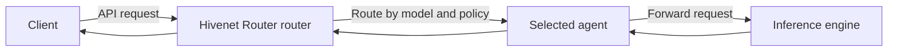

Connect coding agents, browser interfaces, SDKs, and custom applications to Hivenet Router through its supported inference APIs.

The right setup depends on two things:

- the client you are connecting
- the API format supported by the inference backend behind Hivenet Router

<Columns cols={2}>
  <Card title="Claude Code" icon="terminal" href="/integrations/claude-code">
    Connect Claude Code through the Anthropic Messages API.
  </Card>

  <Card title="OpenCode" icon="code" href="/integrations/open-code">
    Configure Hivenet Router as an OpenAI-compatible provider in OpenCode.
  </Card>

  <Card title="Pi" icon="robot" href="/integrations/pi">
    Add Hivenet Router and its available models to the Pi coding agent.
  </Card>

  <Card title="Open WebUI" icon="browser" href="/integrations/open-web-ui">
    Use Hivenet Router as the inference endpoint for a browser-based chat interface.
  </Card>

  <Card title="Use from code" icon="code-branch" href="/integrations/use-from-code">
    Call Hivenet Router from curl, Python, JavaScript, SDKs, and custom services.
  </Card>
</Columns>

## Choose an integration

| Integration | Use it for | API format |
| --- | --- | --- |
| Claude Code | Terminal-based coding assistance and tool use | Anthropic Messages |
| OpenCode | Terminal-based coding with a configurable provider | OpenAI Chat Completions |
| Pi | Lightweight terminal coding workflows | OpenAI Chat Completions |
| Open WebUI | Browser-based chat for individuals or teams | OpenAI Chat Completions |
| Use from code | Applications, scripts, services, embeddings, and reranking | Depends on the endpoint |

The client talks only to the Hivenet Router router. It does not need to know which agent, machine, or inference engine serves the request.



## Before you start

Every integration needs:

1. A reachable Hivenet Router router URL.
2. A client API key when authentication is enabled.
3. An exact model ID visible to that key.
4. A client and backend that support the same API format.

### Router URL

For local testing:

```text
http://localhost:8080
```

For a remote deployment, use a protected HTTPS address:

```text
https://router.example.com
```

### Client API key

Clients authenticate with:

```http
Authorization: Bearer <hivenet-router-api-key>
```

Use a client API key configured through static or dynamic authentication.

Do not use an administrator key from:

```text
HIVENET_ROUTER_ADMIN_API_KEYS
```

in an application or third-party client.

See [API keys](/security/api-keys) for key creation, model restrictions, quotas, and expiration.

### Model ID

List the models available to the client key:

```bash
curl \
  -H "Authorization: Bearer <hivenet-router-api-key>" \
  https://router.example.com/v1/models \
  | jq -r '.data[].id'
```

Use one of the returned IDs exactly as shown.

Model names are case-sensitive, and the response is filtered according to the key’s model access.

## Match the API format

Hivenet Router supports several client-facing inference endpoints.

| Endpoint | Typical use |
| --- | --- |
| `POST /v1/chat/completions` | OpenAI-compatible chat clients |
| `POST /v1/messages` | Anthropic-compatible clients |
| `POST /v1/messages/count_tokens` | Anthropic token counting |
| `POST /v1/embeddings` | Embedding applications |
| `POST /v1/rerank` | Reranking applications |
| `GET /v1/models` | Model discovery |

<Warning>
  Hivenet Router does not translate between OpenAI and Anthropic request formats.

  A request sent to `/v1/messages` must reach a backend that understands the Anthropic Messages API. A backend that supports only `/v1/chat/completions` cannot serve that request merely because both endpoints are exposed by the router.
</Warning>

The individual integration guides explain which endpoint and base URL the client uses.

## Backend features still matter

Hivenet Router routes and forwards requests. It does not add model or engine capabilities that the selected backend does not support.

Compatibility may depend on:

- streaming
- tool and function calling
- structured output
- system or developer roles
- multimodal input
- reasoning parameters
- model-specific request fields

This is particularly important for coding agents, which often depend on structured tool calls rather than text generation alone.

A successful basic chat request does not prove that tool use will work. Test the complete client workflow after connecting it.

## Access and quotas

Integrations use the same Hivenet Router controls as direct API requests.

The router can apply:

- API-key authentication
- model restrictions
- request-rate quotas
- daily token quotas
- routing policies
- fallback behavior
- audit logging
- tenant metrics

Give separate applications or integrations separate keys when you need independent access, rotation, or investigation.

For example:

```text
claude-code-development
opencode-engineering
open-webui-team
production-service
```

Keys with the same `owner` share quota buckets.

## Base URLs

Clients construct endpoint paths differently.

An OpenAI-compatible client commonly expects:

```text
https://router.example.com/v1
```

and adds:

```text
/chat/completions
```

An Anthropic-compatible client may expect:

```text
https://router.example.com
```

and add:

```text
/v1/messages
```

Follow the exact base URL in the relevant integration guide.

A misplaced `/v1` can produce incorrect paths such as:

```text
/v1/v1/messages
```

or:

```text
/chat/completions
```

These requests return `404`.

## Recommended test order

<Steps>
  <Step title="List models">
    Query `/v1/models` with the key the integration will use.
  </Step>
  <Step title="Test the endpoint directly">
    Send a minimal curl request using the intended OpenAI or Anthropic format.
  </Step>
  <Step title="Configure the client">
    Add the router URL, API key, and exact model ID.
  </Step>
  <Step title="Test streaming">
    Confirm that output arrives incrementally when the client uses streaming.
  </Step>
  <Step title="Test advanced features">
    For coding agents, verify tool calling and file operations with a harmless task.
  </Step>
  <Step title="Review the request">
    Find the request in audit logs or metrics and confirm its tenant, model, status, and selected agent.
  </Step>
</Steps>

## Troubleshooting

| Result | Check |
| --- | --- |
| `401 Unauthorized` | API key and `Authorization: Bearer` header |
| `403 model_forbidden` | Key model allowlist |
| `404 model_not_found` | Exact model ID and registered agents |
| Plain `404` | Base URL and endpoint path |
| Backend `400` | Client request format and backend compatibility |
| `429` | Request or token quotas |
| `503` | Agent health, capability, policy, and capacity |
| Output arrives at once | Backend, proxy, or client streaming behavior |
| Text works but tools fail | Model and backend tool-call support |

Use the direct curl test to determine whether a problem belongs to Hivenet Router or the client configuration.

## Integration guides

<Columns cols={2}>
  <Card title="Claude Code" icon="terminal" href="/integrations/claude-code">
    Configure the Anthropic Messages endpoint, authentication, model, and tool-use checks.
  </Card>

  <Card title="OpenCode" icon="code" href="/integrations/open-code">
    Configure a custom OpenAI-compatible provider and model.
  </Card>

  <Card title="Pi" icon="robot" href="/integrations/pi">
    Register a custom provider and expose Hivenet Router models in Pi.
  </Card>

  <Card title="Open WebUI" icon="browser" href="/integrations/open-web-ui">
    Connect a browser interface and understand shared-key behavior.
  </Card>

  <Card title="Use from code" icon="code-branch" href="/integrations/use-from-code">
    Call chat, embeddings, and reranking endpoints from your own software.
  </Card>

  <Card title="Chat completions and messages" icon="messages" href="/use-the-api/chat-completions">
    Review Hivenet Router’s supported LLM paths and forwarding behavior.
  </Card>
</Columns>