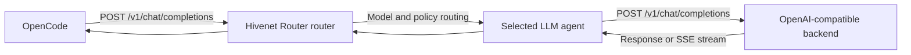

OpenCode can use Hivenet Router as a custom OpenAI-compatible provider.

It sends requests to:

```text
POST /v1/chat/completions
```

Hivenet Router authenticates the client, checks model access and quotas, selects an eligible `llm` agent, and forwards the request to the backend.



<Warning>
  Use OpenCode’s OpenAI-compatible provider adapter.

  Hivenet Router does not expose the OpenAI Responses API at `/v1/responses`. Configuring OpenCode with the standard OpenAI adapter can therefore send requests to an unsupported endpoint.
</Warning>

## Prerequisites

Before configuring OpenCode, you need:

- a reachable Hivenet Router router
- a Hivenet Router client API key
- at least one healthy agent registered with the `llm` capability
- an inference backend that supports OpenAI Chat Completions
- a model with reliable tool-calling behavior
- HTTPS when the router is reached over an untrusted network

List the models visible to the intended client key:

```bash
curl \
  -H "Authorization: Bearer <hivenet-router-api-key>" \
  https://router.example.com/v1/models \
  | jq -r '.data[].id'
```

Use one of the returned IDs exactly as shown.

## Prepare the inference backend

A text-generation model can answer basic prompts without supporting the structured tool calls OpenCode needs for coding work.

The model and inference engine must support operations such as:

- reading files
- editing files
- creating files
- running shell commands
- invoking custom tools or MCP tools

For vLLM, automatic tool calling normally requires:

```bash
vllm serve <model-source> \
  --host 0.0.0.0 \
  --port 8888 \
  --served-model-name hivenet-router-code-model \
  --enable-auto-tool-choice \
  --tool-call-parser <model-specific-parser>
```

Replace:

```text
<model-specific-parser>
```

with the parser required by the model family you are serving.

Some models also require a compatible chat template.

<Note>
  Tool support is model-specific.

  A parser that works for one model family may produce malformed or plain-text tool calls with another.
</Note>

Register the same served-model name with the Hivenet Router agent:

```bash
./bin/hivenet-agent \
  --engine vllm \
  --backend-url http://localhost:8888 \
  --model hivenet-router-code-model \
  --router-grpc <router-host>:50051 \
  --jwt-secret-file /etc/hivenet-router/jwt.secret
```

The value must match across:

- the backend’s served-model name
- the Hivenet Router agent registration
- the OpenCode provider configuration
- the client key’s model restrictions or per-model quotas

## Test Hivenet Router directly

Before installing or configuring OpenCode, send a basic Chat Completions request:

```bash
curl -X POST \
  https://router.example.com/v1/chat/completions \
  -H "Authorization: Bearer <hivenet-router-api-key>" \
  -H "Content-Type: application/json" \
  -d '{
    "model": "hivenet-router-code-model",
    "messages": [
      {
        "role": "user",
        "content": "Reply with one short sentence."
      }
    ],
    "max_tokens": 64
  }'
```

A successful response confirms:

- the client key works
- the key can access the model
- an eligible agent is registered
- the backend accepts Chat Completions
- the router can return the response

Test streaming separately:

```bash
curl -N -X POST \
  https://router.example.com/v1/chat/completions \
  -H "Authorization: Bearer <hivenet-router-api-key>" \
  -H "Content-Type: application/json" \
  -d '{
    "model": "hivenet-router-code-model",
    "messages": [
      {
        "role": "user",
        "content": "Count from one to five."
      }
    ],
    "stream": true,
    "max_tokens": 64
  }'
```

Output should arrive incrementally rather than after the complete response has been generated.

## Install OpenCode

<Tabs>
  <Tab title="Install script">
    ```bash
    curl -fsSL https://opencode.ai/install \
      | bash
    ```
  </Tab>
  <Tab title="npm">
    ```bash
    npm install -g opencode-ai
    ```
  </Tab>
  <Tab title="Homebrew">
    ```bash
    brew install anomalyco/tap/opencode
    ```
  </Tab>
  <Tab title="Windows">
    OpenCode recommends WSL for the most complete terminal experience.

    Native Windows packages are also available:

    ```powershell
    choco install opencode
    ```

    or:

    ```powershell
    scoop install opencode
    ```
  </Tab>
</Tabs>

Verify the installation:

```bash
opencode --version
```

Use a current OpenCode release.

Do not pin the old release mentioned in the original Hivenet Router guide. Custom-provider configuration is part of the current documented interface.

## Choose a configuration location

OpenCode supports both global and project configuration.

| Location | Scope |
| --- | --- |
| `~/.config/opencode/opencode.json` | All projects for the current user |
| `opencode.json` in a project root | One project |
| Path in `OPENCODE_CONFIG` | A selected custom configuration |

OpenCode merges its configuration sources. Project settings override conflicting global settings while preserving unrelated global values.

Use a global file when the same Hivenet Router provider should be available everywhere.

Use a project file when the model, permissions, or router should be tied to one repository.

<Warning>
  A project-level `opencode.json` may be committed to source control.

  Do not put the raw Hivenet Router API key directly in that file.
</Warning>

## Configure the provider

Create:

```text
~/.config/opencode/opencode.json
```

or a project-level:

```text
opencode.json
```

with:

```json
{
  "$schema": "https://opencode.ai/config.json",

  "share": "disabled",

  "enabled_providers": [
    "hivenet-router"
  ],

  "model": "hivenet-router/hivenet-router-code-model",
  "small_model": "hivenet-router/hivenet-router-code-model",

  "permission": {
    "edit": "ask",
    "bash": "ask"
  },

  "provider": {
    "hivenet-router": {
      "npm": "@ai-sdk/openai-compatible",
      "name": "Hivenet Router",

      "options": {
        "baseURL": "https://router.example.com/v1",
        "apiKey": "{env:HIVENET_ROUTER_API_KEY}"
      },

      "models": {
        "hivenet-router-code-model": {
          "name": "Hivenet Router code model",

          "limit": {
            "context": 32768,
            "output": 4096
          }
        }
      }
    }
  }
}
```

Replace:

- `https://router.example.com` with the router address
- `hivenet-router-code-model` with an exact model ID from `/v1/models`
- the context and output limits with values supported by that model and backend

## Set the API key

Export the raw Hivenet Router client key:

```bash
export HIVENET_ROUTER_API_KEY="<hivenet-router-api-key>"
```

Verify that the variable exists without printing its value:

```bash
test -n "$HIVENET_ROUTER_API_KEY" \
  && echo "HIVENET_ROUTER_API_KEY is set"
```

OpenCode’s:

```json
"apiKey": "{env:HIVENET_ROUTER_API_KEY}"
```

substitution reads the value when the configuration loads.

The OpenAI-compatible adapter sends it as:

```http
Authorization: Bearer <hivenet-router-api-key>
```

This is the authentication header Hivenet Router expects.

<Note>
  `HIVENET_ROUTER_API_KEY` is an environment variable used by the OpenCode client.

  It does not need to follow the lower-case `hivenet_router_*` convention used by the Hivenet Router router process.
</Note>

## Read the key from a file

OpenCode can also substitute the contents of a file:

```json
{
  "options": {
    "baseURL": "https://router.example.com/v1",
    "apiKey": "{file:~/.secrets/hivenet-router-api-key}"
  }
}
```

Protect the file:

```bash
chmod 600 \
  ~/.secrets/hivenet-router-api-key
```

The file should contain only the raw API key, without a variable name or surrounding quotation marks.

## Understand the provider configuration

### Provider ID

```json
"provider": {
  "hivenet-router": {}
}
```

`hivenet-router` is the OpenCode provider ID.

It is an arbitrary local identifier, but it must match the prefix used in:

```json
"model": "hivenet-router/hivenet-router-code-model"
```

and:

```json
"small_model": "hivenet-router/hivenet-router-code-model"
```

### Provider adapter

```json
"npm": "@ai-sdk/openai-compatible"
```

This adapter uses the OpenAI-compatible Chat Completions API.

Do not replace it with:

```json
"npm": "@ai-sdk/openai"
```

The standard OpenAI adapter may select the Responses API for some models. Hivenet Router does not currently expose:

```text
POST /v1/responses
```

### Base URL

Use:

```json
"baseURL": "https://router.example.com/v1"
```

The URL must include:

```text
/v1
```

but must not include the final endpoint.

Correct:

```text
https://router.example.com/v1
```

Incorrect:

```text
https://router.example.com
```

Incorrect:

```text
https://router.example.com/v1/chat/completions
```

The adapter appends:

```text
/chat/completions
```

to the configured base URL.

### Model entries

```json
"models": {
  "hivenet-router-code-model": {
    "name": "Hivenet Router code model"
  }
}
```

The object key is the exact model ID sent to Hivenet Router:

```json
{
  "model": "hivenet-router-code-model"
}
```

The `name` value is only the label displayed by OpenCode.

For example:

```json
"models": {
  "Qwen/Qwen3.6-27B": {
    "name": "Qwen 3.6 27B"
  }
}
```

produces the full OpenCode model identifier:

```text
hivenet-router/Qwen/Qwen3.6-27B
```

The part after the first slash remains the Hivenet Router model ID.

### Model limits

```json
"limit": {
  "context": 32768,
  "output": 4096
}
```

| Field | Meaning |
| --- | --- |
| `context` | Maximum context window OpenCode should assume |
| `output` | Maximum output the model should be allowed to generate |

OpenCode cannot infer these values automatically for an arbitrary custom provider.

Set them according to the actual model, backend configuration, and deployment limits.

<Warning>
  Do not copy model limits from another deployment merely because the underlying model name is similar.

  The inference backend may have been started with a lower maximum model length.
</Warning>

Incorrect limits can cause:

- premature context compaction
- requests that exceed the backend context window
- unexpectedly short output
- backend `400` validation errors

## Configure several models

Add each model visible through Hivenet Router:

```json
{
  "$schema": "https://opencode.ai/config.json",

  "share": "disabled",

  "enabled_providers": [
    "hivenet-router"
  ],

  "model": "hivenet-router/code-model-large",
  "small_model": "hivenet-router/code-model-fast",

  "provider": {
    "hivenet-router": {
      "npm": "@ai-sdk/openai-compatible",
      "name": "Hivenet Router",

      "options": {
        "baseURL": "https://router.example.com/v1",
        "apiKey": "{env:HIVENET_ROUTER_API_KEY}"
      },

      "models": {
        "code-model-large": {
          "name": "Code model, large",
          "limit": {
            "context": 131072,
            "output": 8192
          }
        },

        "code-model-fast": {
          "name": "Code model, fast",
          "limit": {
            "context": 32768,
            "output": 4096
          }
        }
      }
    }
  }
}
```

OpenCode uses the full:

```text
provider/model
```

identifier.

In this example:

```text
hivenet-router/code-model-large
hivenet-router/code-model-fast
```

Switch models in the TUI with:

```text
/models
```

Or choose one for a single run:

```bash
opencode run \
  -m hivenet-router/code-model-fast \
  "Explain the structure of this repository."
```

## Set the small model explicitly

OpenCode can use `small_model` for lightweight background tasks such as title generation.

Set it explicitly:

```json
"small_model": "hivenet-router/code-model-fast"
```

When you have only one compatible model, use the same value for both:

```json
"model": "hivenet-router/hivenet-router-code-model",
"small_model": "hivenet-router/hivenet-router-code-model"
```

This keeps both primary and background model requests on Hivenet Router.

The small model must support the requests OpenCode sends for those tasks, but it does not necessarily need the same coding or reasoning capacity as the main model.

## Restrict OpenCode to Hivenet Router

The example uses:

```json
"enabled_providers": [
  "hivenet-router"
]
```

This tells OpenCode to load only the Hivenet Router model provider.

It is stronger and easier to maintain than listing several hosted providers under:

```json
"disabled_providers"
```

Use it when all model inference for that configuration should go through Hivenet Router.

<Note>
  `enabled_providers` controls model providers.

  It does not block every other network feature, such as web tools, plugins, update checks, remote MCP servers, or schema retrieval.
</Note>

To use Hivenet Router alongside another provider, include both provider IDs:

```json
"enabled_providers": [
  "hivenet-router",
  "another-provider"
]
```

or remove the allowlist.

You can then switch models through:

```text
/models
```

## Disable session sharing

OpenCode’s default sharing mode is manual, not automatic.

The example sets:

```json
"share": "disabled"
```

to prevent sessions from being shared through the `/share` command.

This is appropriate when sessions may contain:

- proprietary source code
- credentials or configuration
- internal documentation
- customer information
- security findings

The setting can be committed in a project-level configuration to apply it consistently to everyone using that repository.

## Review tool permissions

OpenCode tools can read, edit, and create files or run commands in the project environment.

Current OpenCode defaults allow tool operations without requiring explicit approval.

The example changes two consequential tools to:

```json
"permission": {
  "edit": "ask",
  "bash": "ask"
}
```

This requires approval before OpenCode edits files or runs shell commands.

The `edit` permission covers every file-modification tool, including edit, write, and patch operations. You do not need a separate `write` permission entry.

For a more restrictive initial test, require approval for every action and then allow only the operations you have reviewed:

```json
"permission": {
  "*": "ask",
  "read": "allow",
  "glob": "allow",
  "grep": "allow"
}
```

Review permissions according to the repository and environment in which OpenCode runs.

<Warning>
  Do not use the `--auto` CLI flag during initial integration testing.

  It automatically approves operations that are not explicitly denied.
</Warning>

## Verify the loaded configuration

Print OpenCode’s merged configuration:

```bash
opencode debug config
```

Inspect the relevant fields:

```bash
opencode debug config \
  | jq '{
      enabled_providers,
      model,
      small_model,
      share,
      permission,
      hivenet-router: .provider.hivenet-router
    }'
```

Confirm that:

- `hivenet-router` appears in `enabled_providers`
- `model` and `small_model` use the `hivenet-router/` prefix
- `baseURL` ends in `/v1`
- the API-key value resolved
- the expected model IDs appear under `models`

<Warning>
  `opencode debug config` may display the resolved API key.

  Do not paste its complete output into tickets, chat rooms, or public issue reports without removing credentials.
</Warning>

List the models OpenCode loaded for the provider:

```bash
opencode models hivenet-router
```

A result may resemble:

```text
hivenet-router/hivenet-router-code-model
```

The OpenCode list comes from its configuration.

The live Hivenet Router list comes from:

```text
GET /v1/models
```

Compare both when agents or model access have changed.

## Start OpenCode

Run OpenCode from the project directory:

```bash
opencode
```

Open the model picker:

```text
/models
```

Confirm that:

- the Hivenet Router provider appears
- the expected models are listed
- the intended model is selected

For a non-interactive smoke test:

```bash
opencode run \
  -m hivenet-router/hivenet-router-code-model \
  "Reply with the word connected."
```

## Test a coding workflow

Begin with a read-only task:

```text
Inspect the current directory and summarize the project structure.
```

Then test a controlled edit:

```text
Create a file named hivenet-router-test.txt containing the word connected.
```

Confirm that OpenCode:

1. proposes the appropriate tool call
2. asks for permission when configured to do so
3. invokes the file tool
4. creates the expected file
5. continues after receiving the tool result

Remove the test file afterward:

```bash
rm hivenet-router-test.txt
```

A model that answers the request as prose instead of issuing a structured tool call is not fully compatible with the coding workflow.

## Keep the configured models synchronized

Hivenet Router’s model catalog is dynamic.

Models can appear or disappear as agents connect, disconnect, or change registration.

OpenCode’s custom-provider model entries are configured locally and are not automatically rebuilt from Hivenet Router’s live catalog.

Compare them periodically:

```bash
curl -s \
  -H "Authorization: Bearer $HIVENET_ROUTER_API_KEY" \
  https://router.example.com/v1/models \
  | jq -r '.data[].id'
```

```bash
opencode models hivenet-router
```

Update `opencode.json` when:

- a model is added
- a model alias changes
- context or output limits change
- a model is retired
- the client key gains or loses access

A configured OpenCode model may remain visible even when no agent currently serves it. Hivenet Router then returns the appropriate model or availability error when it is selected.

## Streaming

OpenCode uses streaming for interactive responses and tool workflows.

The complete path must preserve server-sent events:

```text
OpenCode
  → reverse proxy
  → Hivenet Router router
  → Hivenet Router agent
  → inference backend
```

When output arrives only after generation finishes, check:

- whether the backend streams Chat Completions
- whether the response uses `text/event-stream`
- whether the reverse proxy buffers responses
- whether proxy read and idle timeouts are long enough
- whether the agent is current

For Nginx, the inference route commonly needs:

```nginx
proxy_buffering off;
proxy_cache off;
```

## Request timeouts

Hivenet Router’s default end-to-end request timeout is:

```text
60 seconds
```

Long prompts, slow model loading, tool-heavy workloads, or large outputs may exceed it.

Change it on the router when necessary:

```bash
./bin/hivenet-router \
  --request-timeout 5m \
  ...
```

The environment-variable equivalent is:

```bash
export HIVENET_ROUTER_REQUEST_TIMEOUT=5m
```

A longer OpenCode or SDK timeout cannot extend a shorter deadline enforced by Hivenet Router.

Choose a router timeout that allows normal inference without leaving abandoned requests active indefinitely.

## Quotas and model access

OpenCode requests use the same controls as every Hivenet Router client.

The API key may be subject to:

- an explicit model allowlist
- strict `quota.per_model` enumeration
- request-per-minute limits
- daily token limits
- expiration
- routing and fallback policies

Set both the main and small models within the key’s permitted model set.

For example:

```yaml
models:
  - code-model-large
  - code-model-fast
```

or:

```yaml
quota:
  per_model:
    code-model-large:
      requests_per_minute_per_replica: 10
      tokens_per_day: 1000000

    code-model-fast:
      requests_per_minute_per_replica: 30
      tokens_per_day: 250000
```

When both model roles use the same key and owner, their traffic contributes to the corresponding shared or per-model quota buckets.

## Restricted-egress environments

OpenCode can perform network activity unrelated to model inference, including update checks and remote model-catalog requests.

On a network that permits only the Hivenet Router inference path, you can disable those two activities:

```bash
export OPENCODE_DISABLE_AUTOUPDATE=1
export OPENCODE_DISABLE_MODELS_FETCH=1
```

Use these only when the environment requires them.

Disabling automatic updates means you must maintain another update process.

Other features may still require network access, including:

- web tools
- remote MCP servers
- plugins
- language-server downloads
- external instructions or references

Network controls remain the authoritative enforcement boundary.

## Observe OpenCode traffic

Give OpenCode its own Hivenet Router client key when you need separate access and attribution.

For example:

```yaml
metadata:
  name: "OpenCode development"
  owner: "opencode-development"
```

Search its audit records in Loki:

```logql
{
  job="hivenet-router",
  log_type="audit",
  tenant_id="opencode-development"
}
  | json
```

Request rate by model:

```promql
sum by (tenant_id, model) (
  rate(
    hivenet_router_routing_requests_routed_total[5m]
  )
)
```

Failed requests:

```promql
sum by (tenant_id, model) (
  rate(
    hivenet_router_tenant_requests_failed_total[5m]
  )
)
```

## Troubleshooting

<AccordionGroup>
  <Accordion title="The Hivenet Router provider does not appear">
    Check the merged configuration:

    ```bash
    opencode debug config \
      | jq '.provider.hivenet-router'
    ```

    Check that:

    - the file is in a supported configuration location
    - the JSON is valid
    - `hivenet-router` is included in `enabled_providers`
    - it is not also present in `disabled_providers`
    - the current project does not override the provider

    OpenCode configurations are merged, so a project file can override a global setting.
  </Accordion>

  <Accordion title="OpenCode reports `ProviderModelNotFoundError`">
    Model references must use:

    ```text
    provider/model
    ```

    For example:

    ```text
    hivenet-router/hivenet-router-code-model
    ```

    The provider prefix must match:

    ```json
    "provider": {
      "hivenet-router": {}
    }
    ```

    The model suffix must match a key under:

    ```json
    "provider": {
      "hivenet-router": {
        "models": {}
      }
    }
    ```

    List the loaded models:

    ```bash
    opencode models hivenet-router
    ```
  </Accordion>

  <Accordion title="Hivenet Router returns `401 Unauthorized`">
    Check that:

    - `HIVENET_ROUTER_API_KEY` contains the raw client key
    - the variable reached the OpenCode process
    - the key has not expired
    - the configured `apiKey` uses the correct environment-variable name

    Test the same value directly:

    ```bash
    curl \
      -H "Authorization: Bearer $HIVENET_ROUTER_API_KEY" \
      https://router.example.com/v1/models
    ```
  </Accordion>

  <Accordion title="Requests reach `/v1/responses`">
    The wrong provider adapter is configured.

    Use:

    ```json
    "npm": "@ai-sdk/openai-compatible"
    ```

    Hivenet Router supports:

    ```text
    POST /v1/chat/completions
    ```

    but not:

    ```text
    POST /v1/responses
    ```
  </Accordion>

  <Accordion title="Requests return a plain `404`">
    Check the base URL.

    It must end in:

    ```text
    /v1
    ```

    but not:

    ```text
    /v1/chat/completions
    ```

    Inspect the reverse-proxy access log to confirm the final path.
  </Accordion>

  <Accordion title="Hivenet Router returns `model_not_found`">
    Compare:

    ```bash
    opencode models hivenet-router
    ```

    with:

    ```bash
    curl \
      -H "Authorization: Bearer $HIVENET_ROUTER_API_KEY" \
      https://router.example.com/v1/models \
      | jq -r '.data[].id'
    ```

    Check:

    - capitalization
    - slashes and punctuation
    - backend served-model alias
    - agent registration
    - client-key model access
    - agent health
  </Accordion>

  <Accordion title="Text works but file or shell tools do not">
    The likely issue is model or backend tool-call support.

    Check that:

    - the model supports tools
    - vLLM uses `--enable-auto-tool-choice`
    - the configured parser matches the model
    - the backend returns OpenAI-format `tool_calls`
    - OpenCode permissions allow or ask for the operation
    - the model follows tool schemas reliably

    Test the backend directly with a Chat Completions request containing a `tools` array.
  </Accordion>

  <Accordion title="A tool call appears as plain text">
    The backend did not convert the model output into a structured OpenAI tool call.

    Review:

    - tool-call parser
    - chat template
    - model family
    - backend version
    - streaming tool-call support

    The router forwards the response it receives. It does not parse plain model text into tool calls.
  </Accordion>

  <Accordion title="OpenCode uses an unexpected model">
    Inspect:

    ```bash
    opencode debug config \
      | jq '{
          model,
          small_model,
          enabled_providers
        }'
    ```

    Also check:

    - the `-m` CLI flag
    - the model selected through `/models`
    - project-level overrides
    - agent-specific model settings
    - command-specific model settings

    OpenCode gives a command-line model selection precedence over the configured default.
  </Accordion>

  <Accordion title="Background requests fail">
    Check the configured:

    ```json
    "small_model"
    ```

    The small model must:

    - be defined under the provider
    - appear in Hivenet Router’s client catalog
    - be permitted by the API key
    - have an available `llm` agent

    Using the main model for `small_model` is valid when no separate lightweight model is available.
  </Accordion>

  <Accordion title="OpenCode cannot modify files">
    Check the permission prompt and configuration:

    ```json
    "permission": {
      "edit": "ask",
      "bash": "ask"
    }
    ```

    The `edit` permission also covers file creation and patch operations. The operation may be waiting for approval rather than failing.
  </Accordion>

  <Accordion title="Output stops or hangs during streaming">
    Test the same model directly with streaming curl.

    Check:

    - backend SSE output
    - reverse-proxy buffering
    - proxy timeout
    - router request timeout
    - agent logs
    - OpenCode logs

    OpenCode logs are stored under:

    ```text
    ~/.local/share/opencode/log/
    ```

    Run with debug output:

    ```bash
    opencode \
      --print-logs \
      --log-level DEBUG
    ```
  </Accordion>

  <Accordion title="A backend request is rejected with `invalid_parameter`">
    Hivenet Router now treats structured backend validation failures such as invalid parameters or context-length errors as non-retryable request failures.

    It returns the error without trying every other agent serving the same model.

    Inspect the backend message and correct:

    - context length
    - output limit
    - unsupported tool fields
    - unsupported roles
    - model-specific parameters
  </Accordion>

  <Accordion title="Requests return `504 request_timeout`">
    The request exceeded Hivenet Router’s deadline.

    Check:

    - model startup state
    - prompt and requested output size
    - backend queue depth
    - router-side capacity queueing
    - current `--request-timeout`

    Increase the timeout only after confirming that the backend is progressing normally.
  </Accordion>
</AccordionGroup>

## Read the relevant logs

<Tabs>
  <Tab title="OpenCode">
    ```bash
    ls -lt \
      ~/.local/share/opencode/log/ \
      | head
    ```

    ```bash
    opencode \
      --print-logs \
      --log-level DEBUG
    ```
  </Tab>
  <Tab title="Router">
    ```bash
    docker compose logs router \
      | grep -iE \
        "chat/completions|invalid_parameter|policy|exhaust|timeout"
    ```
  </Tab>
  <Tab title="Agent">
    ```bash
    docker compose logs <agent-service> \
      | tail -100
    ```
  </Tab>
  <Tab title="Backend">
    ```bash
    docker compose logs <backend-service> \
      | tail -100
    ```
  </Tab>
</Tabs>

Request-schema and tool-parser failures usually appear most clearly in the backend log.

## Next steps

<Columns cols={3}>
  <Card title="Pi" icon="terminal" href="/integrations/pi">
    Connect another terminal coding agent through OpenAI Chat Completions.
  </Card>

  <Card title="Open WebUI" icon="browser" href="/integrations/open-web-ui">
    Add a browser-based chat interface backed by Hivenet Router.
  </Card>

  <Card title="Use from code" icon="code-branch" href="/integrations/use-from-code">
    Call Hivenet Router from SDKs, scripts, and custom services.
  </Card>

  <Card title="Chat completions and messages" icon="messages" href="/use-the-api/chat-completions">
    Review request forwarding, streaming, headers, and error behavior.
  </Card>

  <Card title="API keys" icon="key" href="/security/api-keys">
    Configure model access, quotas, expiration, and rotation.
  </Card>

  <Card title="vLLM agent" icon="server" href="/deploy/agents/vllm">
    Deploy and register an OpenAI-compatible inference backend.
  </Card>
</Columns>