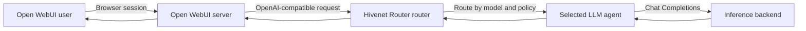

Open WebUI provides a browser-based chat interface for models served through Hivenet Router.

It connects through the OpenAI Chat Completions API:

```text
GET  /v1/models
POST /v1/chat/completions
```

Hivenet Router authenticates the shared client credential, applies model access and quotas, selects an eligible `llm` agent, and forwards the request to its inference backend.



<Warning>
  Configure the connection to use **Chat Completions**.

  Hivenet Router does not currently expose the OpenAI Responses API at:

  ```text
  POST /v1/responses
  ```

  Selecting the experimental Responses connection type in Open WebUI produces requests that Hivenet Router cannot serve.
</Warning>

## Prerequisites

Before connecting Open WebUI, you need:

- a reachable Hivenet Router router
- a Hivenet Router client API key
- at least one healthy agent registered with the `llm` capability
- an OpenAI-compatible inference backend
- a persistent location for Open WebUI data
- HTTPS when users connect over an untrusted network

List the models visible to the intended key:

```bash
curl \
  -H "Authorization: Bearer <hivenet-router-api-key>" \
  https://router.example.com/v1/models \
  | jq -r '.data[] | [
      .id,
      .capability
    ] | @tsv'
```

Use the model IDs exactly as returned.

## Test Hivenet Router first

Send a direct request before adding Open WebUI:

```bash
curl -X POST \
  https://router.example.com/v1/chat/completions \
  -H "Authorization: Bearer <hivenet-router-api-key>" \
  -H "Content-Type: application/json" \
  -d '{
    "model": "<llm-model-id>",
    "messages": [
      {
        "role": "user",
        "content": "Reply with one short sentence."
      }
    ],
    "max_tokens": 64
  }'
```

Then test streaming:

```bash
curl -N -X POST \
  https://router.example.com/v1/chat/completions \
  -H "Authorization: Bearer <hivenet-router-api-key>" \
  -H "Content-Type: application/json" \
  -d '{
    "model": "<llm-model-id>",
    "messages": [
      {
        "role": "user",
        "content": "Count from one to five."
      }
    ],
    "stream": true,
    "max_tokens": 64
  }'
```

Output should arrive incrementally.

A successful direct request confirms:

- the API key is valid
- the key can access the model
- an eligible agent is available
- the backend accepts Chat Completions
- streaming works across the router and agent

## Run Open WebUI

For a shared or persistent deployment, use Docker Compose and pin a specific Open WebUI release.

Create:

```text
docker-compose.yml
```

```yaml
services:
  open-webui:
    image: ghcr.io/open-webui/open-webui:<open-webui-version>
    container_name: open-webui

    ports:
      - "3000:8080"

    environment:
      ENABLE_OLLAMA_API: "False"
      WEBUI_SECRET_KEY: "${WEBUI_SECRET_KEY}"

    volumes:
      - open-webui-data:/app/backend/data

    restart: unless-stopped

volumes:
  open-webui-data:
```

Generate a secret:

```bash
printf \
  'WEBUI_SECRET_KEY=%s\n' \
  "$(openssl rand -hex 32)" \
  > .env

chmod 600 .env
```

Start the service:

```bash
docker compose up -d
```

Open:

```text
http://localhost:3000
```

For a remote deployment, place Open WebUI behind an HTTPS reverse proxy rather than publishing port `3000` directly to the internet.

<Note>
  The persistent volume stores Open WebUI’s database, accounts, chats, uploads, settings, and provider configuration.

  Recreating the container with the same volume preserves that data.
</Note>

## Create the administrator account

The first account created on a fresh Open WebUI installation becomes the administrator.

When additional sign-up is enabled, new accounts use the configured default role. The normal restricted value is:

```text
pending
```

A pending account cannot use the instance until an administrator approves it.

After creating the administrator:

- review whether sign-up should remain enabled
- approve only intended users
- review default user permissions
- keep provider and model administration restricted
- configure SSO when the deployment requires centralized identity management

## Add the Hivenet Router connection

In Open WebUI:

<Steps>
  <Step title="Open the connection settings">
    Go to:

    ```text
    Admin Settings → Connections → OpenAI → Manage
    ```

    Add a new connection.
  </Step>
  <Step title="Select Chat Completions">
    Keep the connection’s API type set to:

    ```text
    Chat Completions
    ```

    Do not select Responses.
  </Step>
  <Step title="Enter the router URL">
    Use the Hivenet Router base URL with `/v1`:

    ```text
    https://router.example.com/v1
    ```

    Do not include the final `/chat/completions` path.
  </Step>
  <Step title="Enter the client API key">
    Enter the raw Hivenet Router client key.

    Open WebUI sends it upstream as:

    ```http
    Authorization: Bearer <hivenet-router-api-key>
    ```
  </Step>
  <Step title="Filter the model list">
    Add the LLM model IDs that should appear in the Open WebUI model selector.

    Use the exact values returned by:

    ```text
    GET /v1/models
    ```
  </Step>
  <Step title="Save and verify">
    Save the connection and confirm that the intended models appear in the chat model selector.
  </Step>
</Steps>

## Base URL

Use:

```text
https://router.example.com/v1
```

Open WebUI appends:

```text
/models
/chat/completions
```

Incorrect:

```text
https://router.example.com
```

Incorrect:

```text
https://router.example.com/v1/chat/completions
```

The first can produce a request to:

```text
/chat/completions
```

The second can produce a duplicated endpoint path.

Both return `404`.

## Docker networking

Inside the Open WebUI container:

```text
localhost
```

refers to the Open WebUI container itself.

It does not refer to the Docker host or Hivenet Router router.

Use an address appropriate to the deployment.

### Router in the same Compose network

```text
http://router:8080/v1
```

where `router` is the Hivenet Router service name.

### Router on the Docker host

```text
http://host.docker.internal:8080/v1
```

On Linux, add the host-gateway mapping when needed:

```yaml
services:
  open-webui:
    extra_hosts:
      - "host.docker.internal:host-gateway"
```

### Router on another machine

```text
https://router.example.com/v1
```

The connection must be reachable from the Open WebUI server, not only from the user’s browser.

## Filter the model IDs

Open WebUI can discover models automatically through:

```text
GET /v1/models
```

The **Model IDs** field acts as a connection-level allowlist.

For example:

```text
code-model-large
chat-model-standard
chat-model-fast
```

Using an explicit filter is recommended for a mixed Hivenet Router fleet.

The Hivenet Router catalog can contain:

- LLM models
- embedding models
- reranking models

Open WebUI’s chat selector should normally contain only models registered with:

```text
capability: llm
```

Otherwise, a user may select an embedding or reranking model and send it to:

```text
/v1/chat/completions
```

No compatible `llm` agent would then be eligible.

<Warning>
  The Open WebUI model filter is a user-interface and connection control.

  It is not the upstream authorization boundary. Configure actual model access on the Hivenet Router API key.
</Warning>

## Model names must match exactly

The ID configured in Open WebUI becomes the request’s top-level model value:

```json
{
  "model": "chat-model-standard"
}
```

Matching is case-sensitive.

These are different:

```text
chat-model-standard
Chat-Model-Standard
chat-model-Standard
```

Compare the configured list with:

```bash
curl \
  -H "Authorization: Bearer <hivenet-router-api-key>" \
  https://router.example.com/v1/models \
  | jq -r '.data[].id'
```

## Use a connection prefix

When several Open WebUI connections contain models with the same ID, add a connection prefix.

For example:

```text
hivenet-router/
```

A model may then appear in Open WebUI as:

```text
hivenet-router/chat-model-standard
```

Open WebUI uses the prefix to distinguish the model in its own interface.

The upstream request still needs to resolve to the exact model ID expected by the configured connection.

Test the resulting request after adding or changing a prefix.

## Test the browser workflow

Select one of the Hivenet Router models and send:

```text
Reply with the word connected.
```

Then test a longer streamed response:

```text
Explain in five short steps how a request reaches an inference backend through Hivenet Router.
```

Confirm that:

- the model appears in the selector
- the response begins streaming
- the expected model is used
- a request appears in Hivenet Router audit data
- the selected agent is healthy
- no unexpected background or fallback provider receives the request

## Shared API-key behavior

An administrator-managed Open WebUI connection is shared by the instance.

Every user who accesses that connection sends requests through the same Hivenet Router client API key.

Hivenet Router therefore sees:

- one tenant owner
- one static key identity or dynamic key ID
- one model-access policy
- shared request-rate quotas
- shared daily token quotas

Open WebUI can distinguish its own users, groups, and chats, but that identity does not automatically become a separate Hivenet Router tenant.

<Warning>
  Open WebUI per-user accounts do not create per-user Hivenet Router quotas.

  A single user can consume part or all of the shared key’s request or token budget unless Open WebUI or another upstream control limits that user separately.
</Warning>

Use separate Open WebUI deployments or separate upstream connections when teams require independent Hivenet Router:

- credentials
- model access
- quotas
- rotation
- audit attribution

## Forwarded user information

Open WebUI can forward headers such as:

```text
X-OpenWebUI-User-Id
X-OpenWebUI-User-Name
X-OpenWebUI-User-Email
X-OpenWebUI-User-Role
X-OpenWebUI-Chat-Id
```

when you enable:

```text
ENABLE_FORWARD_USER_INFO_HEADERS=True
```

By default, these identity values are plain headers. Open WebUI can replace the four `X-OpenWebUI-User-*` headers with a signed JWT when `FORWARD_USER_INFO_HEADER_JWT_SECRET` is configured.

Hivenet Router preserves compatible client headers when forwarding a request to the selected inference backend.

However, Hivenet Router does not currently use these Open WebUI headers for:

- client authentication
- tenant selection
- API-key quotas
- model authorization
- audit tenant identity

The Hivenet Router tenant remains the owner associated with the shared API key.

Do not treat unsigned user-information headers as verified identity unless the receiving service authenticates the source or verifies a signed value.

## Background task requests

Open WebUI can send additional model requests for interface features such as:

- chat-title generation
- tag generation
- follow-up suggestions
- prompt autocomplete
- search-query generation
- context compaction

By default, these tasks may use the current chat model.

This means one visible chat interaction can produce several requests against the same Hivenet Router key and quota budget.

### Use a dedicated task model

Configure a smaller model available through Hivenet Router:

```text
TASK_MODEL_EXTERNAL=chat-model-fast
```

The task model must:

- appear in `/v1/models`
- be permitted by the shared API key
- have a healthy `llm` agent
- support the task request format
- have a declared per-model quota when strict per-model quotas are used

### Disable unnecessary tasks

Selected features can be disabled through the Open WebUI administrator settings or environment configuration:

```text
ENABLE_TITLE_GENERATION=False
ENABLE_TAGS_GENERATION=False
ENABLE_FOLLOW_UP_GENERATION=False
ENABLE_AUTOCOMPLETE_GENERATION=False
```

Do not assume that the number of visible user messages equals the number of requests sent to Hivenet Router.

Check the audit log when usage is higher than expected.

## Tool calling

Current Open WebUI releases use native model tool calling as the default supported mode.

Hivenet Router forwards Chat Completions fields such as:

```json
{
  "tools": [],
  "tool_choice": "auto"
}
```

to the selected backend.

The model and inference engine must return valid OpenAI-format tool calls.

For a vLLM backend, this commonly requires:

```bash
vllm serve <model-source> \
  --enable-auto-tool-choice \
  --tool-call-parser <model-specific-parser> \
  ...
```

Tool support depends on:

- model family
- tool-call parser
- chat template
- backend version
- streaming behavior
- model reliability

A model that generates valid text may still fail to call tools correctly.

### Test native tool use

Attach a harmless tool in Open WebUI, then ask the model to use it.

Confirm that:

1. Open WebUI sends structured tool definitions.
2. The backend returns a structured tool call.
3. Open WebUI runs the tool.
4. The tool result is sent back to the model.
5. The model produces a final response.

Hivenet Router does not convert plain-text descriptions of tool calls into structured tool calls.

## Chat features and endpoint support

| Open WebUI feature | Hivenet Router endpoint | Status |
| --- | --- | --- |
| Model discovery | `GET /v1/models` | Supported |
| Chat | `POST /v1/chat/completions` | Supported |
| Streaming chat | `POST /v1/chat/completions` | Supported |
| Native tool calls | Chat Completions fields | Backend-dependent |
| RAG embeddings | `POST /v1/embeddings` | Supported with configuration |
| External reranking | `POST /v1/rerank` | Supported with compatible request schema |
| Open Responses | `POST /v1/responses` | Not supported |
| Text to speech | `/v1/audio/speech` | Not supported |
| Speech transcription | `/v1/audio/transcriptions` | Not supported |
| Image generation | `/v1/images/generations` | Not supported |

Unsupported Open WebUI features can use separate external services where appropriate.

Do not enable Hivenet Router’s public inference surface to proxy arbitrary backend endpoints merely to satisfy an unrelated Open WebUI feature.

## Use Hivenet Router for RAG embeddings

Open WebUI can send its RAG embedding requests through Hivenet Router.

Configure:

```text
RAG_EMBEDDING_ENGINE=openai
RAG_OPENAI_API_BASE_URL=https://router.example.com/v1
RAG_OPENAI_API_KEY=<hivenet-router-api-key>
RAG_EMBEDDING_MODEL=<embedding-model-id>
```

The embedding model must be registered by an agent with:

```text
capability: embedding
```

The API key must permit both:

- the LLM used for chat
- the embedding model used for retrieval

For example:

```yaml
models:
  - chat-model-standard
  - embedding-model
```

Or with per-model quotas:

```yaml
quota:
  per_model:
    chat-model-standard:
      requests_per_minute_per_replica: 20
      tokens_per_day: 1000000

    embedding-model:
      requests_per_minute_per_replica: 100
      tokens_per_day: 0
```

Hivenet Router currently applies request-rate quotas to embedding requests but does not charge their input against the chat token-per-day budget.

### Test embeddings directly

```bash
curl -X POST \
  https://router.example.com/v1/embeddings \
  -H "Authorization: Bearer <hivenet-router-api-key>" \
  -H "Content-Type: application/json" \
  -d '{
    "model": "<embedding-model-id>",
    "input": [
      "A short document for retrieval."
    ]
  }'
```

Test this path before diagnosing Open WebUI document retrieval.

## Use Hivenet Router for reranking

Configure an external reranker:

```text
RAG_RERANKING_ENGINE=external
RAG_RERANKING_MODEL=<reranker-model-id>
RAG_EXTERNAL_RERANKER_URL=https://router.example.com/v1/rerank
RAG_EXTERNAL_RERANKER_API_KEY=<hivenet-router-api-key>
```

The URL must include the complete endpoint:

```text
/v1/rerank
```

The reranking model must be registered with:

```text
capability: reranker
```

The API key must permit that model.

Test the request shape accepted by both Open WebUI and the selected reranking backend. Hivenet Router forwards the original body and does not translate between incompatible reranking schemas.

## Configuration persistence

Many Open WebUI environment settings are persistent configuration values.

On the first launch, an environment variable can initialize the setting. Open WebUI then stores it in its database.

On later restarts, the stored database value can take precedence over a changed environment variable.

This affects settings such as:

- provider URLs and keys
- model filters
- task models
- feature toggles
- sign-up and role settings

When a changed environment variable appears to have no effect:

1. inspect the value in the administrator interface
2. update the stored setting there
3. confirm that you are using the intended data volume
4. review `ENABLE_PERSISTENT_CONFIG` before changing its behavior

<Warning>
  Setting:

  ```text
  ENABLE_PERSISTENT_CONFIG=False
  ```

  makes environment configuration authoritative but prevents administrator-interface changes from surviving a restart.

  Use it only in an intentionally environment-managed deployment.
</Warning>

## Bootstrap the connection through environment variables

For a simple one-connection deployment, you can seed the Hivenet Router connection when Open WebUI starts:

```yaml
services:
  open-webui:
    image: ghcr.io/open-webui/open-webui:<open-webui-version>

    environment:
      OPENAI_API_BASE_URL: "https://router.example.com/v1"
      OPENAI_API_KEY: "${HIVENET_ROUTER_API_KEY}"
      ENABLE_OLLAMA_API: "False"
      WEBUI_SECRET_KEY: "${WEBUI_SECRET_KEY}"
```

Store the raw key outside the Compose file:

```text
HIVENET_ROUTER_API_KEY=<hivenet-router-api-key>
```

Protect the environment file:

```bash
chmod 600 .env
```

The administrator interface remains the clearer approach when connections are expected to change interactively.

## Timeouts

Open WebUI and Hivenet Router enforce separate timeouts.

Hivenet Router’s default request timeout is:

```text
60 seconds
```

Long chats, cold model starts, large prompts, and queued requests may exceed it.

Increase the router deadline when representative requests genuinely need more time:

```bash
./bin/hivenet-router \
  --request-timeout 5m \
  ...
```

Open WebUI cannot extend a shorter deadline already enforced by Hivenet Router.

For model-list loading, Open WebUI also has a separate timeout:

```text
AIOHTTP_CLIENT_TIMEOUT_MODEL_LIST
```

Increase it when a distant or slow router causes model discovery to fail.

## Streaming and reverse proxies

The complete response path must preserve server-sent events:

```text
Browser
  → Open WebUI
  → Hivenet Router reverse proxy
  → Hivenet Router router
  → agent
  → inference backend
```

When the response appears only after generation finishes, check:

- backend streaming
- response `Content-Type`
- Hivenet Router agent version
- proxy buffering
- proxy read and idle timeouts
- Open WebUI upstream timeouts
- Hivenet Router request timeout

For Nginx in front of Hivenet Router, the inference route commonly needs:

```nginx
proxy_buffering off;
proxy_cache off;
```

## Access control

Open WebUI can control which users and groups can access its models and features.

Use Open WebUI access control for:

- model visibility in the interface
- group-based access
- chat and workspace permissions
- tools and knowledge-base access
- user approval

Use Hivenet Router for:

- upstream API authentication
- enforceable model allowlists
- request quotas
- daily token budgets
- tenant attribution
- routing policies

Apply both layers.

An Open WebUI access-control error should not expose a model that the shared Hivenet Router API key itself was never intended to use.

## Security guidance

For a shared deployment:

- place Open WebUI behind HTTPS
- keep it on a private network, VPN, or protected access layer
- keep sign-up disabled except during controlled onboarding
- leave new users pending until approved
- use a dedicated Hivenet Router key
- restrict that key to the required models
- do not use a Hivenet Router administrator key
- keep Open WebUI’s arbitrary OpenAI passthrough disabled
- review tools, functions, web search, code execution, and community sharing
- protect and back up the Open WebUI data volume
- treat the volume as sensitive
- use a pinned Open WebUI release for shared or production deployments

Open WebUI is a substantial application with its own authentication, storage, tool, retrieval, and network surfaces.

Connecting it to a private Hivenet Router router does not automatically make every optional Open WebUI feature private or offline.

## Back up before upgrading

Back up the data volume:

```bash
docker run --rm \
  -v open-webui-data:/data \
  -v "$PWD":/backup \
  alpine \
  tar czf \
  "/backup/open-webui-$(date +%Y%m%d).tar.gz" \
  /data
```

Then update the pinned image version:

```yaml
image: ghcr.io/open-webui/open-webui:<new-version>
```

Pull and recreate:

```bash
docker compose pull
docker compose up -d
```

Open WebUI may run database migrations during startup.

A container rollback does not reverse a database migration. Restore the pre-upgrade backup when an older image cannot read the migrated database.

## Observe Open WebUI traffic

Give the shared connection a dedicated Hivenet Router key:

```yaml
metadata:
  name: "Open WebUI"
  owner: "open-webui"
```

Search its audit records:

```logql
{
  job="hivenet-router",
  log_type="audit",
  tenant_id="open-webui"
}
  | json
```

Request rate by model:

```promql
sum by (model) (
  rate(
    hivenet_routing_requests_routed_total{
      tenant_id="open-webui"
    }[5m]
  )
)
```

Failed requests:

```promql
sum by (model) (
  rate(
    hivenet_tenant_requests_failed_total{
      tenant_id="open-webui"
    }[5m]
  )
)
```

Compare the audit records with visible user actions to identify background title, tag, follow-up, autocomplete, or retrieval traffic.

## Troubleshooting

<AccordionGroup>
  <Accordion title="The connection verification fails">
    Test the same URL and key directly:

    ```bash
    curl \
      -H "Authorization: Bearer <hivenet-router-api-key>" \
      https://router.example.com/v1/models
    ```

    Check:

    - URL ends in `/v1`
    - API key is the raw client credential
    - Open WebUI can reach the router
    - TLS certificates are trusted
    - the router has registered agents
    - a reverse proxy preserves `Authorization`
  </Accordion>

  <Accordion title="The model selector is empty">
    Check the live catalog:

    ```bash
    curl \
      -H "Authorization: Bearer <hivenet-router-api-key>" \
      https://router.example.com/v1/models \
      | jq .
    ```

    Then add exact LLM IDs to the connection’s **Model IDs** filter.

    Also check whether:

    - the API key hides the models
    - strict per-model quotas omit them
    - the model-list timeout is too short
    - the saved connection is disabled
    - persistent configuration contains an older URL or key
  </Accordion>

  <Accordion title="An embedding model appears in the chat selector">
    Limit the connection’s Model IDs to `llm` models.

    Configure embeddings separately through the RAG settings.
  </Accordion>

  <Accordion title="Chat requests go to `/v1/responses`">
    The connection uses the wrong API type.

    Edit it and select:

    ```text
    Chat Completions
    ```

    Hivenet Router does not support `/v1/responses`.
  </Accordion>

  <Accordion title="Requests return `401 Unauthorized`">
    Confirm that Open WebUI stores the raw Hivenet Router client key.

    Do not use:

    - the key hash from `auth.yaml`
    - an administrator key
    - the agent JWT secret

    Test the raw value directly with `/v1/models`.
  </Accordion>

  <Accordion title="Hivenet Router returns `model_forbidden`">
    The shared key’s explicit allowlist does not include the selected model.

    Add the exact model ID to the key or remove the model from Open WebUI.
  </Accordion>

  <Accordion title="Hivenet Router returns `429` for an apparently permitted model">
    The key probably uses `quota.per_model`, and the selected model has no entry.

    Every model used for chat, tasks, embeddings, or reranking needs its own per-model quota entry.
  </Accordion>

  <Accordion title="Hivenet Router returns `no_agents_available`">
    Check:

    - selected model ID
    - `llm` capability
    - agent health
    - routing policy
    - model availability
    - static metadata matches

    An embedding or reranking agent cannot serve a Chat Completions request.
  </Accordion>

  <Accordion title="There are more requests than user messages">
    Open WebUI background tasks are using the shared model.

    Check:

    - title generation
    - tag generation
    - follow-up generation
    - autocomplete
    - retrieval-query generation
    - context compaction

    Set `TASK_MODEL_EXTERNAL` or disable unnecessary features.
  </Accordion>

  <Accordion title="Text works but tools fail">
    Check that:

    - the model supports native function calling
    - the backend accepts `tools` and `tool_choice`
    - the correct tool-call parser is enabled
    - the chat template supports tools
    - the response contains structured `tool_calls`
    - the user has access to the attached Open WebUI tool

    Inspect the backend log first.
  </Accordion>

  <Accordion title="Streaming arrives all at once">
    Test streaming directly against Hivenet Router.

    If direct streaming works, inspect:

    - the proxy in front of Hivenet Router
    - Open WebUI’s upstream connection
    - browser-to-Open-WebUI proxy settings
    - response buffering
    - read and idle timeouts
  </Accordion>

  <Accordion title="The router is on the host but cannot be reached">
    Do not use:

    ```text
    http://localhost:8080/v1
    ```

    from inside the container.

    Use:

    ```text
    http://host.docker.internal:8080/v1
    ```

    and add a Linux host-gateway mapping when required.
  </Accordion>

  <Accordion title="Environment changes do not apply">
    Open WebUI may be using the value persisted in its database.

    Update it through the administrator settings or review the persistent-configuration behavior.
  </Accordion>

  <Accordion title="Sign-in state is lost after recreating the container">
    Confirm that:

    - `/app/backend/data` uses a persistent volume
    - the same volume is mounted after recreation
    - `WEBUI_SECRET_KEY` has not changed

    Changing the secret invalidates existing sessions.
  </Accordion>

  <Accordion title="Open WebUI stops after an upgrade">
    Inspect:

    ```bash
    docker compose logs open-webui \
      | tail -200
    ```

    Look for:

    - database migration errors
    - invalid persistent configuration
    - volume permission problems
    - incompatible environment variables
    - frontend cache problems

    Restore the pre-upgrade volume backup when rollback requires the previous database state.
  </Accordion>
</AccordionGroup>

## Next steps

<Columns cols={3}>
  <Card title="Use from code" icon="code-branch" href="/integrations/use-from-code">
    Call Hivenet Router from curl, Python, JavaScript, SDKs, and services.
  </Card>

  <Card title="Chat completions and messages" icon="messages" href="/use-the-api/chat-completions">
    Review Chat Completions forwarding, streaming, headers, and errors.
  </Card>

  <Card title="Embeddings" icon="vector-square" href="/use-the-api/embeddings">
    Configure a Hivenet Router embedding model for Open WebUI retrieval.
  </Card>

  <Card title="Reranking" icon="arrow-down-wide-short" href="/use-the-api/reranking">
    Connect an external reranking model to the retrieval pipeline.
  </Card>

  <Card title="API keys" icon="key" href="/security/api-keys">
    Configure the shared model access, quotas, expiration, and rotation.
  </Card>

  <Card title="Audit logging" icon="clipboard-list" href="/observability/audit-logging">
    Investigate user-facing and background requests through structured records.
  </Card>
</Columns>