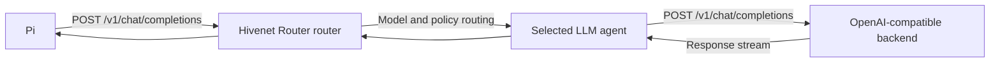

Pi can use Hivenet Router as a custom OpenAI-compatible model provider.

Pi sends requests to:

```text
POST /v1/chat/completions
```

Hivenet Router authenticates the request, checks model access and quotas, selects an eligible `llm` agent, and forwards the request to its inference backend.



<Warning>
  Pi’s built-in tools can read, create, edit, and delete files and run shell commands with the permissions of the operating-system user that started Pi.

  Pi does not provide a built-in approval system or security sandbox. Use a dedicated account, container, virtual machine, or another execution boundary when the project or environment requires stronger isolation.
</Warning>

## Prerequisites

Before configuring Pi, you need:

- Node.js `22.19.0` or later
- a reachable Hivenet Router router
- a Hivenet Router client API key
- at least one healthy agent registered with the `llm` capability
- an inference backend that supports OpenAI Chat Completions
- a model that can produce reliable structured tool calls
- HTTPS when the router is reached over an untrusted network

Check Node.js:

```bash
node --version
```

List the models available to the intended client key:

```bash
curl \
  -H "Authorization: Bearer <hivenet-router-api-key>" \
  https://router.example.com/v1/models \
  | jq -r '.data[].id'
```

Use one of the returned model IDs exactly as shown.

## Prepare the inference backend

Pi can answer text prompts through any compatible chat model.

For coding work, the selected model and inference engine must also support structured tool calls for operations such as:

- reading files
- editing and creating files
- running shell commands
- searching the project
- invoking extension-provided tools

For vLLM, automatic tool calling normally requires:

```bash
vllm serve <model-source> \
  --host 0.0.0.0 \
  --port 8888 \
  --served-model-name hivenet-router-code-model \
  --enable-auto-tool-choice \
  --tool-call-parser <model-specific-parser>
```

Replace:

```text
<model-source>
```

with the model being served.

Replace:

```text
<model-specific-parser>
```

with the parser supported by that model family.

Some models also require a tool-compatible chat template.

<Note>
  Tool-call parsers are model-specific.

  Do not copy a parser from another model family without checking the inference-engine documentation and testing the complete tool loop.
</Note>

Register the same public model ID with the Hivenet Router agent:

```bash
./bin/hivenet-agent \
  --engine vllm \
  --backend-url http://localhost:8888 \
  --model hivenet-router-code-model \
  --router-grpc <router-host>:50051 \
  --jwt-secret-file /etc/hivenet-router/jwt.secret
```

The model ID must match across:

- the backend’s served-model name
- the Hivenet Router agent registration
- Pi’s `models.json`
- the client API key’s model restrictions
- any per-model quota entry

## Test Hivenet Router directly

Before configuring Pi, test the complete Hivenet Router request path:

```bash
curl -X POST \
  https://router.example.com/v1/chat/completions \
  -H "Authorization: Bearer <hivenet-router-api-key>" \
  -H "Content-Type: application/json" \
  -d '{
    "model": "hivenet-router-code-model",
    "messages": [
      {
        "role": "user",
        "content": "Reply with one short sentence."
      }
    ],
    "max_tokens": 64
  }'
```

Then test streaming:

```bash
curl -N -X POST \
  https://router.example.com/v1/chat/completions \
  -H "Authorization: Bearer <hivenet-router-api-key>" \
  -H "Content-Type: application/json" \
  -d '{
    "model": "hivenet-router-code-model",
    "messages": [
      {
        "role": "user",
        "content": "Count from one to five."
      }
    ],
    "stream": true,
    "max_tokens": 64
  }'
```

Output should arrive incrementally.

A successful direct request confirms:

- the client key is valid
- the key can access the model
- an eligible agent is available
- the backend accepts Chat Completions
- the router and agent can preserve streaming

## Install Pi

<Tabs>
  <Tab title="npm">
    ```bash
    npm install -g \
      --ignore-scripts \
      @earendil-works/pi-coding-agent
    ```
  </Tab>
  <Tab title="Installer">
    ```bash
    curl -fsSL https://pi.dev/install.sh \
      | sh
    ```
  </Tab>
</Tabs>

Verify the installation:

```bash
pi --version
```

Use a current release unless you have confirmed a specific compatibility regression.

## Configure Hivenet Router as a provider

Pi reads custom providers and models from:

```text
~/.pi/agent/models.json
```

Create the directory:

```bash
mkdir -p \
  ~/.pi/agent
```

Create the configuration:

```json
{
  "providers": {
    "hivenet-router": {
      "baseUrl": "https://router.example.com/v1",
      "api": "openai-completions",
      "authHeader": true,
      "apiKey": "$HIVENET_ROUTER_API_KEY",

      "models": [
        {
          "id": "hivenet-router-code-model",
          "name": "Hivenet Router code model",
          "reasoning": false,
          "input": [
            "text"
          ],
          "contextWindow": 32768,
          "maxTokens": 4096,
          "cost": {
            "input": 0,
            "output": 0,
            "cacheRead": 0,
            "cacheWrite": 0
          }
        }
      ]
    }
  }
}
```

Replace:

- `https://router.example.com` with the router address
- `hivenet-router-code-model` with an exact model ID from `/v1/models`
- `contextWindow` with the usable context size
- `maxTokens` with the supported maximum output

## Set the API key

Export the raw Hivenet Router client key:

```bash
export HIVENET_ROUTER_API_KEY="<hivenet-router-api-key>"
```

Verify that the variable is present without printing it:

```bash
test -n "$HIVENET_ROUTER_API_KEY" \
  && echo "HIVENET_ROUTER_API_KEY is set"
```

The configuration value:

```json
"apiKey": "$HIVENET_ROUTER_API_KEY"
```

resolves the environment variable when Pi sends a request.

The provider setting:

```json
"authHeader": true
```

makes Pi send the resolved credential as:

```http
Authorization: Bearer <hivenet-router-api-key>
```

Do not put:

- the SHA-256 key hash
- an administrator key
- the agent JWT secret
- a provider fallback key

in this variable.

<Note>
  `HIVENET_ROUTER_API_KEY` is a client-side environment variable chosen for this guide.

  It does not need to follow the case-sensitive `HIVENET_ROUTER_*` convention used by the Hivenet Router process.
</Note>

## Read the key from a command

Pi can resolve a credential by running a shell command:

```json
{
  "apiKey": "!op read 'op://Infrastructure/Hivenet Router API key/credential'"
}
```

or:

```json
{
  "apiKey": "!pass show services/hivenet-router/pi"
}
```

The command must print only the raw API key to standard output.

Pi resolves command-backed values when a request is sent. It does not add its own caching, stale-value reuse, or retry policy for arbitrary credential commands.

Use a wrapper script when the secret command needs:

- caching
- a timeout
- fallback behavior
- refresh logic
- custom error handling

## Understand the provider fields

### Provider ID

```json
"providers": {
  "hivenet-router": {}
}
```

`hivenet-router` is Pi’s local provider ID.

It is used by:

```bash
pi --provider hivenet-router
```

and by full model references such as:

```text
hivenet-router/hivenet-router-code-model
```

The provider ID does not need to match a router, tenant, or organization name.

### Base URL

Use:

```json
"baseUrl": "https://router.example.com/v1"
```

The URL must include:

```text
/v1
```

but must not include the final endpoint.

Correct:

```text
https://router.example.com/v1
```

Incorrect:

```text
https://router.example.com
```

Incorrect:

```text
https://router.example.com/v1/chat/completions
```

Pi appends:

```text
/chat/completions
```

to the configured URL.

### API type

Use:

```json
"api": "openai-completions"
```

This selects OpenAI Chat Completions.

Do not use:

```json
"api": "openai-responses"
```

Hivenet Router does not currently expose:

```text
POST /v1/responses
```

### Bearer authentication

Use:

```json
"authHeader": true
```

Pi then sends the resolved `apiKey` value in the standard bearer header Hivenet Router accepts. Without this setting, a custom provider can resolve the key without attaching it as `Authorization: Bearer`.

### Model ID

```json
"id": "hivenet-router-code-model"
```

Pi sends this value unchanged:

```json
{
  "model": "hivenet-router-code-model"
}
```

It must match the model registered by the Hivenet Router agent.

Model IDs are case-sensitive.

### Display name

```json
"name": "Hivenet Router code model"
```

This is the human-readable label shown as secondary model information.

The model picker and status display still identify the model primarily by its configured `id`.

### Context window

```json
"contextWindow": 32768
```

This tells Pi how much conversation context the model can accept.

Use the effective context limit of the deployed backend, not only the theoretical limit of the underlying model.

For example, a model repository may support 128,000 tokens while the backend is started with:

```bash
--max-model-len 32768
```

In that deployment, configure:

```json
"contextWindow": 32768
```

An accurate value helps Pi compact the conversation before the backend rejects it.

### Maximum output

```json
"maxTokens": 4096
```

This is the largest output Pi should request.

The prompt and requested output must fit inside the backend context limit.

Use a value that leaves enough room for:

- project instructions
- conversation history
- tool definitions
- tool results
- the current prompt

### Cost

```json
"cost": {
  "input": 0,
  "output": 0,
  "cacheRead": 0,
  "cacheWrite": 0
}
```

Pi uses these values for its local cost display.

They do not affect Hivenet Router billing, quotas, or routing.

For a self-hosted deployment, zero values are reasonable unless you maintain your own internal per-token cost model.

## Add several models

Add every model that should appear in Pi:

```json
{
  "providers": {
    "hivenet-router": {
      "baseUrl": "https://router.example.com/v1",
      "api": "openai-completions",
      "authHeader": true,
      "apiKey": "$HIVENET_ROUTER_API_KEY",

      "models": [
        {
          "id": "code-model-large",
          "name": "Code model, large",
          "reasoning": false,
          "contextWindow": 131072,
          "maxTokens": 8192
        },
        {
          "id": "code-model-fast",
          "name": "Code model, fast",
          "reasoning": false,
          "contextWindow": 32768,
          "maxTokens": 4096
        }
      ]
    }
  }
}
```

Each ID must appear in the live Hivenet Router model catalog for the Pi API key:

```bash
curl -s \
  -H "Authorization: Bearer $HIVENET_ROUTER_API_KEY" \
  https://router.example.com/v1/models \
  | jq -r '.data[].id'
```

A model may remain configured in Pi while temporarily unavailable in Hivenet Router. Selecting it then produces the relevant model or availability error.

## Configure the default model

Pi’s global settings file is:

```text
~/.pi/agent/settings.json
```

Set the default provider and model:

```json
{
  "defaultProvider": "hivenet-router",
  "defaultModel": "hivenet-router-code-model"
}
```

Project-specific settings can live in:

```text
.pi/settings.json
```

Project settings override conflicting global values.

For example:

```json
{
  "defaultProvider": "hivenet-router",
  "defaultModel": "code-model-large"
}
```

<Warning>
  Do not put the raw Hivenet Router API key in a project settings file.

  A project-level `.pi/settings.json` may be committed to source control. Keep the credential in an environment variable, protected secret file, or credential command.
</Warning>

## Review compatibility only when needed

The minimal configuration should be the starting point.

Pi also supports compatibility overrides for OpenAI-compatible backends:

```json
{
  "compat": {
    "supportsDeveloperRole": false,
    "supportsReasoningEffort": false,
    "supportsUsageInStreaming": false,
    "maxTokensField": "max_tokens"
  }
}
```

Do not add all four automatically.

Use only the fields required by the deployed model, chat template, and backend version.

### Developer role

Set:

```json
"supportsDeveloperRole": false
```

when the backend rejects:

```text
role: developer
```

Pi then sends its instruction message with:

```text
role: system
```

This is most likely to matter for reasoning models or chat templates that accept only:

```text
system
user
assistant
tool
```

### Reasoning effort

Set:

```json
"supportsReasoningEffort": false
```

when the backend rejects:

```text
reasoning_effort
```

Current vLLM versions support `reasoning_effort` for several reasoning-model integrations, so disabling it unconditionally can remove a feature that the deployment supports.

### Output-token field

Set:

```json
"maxTokensField": "max_tokens"
```

when the backend rejects:

```text
max_completion_tokens
```

Current vLLM accepts both fields. Older or partially compatible servers may accept only `max_tokens`.

### Streaming usage

Set:

```json
"supportsUsageInStreaming": false
```

when the backend rejects:

```json
{
  "stream_options": {
    "include_usage": true
  }
}
```

When usage is unavailable, Hivenet Router may need to estimate tokens instead of using the backend’s exact final usage values.

## Configure a model-specific override

Compatibility may differ between models served by the same provider.

Put the override on one model:

```json
{
  "providers": {
    "hivenet-router": {
      "baseUrl": "https://router.example.com/v1",
      "api": "openai-completions",
      "authHeader": true,
      "apiKey": "$HIVENET_ROUTER_API_KEY",

      "models": [
        {
          "id": "legacy-code-model",
          "reasoning": false,
          "contextWindow": 32768,
          "maxTokens": 4096,

          "compat": {
            "supportsDeveloperRole": false,
            "maxTokensField": "max_tokens"
          }
        },
        {
          "id": "current-code-model",
          "reasoning": true,
          "contextWindow": 131072,
          "maxTokens": 8192
        }
      ]
    }
  }
}
```

This avoids reducing the capabilities of every model because one backend has a compatibility limitation.

## Configure reasoning models

Set:

```json
"reasoning": true
```

only when the model and backend expose reasoning in a format Pi understands.

For example:

```json
{
  "id": "reasoning-code-model",
  "reasoning": true,
  "contextWindow": 131072,
  "maxTokens": 16384
}
```

Pi also supports model-specific thinking-level mappings and compatibility formats.

The appropriate configuration depends on:

- model family
- reasoning parser
- chat template
- vLLM version
- whether the server expects `reasoning_effort`
- whether it expects `enable_thinking`
- how reasoning is represented in streamed responses

Establish basic chat and tool compatibility before enabling reasoning controls.

<Note>
  A model being described as a reasoning model does not prove that its tool calls work reliably while reasoning is enabled.

  Test reasoning and tool use together.
</Note>

## Reload model configuration

Pi reloads:

```text
~/.pi/agent/models.json
```

when you open:

```text
/model
```

You can edit the file while Pi is running, then reopen the model picker.

A complete application restart is normally unnecessary for model-list changes.

## Verify the provider

List models matching the provider:

```bash
pi --list-models hivenet-router
```

A result may include:

```text
hivenet-router/hivenet-router-code-model
```

If the model does not appear, check that:

- `models.json` is valid
- the provider contains `baseUrl` and `api`
- the API key can be resolved
- the model entry has an `id`
- the expected Pi configuration directory is in use

The default configuration directory is:

```text
~/.pi/agent
```

It can be changed with:

```bash
export PI_CODING_AGENT_DIR=/custom/pi/config
```

When this is set, Pi reads:

```text
/custom/pi/config/models.json
/custom/pi/config/settings.json
```

## Start Pi

Run Pi in the project directory:

```bash
pi
```

Open the model picker:

```text
/model
```

Select:

```text
hivenet-router/hivenet-router-code-model
```

You can also choose the model from the command line:

```bash
pi \
  --model hivenet-router/hivenet-router-code-model
```

Or specify provider and model separately:

```bash
pi \
  --provider hivenet-router \
  --model hivenet-router-code-model
```

For a non-interactive smoke test:

```bash
pi \
  --model hivenet-router/hivenet-router-code-model \
  -p \
  "Reply with the word connected."
```

## Begin with a read-only test

Pi does not ask for confirmation before using its tools.

For the first integration test, limit the available tools:

```bash
pi \
  --model hivenet-router/hivenet-router-code-model \
  --tools read,grep,find,ls \
  -p \
  "Inspect this project and summarize its structure."
```

This verifies:

- structured tool calling
- tool-result handling
- multi-step model behavior
- project access

without enabling edits or shell execution.

## Test the complete tool loop

After the read-only test succeeds, start Pi normally in a disposable directory:

```bash
mkdir -p \
  /tmp/hivenet-router-pi-test

cd \
  /tmp/hivenet-router-pi-test

pi \
  --model hivenet-router/hivenet-router-code-model
```

Ask:

```text
Create a file named connected.txt containing the word connected, then read it back to me.
```

Confirm that Pi:

1. receives a structured tool call from the model
2. invokes the file tool
3. returns the tool result to the model
4. reads the file
5. completes the task without inventing the result

Remove the directory afterward:

```bash
rm -rf \
  /tmp/hivenet-router-pi-test
```

Text generation can work while tool calling remains broken. The complete loop is the meaningful compatibility test.

## Streaming

Pi’s OpenAI-compatible provider consumes streamed Chat Completions responses.

The complete path must preserve server-sent events:

```text
Pi
  → reverse proxy
  → Hivenet Router router
  → Hivenet Router agent
  → inference backend
```

When output arrives only after generation finishes, check:

- whether the backend streams
- whether the response is `text/event-stream`
- whether the reverse proxy buffers responses
- whether proxy timeouts are long enough
- whether the agent is current

For Nginx, the inference route commonly needs:

```nginx
proxy_buffering off;
proxy_cache off;
```

## Request timeout

Hivenet Router’s default request timeout is:

```text
60 seconds
```

Long coding requests may exceed it because they can include:

- large system instructions
- many tool definitions
- long project context
- slow model startup
- large requested outputs
- backend queueing

Increase it when representative requests need more time:

```bash
./bin/hivenet-router \
  --request-timeout 5m \
  ...
```

The client cannot extend a shorter deadline enforced by the router.

Avoid increasing the timeout before checking whether the backend is healthy and making progress.

## Model access and quotas

Pi requests use the same Hivenet Router controls as other clients.

The API key may be subject to:

- model allowlists
- strict per-model quota enumeration
- request-rate limits
- daily token budgets
- expiration
- routing policies
- provider fallback

For several Pi models, include each one in the key configuration.

For example:

```yaml
models:
  - code-model-large
  - code-model-fast
```

or:

```yaml
quota:
  per_model:
    code-model-large:
      requests_per_minute_per_replica: 10
      tokens_per_day: 1000000

    code-model-fast:
      requests_per_minute_per_replica: 30
      tokens_per_day: 250000
```

Use a dedicated Pi client key when you need independent:

- revocation
- rotation
- model access
- quotas
- audit attribution

## Restricted-egress environments

Pi performs some startup network operations independently of model inference.

Disable install and update telemetry:

```bash
export PI_TELEMETRY=0
```

Disable only the version check:

```bash
export PI_SKIP_VERSION_CHECK=1
```

Disable Pi’s startup network operations:

```bash
export PI_OFFLINE=1
```

You can also start one session with:

```bash
pi --offline
```

Offline mode disables Pi’s startup update, package-update, and telemetry requests. It does not prevent the selected model provider from calling the configured Hivenet Router router.

Network policy remains the authoritative control for:

- model traffic
- extensions
- packages
- external tools
- shell commands
- session sharing

## Session sharing

Pi’s:

```text
/share
```

command uploads the current session as a private GitHub gist.

Do not use it when a session may contain:

- private source code
- credentials
- customer data
- internal prompts or documents
- security findings
- regulated information

The command is explicit rather than automatic, but Pi does not provide an internal policy control that prevents a user or extension from invoking external network operations.

Use network restrictions and organizational controls where sharing must be prohibited.

## Extensions and packages

Pi can load extensions, skills, prompt templates, and packages.

These can change:

- available tools
- model behavior
- project instructions
- network access
- command execution
- session handling

Third-party extensions execute with the same system access as Pi.

Review their source and provenance before installation.

For a minimal Hivenet Router integration test, begin without third-party extensions and add them only after the model, tools, and router path work correctly.

## Observe Pi traffic

Give Pi its own client key and owner:

```yaml
metadata:
  name: "Pi development"
  owner: "pi-development"
```

Search its audit records in Loki:

```logql
{
  job="hivenet-router",
  log_type="audit",
  tenant_id="pi-development"
}
  | json
```

Request rate by model:

```promql
sum by (tenant_id, model) (
  rate(
    hivenet_router_routing_requests_routed_total[5m]
  )
)
```

Failed requests:

```promql
sum by (tenant_id, model) (
  rate(
    hivenet_router_tenant_requests_failed_total[5m]
  )
)
```

Use the request or trace ID from an audit record to investigate one failed tool or inference step.

## Troubleshooting

### The provider or model does not appear

Check the configuration file:

```bash
jq . \
  ~/.pi/agent/models.json
```

List matching models:

```bash
pi --list-models hivenet-router
```

Check that:

- the file is in the active Pi configuration directory
- `providers.hivenet-router` exists
- `baseUrl` ends in `/v1`
- `api` is `openai-completions`
- `authHeader` is `true`
- `models` contains at least one entry
- each model has an `id`
- the API-key value can be resolved

Open `/model` again after editing the file.

### Pi reports that no API key is available

Check the variable:

```bash
test -n "$HIVENET_ROUTER_API_KEY" \
  && echo set \
  || echo missing
```

The configuration must include the `$`:

```json
"apiKey": "$HIVENET_ROUTER_API_KEY"
```

This is a literal string rather than environment interpolation:

```json
"apiKey": "HIVENET_ROUTER_API_KEY"
```

### Hivenet Router returns `401 Unauthorized`

Check that:

- the variable contains the raw client key
- the key has not expired
- the key belongs to client authentication
- the variable reached the Pi process

Test the same value directly:

```bash
curl \
  -H "Authorization: Bearer $HIVENET_ROUTER_API_KEY" \
  https://router.example.com/v1/models
```

### Requests return a plain `404`

Check the base URL.

It should be:

```text
https://router.example.com/v1
```

not:

```text
https://router.example.com
```

and not:

```text
https://router.example.com/v1/chat/completions
```

Also confirm that the provider uses:

```json
"api": "openai-completions"
```

rather than `openai-responses`.

### Hivenet Router returns `model_not_found`

Compare Pi’s configuration with the live catalog:

```bash
pi --list-models hivenet-router
```

```bash
curl \
  -H "Authorization: Bearer $HIVENET_ROUTER_API_KEY" \
  https://router.example.com/v1/models \
  | jq -r '.data[].id'
```

Check:

- capitalization
- punctuation and slashes
- backend served-model name
- agent registration
- key model access
- agent health

### Text works but tools do not

Check that:

- the model supports tool calling
- the backend uses a model-appropriate tool parser
- vLLM was started with `--enable-auto-tool-choice`
- the chat template supports tool and tool-result messages
- the backend returns structured `tool_calls`
- the model follows the schemas reliably

Test the backend directly with a Chat Completions request containing a `tools` array.

Hivenet Router forwards the response. It does not convert plain model text into a structured tool call.

### Tool calls appear as text

The backend parser did not recognize the model’s tool syntax.

Review:

- model family
- tool-call parser
- chat template
- backend version
- streaming tool-call support

Inspect the backend logs first.

### The backend rejects the `developer` role

Add:

```json
"compat": {
  "supportsDeveloperRole": false
}
```

to the provider or affected model.

Open `/model` again to reload the configuration.

### The backend rejects `reasoning_effort`

Add:

```json
"compat": {
  "supportsReasoningEffort": false
}
```

Do this only for models or backends that reject the field.

### The backend rejects `max_completion_tokens`

Add:

```json
"compat": {
  "maxTokensField": "max_tokens"
}
```

Current vLLM supports both fields, but other OpenAI-compatible servers may not.

### Streaming usage causes a validation error

Add:

```json
"compat": {
  "supportsUsageInStreaming": false
}
```

This prevents Pi from requesting the final streaming usage block.

### Pi compacts too early

Increase the configured:

```json
"contextWindow"
```

only when the deployed backend genuinely accepts the larger context.

Check the backend’s effective maximum model length.

### The backend rejects the prompt as too long

Reduce:

- `contextWindow`
- `maxTokens`
- included project context
- requested output

An accurate context configuration lets Pi compact before the request reaches the backend limit.

### Output arrives only after completion

Test streaming directly with curl.

Then check:

- backend SSE behavior
- reverse-proxy buffering
- proxy read and idle timeouts
- Hivenet Router request timeout
- agent logs

### Pi modifies files without asking

This is expected behavior.

Pi does not have a built-in permission-prompt system.

Restart it with restricted tools:

```bash
pi \
  --tools read,grep,find,ls
```

Use a container, virtual machine, or equivalent sandbox when tools need stronger boundaries.

### Requests return `504 request_timeout`

The request exceeded the Hivenet Router deadline.

Check:

- backend readiness
- prompt size
- output size
- engine queue depth
- router-side capacity queueing
- current request timeout

Increase the deadline only after confirming that the backend is progressing normally.

## Read the relevant logs

<Tabs>
  <Tab title="Router">
    ```bash
    docker compose logs router \
      | grep -iE \
        "chat/completions|invalid_parameter|context_length|policy|timeout"
    ```
  </Tab>
  <Tab title="Agent">
    ```bash
    docker compose logs <agent-service> \
      | tail -100
    ```
  </Tab>
  <Tab title="Backend">
    ```bash
    docker compose logs <backend-service> \
      | tail -100
    ```
  </Tab>
</Tabs>

Request-schema, context, chat-template, and tool-parser failures usually appear most clearly in the backend log.

## Next steps

<CardGroup cols={3}>
  <Card title="Open WebUI" href="/integrations/open-web-ui">
    Add a browser-based chat interface backed by Hivenet Router.
  </Card>

  <Card title="Use from code" href="/integrations/use-from-code">
    Call Hivenet Router from SDKs, scripts, and custom applications.
  </Card>

  <Card title="Chat completions and messages" href="/use-the-api/chat-completions">
    Review the supported LLM request paths and streaming behavior.
  </Card>

  <Card title="API keys" href="/security/api-keys">
    Configure model access, quotas, expiration, and rotation.
  </Card>

  <Card title="vLLM agent" href="/deploy/agents/vllm">
    Deploy and register an OpenAI-compatible inference backend.
  </Card>

  <Card title="Audit logging" href="/observability/audit-logging">
    Investigate Pi requests by tenant, model, status, and agent.
  </Card>
</CardGroup>