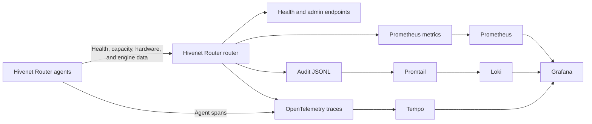

Hivenet Router provides several ways to understand the state of the router, its agents, inference backends, hardware, tenants, and individual requests.

Use:

- health and administration endpoints for the current state
- Prometheus for metrics, trends, and alerts
- Grafana for dashboards and investigation
- structured audit records for request-level history
- OpenTelemetry and Tempo for distributed traces



<Note>
  Prometheus scrapes the router, and Loki receives the router’s audit or application logs through the log pipeline. Tempo can receive spans from both the router and agents.

  None of these services needs to scrape an agent’s HTTP API directly, but agents need network access to the configured OTLP endpoint when agent tracing is enabled.
</Note>

## Choose the right view

| Question | Start here |
| --- | --- |
| Is the router process running? | `GET /health` |
| Are agents connected and healthy? | `GET /admin/health` |
| Which agents can serve each model? | `GET /admin/routing-table` |
| Is traffic increasing or failing? | Prometheus metrics |
| Is one agent under hardware or engine pressure? | Grafana or Prometheus |
| Which tenant or model produced an error? | Audit logs |
| What happened during one request? | Audit logs and Tempo |
| Are quotas close to their limits? | Tenant metrics and dashboards |
| Is a routing policy falling back or exhausting? | Policy metrics and router logs |

## Current router health

The public liveness endpoint is:

```text
GET /health
```

```bash
curl http://localhost:8080/health
```

A healthy router process returns:

```json
{
  "status": "ok"
}
```

This confirms that the HTTP process is responding. It does not confirm that agents or inference backends are available.

For operational status, use:

```text
GET /admin/health
```

```bash
curl \
  -H "Authorization: Bearer <admin-api-key>" \
  http://localhost:8080/admin/health \
  | jq .
```

The response includes information such as:

- total registered agents
- healthy agents
- the current length of the router’s global request channel
- individual agent health

This is an operational summary, not a model-specific readiness or free-capacity check. Use the routing table to inspect each agent’s model, backend health, active requests, and declared capacity.

## Current routing state

Use:

```text
GET /admin/routing-table
```

to inspect the router’s current view of every registered agent.

```bash
curl \
  -H "Authorization: Bearer <admin-api-key>" \
  http://localhost:8080/admin/routing-table \
  | jq '.agents[] | {
      peer_id,
      model: .metadata.model,
      engine: .metadata.engine,
      region: .metadata.region,
      status: .status,
      active_requests: .status.active_requests,
      capacity: .metadata.capacity
    }'
```

Depending on the agent and backend, the routing table can also include:

- tags and hardware metadata
- request and token history
- SRTT and RTTVAR
- GPU, CPU, and memory data
- KV-cache and engine-queue state

The routing table is useful for current diagnosis. Use Prometheus when you need trends, aggregation, or alerts.

## Metrics and alerts

The router exposes Prometheus metrics at:

```text
GET /metrics
```

on port `2112` by default.

```bash
curl http://localhost:2112/metrics
```

The metrics cover:

- registered and healthy agents
- routed and failed requests
- primary, fallback, and exhausted policy steps
- agent capacity and request history
- GPU, CPU, and memory state
- inference-engine cache and queues
- TTFT, ITL, and request-shape histograms
- tenant requests, tokens, quotas, and latency
- router and provider HTTP traffic

See [Prometheus metrics](/observability/prometheus-metrics) for the complete metric groups, PromQL examples, and alert rules.

<Warning>
  The metrics endpoint does not have built-in authentication.

  Keep it on a private network or protect it with firewall or proxy controls.
</Warning>

## Grafana dashboards

The repository’s Docker Compose stack provisions Grafana with data sources for:

- Prometheus
- Loki
- Tempo

It also includes dashboards for:

- router and agent operations
- tenant quotas and usage
- structured audit records

Grafana is available on port `3000` in the default Compose deployment:

```text
http://localhost:3000
```

Use it to correlate:

- routing outcomes
- agent health
- hardware pressure
- backend queues
- token use
- quota failures
- request latency
- audit events

See [Grafana dashboards](/observability/grafana-dashboards) for access, provisioning, variables, and dashboard limitations.

## Audit records

Hivenet Router writes one structured JSON record after each audited HTTP request.

The default path is:

```text
/var/log/hivenet-router/audit.jsonl
```

A record can include:

- request and trace IDs
- tenant and dynamic key IDs
- requested model
- status and error code
- request latency
- input and output tokens
- selected agent or fallback provider
- source IP

The dedicated audit record does not store prompt or response content.

The repository’s Compose stack sends the JSONL records through Promtail to Loki, where they can be searched in Grafana.

See [Audit logging](/observability/audit-logging) for the schema, LogQL examples, retention, and privacy guidance.

## Distributed tracing

Hivenet Router can export OpenTelemetry traces through OTLP.

The Compose stack uses Tempo as the trace backend:

```text
Router and agents → OTLP gRPC → Tempo → Grafana
```

Tracing is useful when metrics show that a problem exists but you need to inspect one request’s path.

A trace can help separate time spent in:

- router processing
- agent communication
- inference
- provider fallback
- other instrumented operations

Audit records include a trace ID when tracing is active. Grafana can use that value to move between Loki records and Tempo traces.

Trace export depends on the router receiving a valid OpenTelemetry endpoint and being able to reach the collector or Tempo service.

## Agent and backend signals

Hivenet Router agents send two broad categories of operational data.

### Universal agent data

This can apply to any backend:

- health
- active requests
- declared capacity
- successful and failed requests
- token counts
- disconnections
- capacity rejections
- SRTT and RTTVAR

### Backend-specific data

Supported engines can also report:

- KV-cache utilization
- running and waiting requests
- preemptions
- TTFT and ITL
- request-size histograms
- finish reasons
- token throughput

See [Engine metrics](/observability/engine-metrics) for backend support and metric behavior.

## Hardware signals

When available, agents report:

- NVIDIA GPU utilization
- VRAM use
- GPU temperature
- GPU power
- host CPU use
- host memory use and availability

The router publishes these values through Prometheus and includes the current snapshot in the administration routing table.

See [Hardware metrics](/observability/hardware-metrics) for collection, multi-GPU behavior, device filtering, and troubleshooting.

## Latency signals

Hivenet Router exposes several latency views that answer different questions.

| Signal | What it measures |
| --- | --- |
| Router HTTP duration | Complete router handling time |
| Tenant request duration | Request duration attributed to a tenant and model |
| Audit `latency_ms` | Completed HTTP-request duration in one audit record |
| SRTT | Smoothed router-to-agent-backend response timing |
| RTTVAR | Variation around the agent’s SRTT |
| TTFT | Time until the inference engine produces its first token |
| ITL | Time between generated output tokens |
| Per-model capacity-queue wait | Time spent waiting for an eligible agent to release a declared capacity slot |

Do not treat these values as interchangeable.

For example, SRTT excludes client-to-router latency, while an audit duration covers the router’s full handling of that request.

See [Latency tracking](/observability/latency-tracking) for the SRTT and RTTVAR calculation and interpretation.

## Observability and routing

Some operational metrics can also act as routing-policy gates.

Hivenet Router can exclude agents based on values such as:

- capacity utilization
- success rate
- SRTT
- KV-cache utilization
- engine queue depth
- TTFT and ITL
- GPU temperature
- GPU and VRAM utilization
- CPU and system-memory use

For example:

```yaml
routing_policy:
  exclude_if:
    kv_cache_utilization:
      gt: 0.9

    gpu_temperature_c:
      gt: 82

    srtt:
      gt: 750

  strategy: least-loaded
```

Monitoring and routing have different purposes:

- dashboards and alerts tell operators when to investigate
- policy gates decide whether an agent should receive one request

Do not assume that an alert threshold should also be a routing threshold.

See [Hardware-aware routing](/observability/hardware-aware-routing) and [Policy gates](/routing/policy-gates).

## Missing and stale data

A missing metric does not necessarily mean zero.

It may mean:

- the backend does not support the metric
- backend metrics are disabled
- no request has produced an observation
- NVML is unavailable
- an agent has not sent its first snapshot
- a scrape has failed

Engine or hardware collection failures can leave the last successful snapshot active while request forwarding continues.

When a value appears suspicious, check:

1. agent heartbeat freshness
2. agent logs
3. the backend metrics endpoint
4. the administration routing table
5. the Prometheus series
6. recent audit records and traces

<Warning>
  Dynamic routing gates generally pass when their metric is unavailable.

  Combine metric gates with stable engine, hardware, or tag matches when the metric must exist.
</Warning>

## Persistence and restarts

Not every observability value has the same persistence behavior.

| Data | Restart behavior |
| --- | --- |
| Current registration, health, hardware, and engine snapshots | Rebuilt after agents reconnect |
| Selected per-agent counters and latency history | Persisted through BadgerDB |
| Prometheus router and HTTP counters | Restart with the router process |
| In-memory request-per-minute quotas | Reset after restart |
| Badger-backed daily token use | Restored when persistence is enabled |
| Dynamic API-key registry | Lost and must be repopulated |
| Audit JSONL files | Remain on the configured filesystem or volume |
| Loki, Prometheus, and Tempo history | Depends on their storage and retention configuration |

Use a persistent agent identity with:

```text
--identity-path
```

when you want Hivenet Router to associate a reconnecting agent with its earlier per-agent history.

## Recommended setup

<Steps>
  <Step title="Protect the administration and metrics surfaces">
    Enable administrator authentication and restrict ports `2112`, `3000`, `3100`, `3200`, and `9090` to trusted networks or operators.
  </Step>
  <Step title="Scrape Prometheus metrics">
    Configure Prometheus to scrape the router’s metrics endpoint.
  </Step>
  <Step title="Open the provisioned dashboards">
    Confirm that Grafana can query Prometheus, Loki, and Tempo.
  </Step>
  <Step title="Verify audit ingestion">
    Send a test request and find its JSON record in the audit file and Loki.
  </Step>
  <Step title="Test trace correlation">
    Find a traced request by its request ID or trace ID and open it in Tempo.
  </Step>
  <Step title="Add alerts from observed baselines">
    Establish normal behavior before defining production thresholds for health, failures, latency, temperature, cache pressure, or quotas.
  </Step>
</Steps>

## Production checklist

Before relying on the observability stack in production:

- protect every operational endpoint
- change default Grafana credentials
- use persistent storage where history must survive restarts
- define Prometheus, Loki, Tempo, and local-log retention
- monitor the observability services themselves
- keep agent identities and metadata stable
- restrict access to tenant and audit information
- test dashboards and alerts during a controlled failure
- document which signals are authoritative for each incident type

## Explore the observability guides

<Columns cols={2}>
  <Card title="Prometheus metrics" icon="chart-line" href="/observability/prometheus-metrics">
    Scrape, query, aggregate, and alert on router, agent, tenant, and backend metrics.
  </Card>

  <Card title="Grafana dashboards" icon="gauge-high" href="/observability/grafana-dashboards">
    Use the provisioned router, tenant, audit, and trace views.
  </Card>

  <Card title="Audit logging" icon="file-lines" href="/observability/audit-logging">
    Search structured request records through JSONL files and Loki.
  </Card>

  <Card title="Hardware metrics" icon="microchip" href="/observability/hardware-metrics">
    Inspect GPU, CPU, memory, temperature, and power data.
  </Card>

  <Card title="Engine metrics" icon="gears" href="/observability/engine-metrics">
    Monitor cache, backend queues, latency, request shape, and throughput.
  </Card>

  <Card title="Latency tracking" icon="stopwatch" href="/observability/latency-tracking">
    Understand SRTT, RTTVAR, TTFT, ITL, and request-duration boundaries.
  </Card>

  <Card title="Hardware-aware routing" icon="route" href="/observability/hardware-aware-routing">
    Turn selected operational signals into routing gates and fallback tiers.
  </Card>
</Columns>