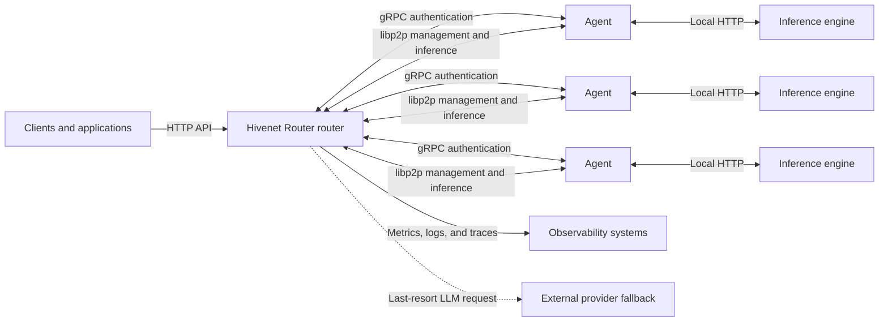
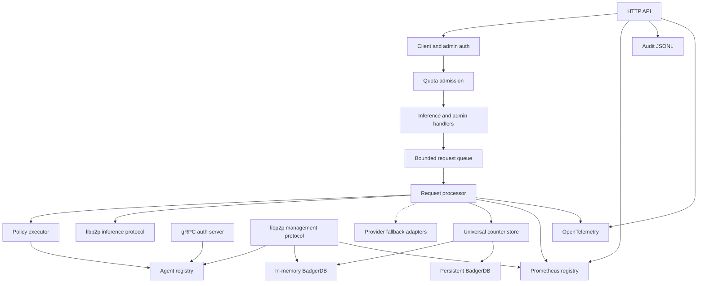
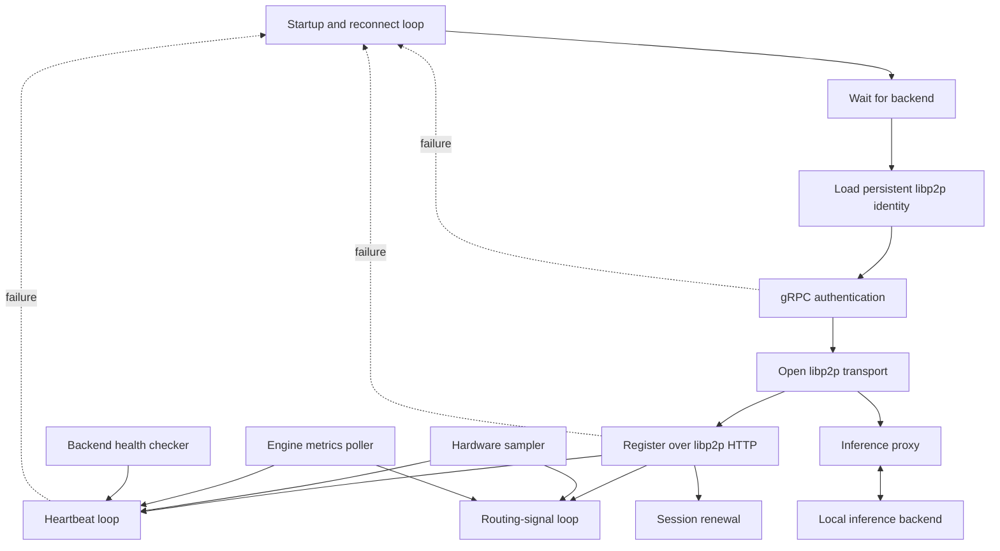
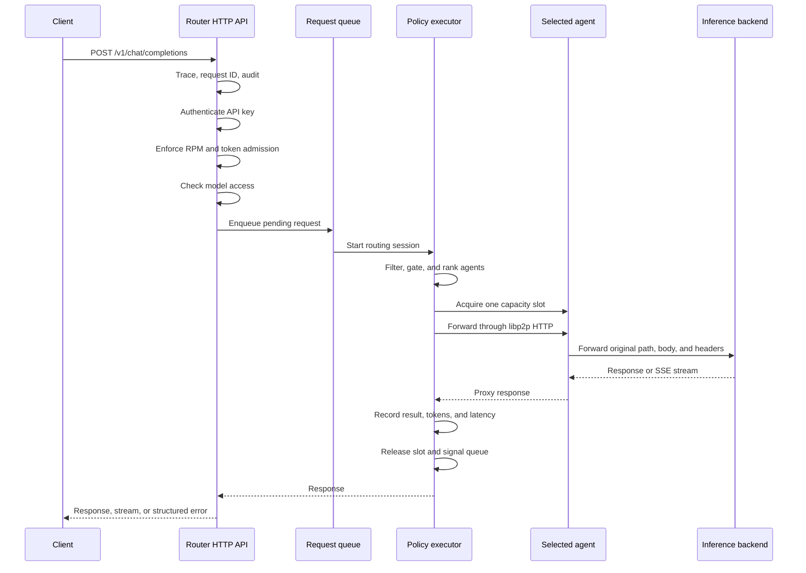
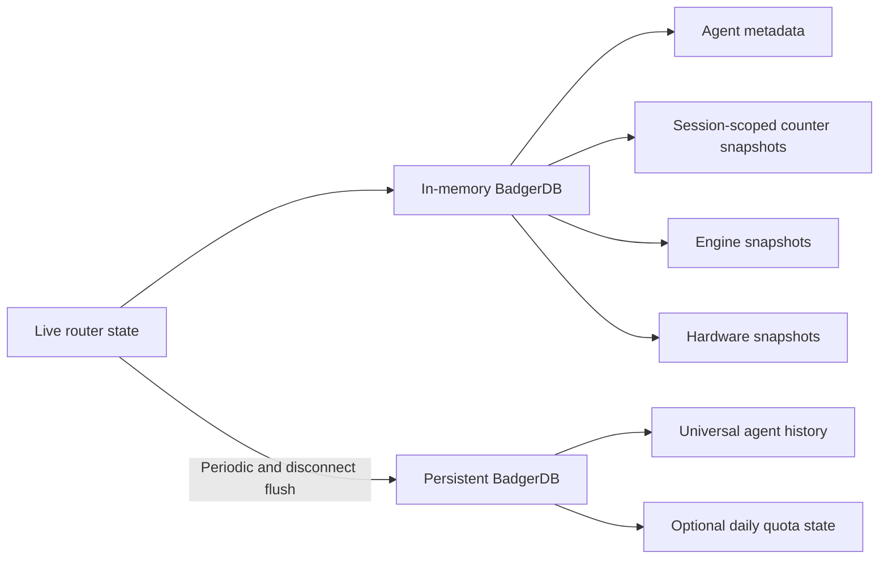

Hivenet Router uses a hub-and-spoke architecture with one router process coordinating one or more inference agents.

The router exposes the client and administration APIs. Agents connect inference engines to the router, advertise their capabilities and capacity, report their health and operational state, and proxy selected requests to their local backends.



For the conceptual view and product boundaries, start with [Architecture overview](/getting-started/architecture-overview).

## Deployment boundary

A Hivenet Router deployment currently consists of:

- one router process
- one or more agent processes
- one inference backend behind each agent
- optional Prometheus, Grafana, Loki, and Tempo services
- optional OpenAI or Anthropic provider fallback

Agents can run:

- on the same machine as the router
- on remote bare-metal or virtual machines
- in containers
- in Kubernetes or another scheduler
- across several infrastructure providers or locations

Hivenet Router does not depend on Kubernetes for registration, discovery, or routing. Agents authenticate and register themselves.

<Warning>
  The current router is a single coordination point.

  Agent state, request queues, routing-policy state, sessions, and dynamic API keys are not replicated between router processes. Running several independent routers does not create one shared active-active routing plane.
</Warning>

## Main network surfaces

The router and agents use separate interfaces for clients, authentication, peer communication, and metrics.

| Surface | Default | Purpose |
| --- | --- | --- |
| Router HTTP API | `:8080` | Client inference, model discovery, health, and administration |
| Router gRPC | `:50051` | Agent authentication and connection bootstrap |
| Router libp2p | TCP `9000` | Agent registration, heartbeats, routing signals, and request forwarding |
| Router Prometheus | `:2112` | Metrics exposition |
| Agent transport | Outbound connection | Agent-initiated libp2p connection used for management and inference traffic |
| Inference backend | Commonly `:8888` | Local model-serving API used by the agent |

The public HTTP server uses plain HTTP by default. Terminate TLS through a reverse proxy or another trusted ingress when clients connect over an untrusted network.

Streaming responses use server-sent events when the backend returns:

```text
Content-Type: text/event-stream
```

HTTP/2 availability depends on the surrounding TLS or proxy deployment. It is not required for Hivenet Router’s streaming path.

### Router libp2p reachability

The router listens on:

```text
127.0.0.1
```

by default for libp2p.

Remote agents require:

```bash
--p2p-listen-addr 0.0.0.0
```

When the router is behind NAT, Docker, or another address translation layer, configure an address agents can actually dial:

```bash
--p2p-announce-addr \
  /dns4/router.example.com/tcp/9000
```

Agents initiate the libp2p connection to the router. An agent behind NAT therefore does not need a public inbound port, fixed listen port, or advertised address.

<Note>
  Using libp2p does not remove the need for network reachability.

  Agent hosts must be able to reach both the router’s gRPC authentication endpoint and the libp2p address returned during authentication.
</Note>

## Router architecture

The router brings several subsystems into one process.



### HTTP API

The Gin HTTP server exposes:

- public liveness at `/health`
- authenticated client routes under `/v1/*`
- separately authenticated operator routes under `/admin/*`

The metrics server is separate and listens on its own port.

### Agent registry

The in-process agent registry indexes live agents:

- by peer ID
- by registered model

Each live agent record contains:

- its persistent libp2p peer ID
- its active agent-initiated transport connection
- model and capability
- engine and deployment metadata
- declared concurrency capacity
- current active-request count
- process and backend health
- last heartbeat time
- current session token

The registry contains only agents known to the current router process.

### Policy executor

The policy executor owns:

- the global routing policy
- optional per-model policy documents
- candidate evaluation
- fallback-chain progression
- per-step retry state
- per-model capacity wait queues

Policy state is stored through an atomic snapshot. A request takes one policy snapshot when its routing session begins.

A concurrent reload affects new routing sessions without changing the policy already held by an in-flight request.

### Request processor

The request processor consumes work from the router’s buffered request queue.

It:

1. creates a routing session
2. selects an agent
3. acquires one declared capacity slot
4. forwards the request over libp2p HTTP
5. handles streaming or buffered responses
6. records the result and observed latency
7. retries or advances the fallback chain when appropriate
8. releases the capacity slot
9. wakes the next request waiting for that model

A semaphore also limits the total number of concurrent agent forwards performed by one router process.

### Provider fallback

Optional OpenAI and Anthropic adapters live inside the router process.

They are used only when:

- the local routing policy and fallback chain are exhausted
- the request requires the `llm` capability
- the active policy declares a provider fallback
- the corresponding provider credential was available when the router started

Provider fallback does not use the agent plane.

## HTTP middleware and route boundaries

Global HTTP middleware runs before route-specific authentication.

The current high-level order is:

1. OpenTelemetry tracing
2. RED request metrics
3. trace-response headers
4. request ID assignment
5. audit logging
6. application request logging
7. panic recovery
8. CORS handling

Route groups then add their own controls.

| Route | Client auth | Admin auth | Quota middleware |
| --- | --- | --- | --- |
| `GET /health` | No | No | No |
| `GET /v1/models` | Yes | No | No |
| `GET /v1/models/{model}` | Yes | No | No |
| Inference routes under `/v1/*` | Yes | No | Yes |
| Routes under `/admin/*` | No | Yes | No |
| Metrics on port `2112` | No built-in auth | No | No |

Model-discovery requests bypass quota admission. This lets a key using strict per-model quotas discover the models declared for it before sending an inference request.

Client authentication and administrator authentication use separate providers and credentials.

## Agent architecture

An agent is a long-running bridge between the router and one inference backend.



The agent is designed to survive transient failures.

It does not require:

- the inference backend to be ready at agent startup
- the router to be reachable at agent startup
- one uninterrupted connection for the process lifetime

When a stage fails, the agent closes the current peer connection, waits, and begins the connection sequence again.

## Agent startup and registration

The normal agent lifecycle is:

1. Load or create a persistent Ed25519 libp2p identity.
2. Poll the inference backend until it is ready.
3. Use the configured model ID or discover one from the backend.
4. Create a signed agent JWT.
5. Authenticate with the router over TLS-protected gRPC.
6. Receive a short-lived session token, router peer ID, and dialable router addresses.
7. Initiate the libp2p connection to the router.
8. Register the agent’s peer ID, metadata, and session over that connection.
9. Start heartbeats, metric pushes, backend checks, and session renewal.
10. Receive forwarded inference requests over the established agent-initiated transport.

The agent’s identity file should remain persistent across restarts:

```bash
--identity-path /var/lib/hivenet-router/agent-identity.key
```

A stable peer ID lets the router restore the agent’s earlier latency and counter history.

## Agent authentication bootstrap

Agent trust begins with one shared secret configured on the router and every agent.

That secret is used in two independent ways.

### JWT authentication

The agent creates a one-hour HMAC-SHA256 JWT.

The token contains standard claims such as:

- subject
- issuer
- issued-at time
- expiration time

The router verifies the signature and claims.

### gRPC server identity

Both sides derive the same Ed25519 key material from the shared secret using HKDF-SHA256.

The current derivation uses:

```text
Salt: hivenet-router-grpc-tls-v2
Info: ed25519
```

The router presents a self-signed certificate based on that key.

The agent pins the expected public key rather than relying on a public certificate authority or hostname verification.

The gRPC connection requires TLS 1.3.

### Session token

After successful gRPC authentication, the router creates a random session token.

The agent then uses that token for:

- registration
- heartbeats
- routing-signal pushes

The session lasts one hour by default.

The agent normally reauthenticates five minutes before expiration. A failed renewal is retried after 30 seconds.

<Warning>
  The agent’s registration metadata is authenticated as coming from a process that knows the shared secret, but it is still asserted by that agent.

  Hivenet Router does not independently attest the machine, GPU model, region, organization, model, or capacity values supplied during registration.
</Warning>

## libp2p protocols

Hivenet Router uses two namespaced libp2p HTTP protocols.

| Protocol | Hosted by | Purpose |
| --- | --- | --- |
| `/hivenet_router/router/1.0.0` | Router | Registration, heartbeat, and routing signals |
| `/hivenet_router/inference/1.0.0` | Agent side of the established connection | Inference request forwarding |

libp2p encrypts peer streams with Noise.

### Router management handlers

The router protocol contains:

```text
POST /register
POST /heartbeat
POST /routing-signals
```

These are not routes on the public router HTTP port.

They are available only through the router’s namespaced libp2p HTTP host.

### Agent inference handlers

The agent protocol receives the request selected by the router.

The agent has a dedicated handler for:

```text
/v1/chat/completions
```

and a catch-all proxy for other routed paths such as:

```text
/v1/messages
/v1/messages/count_tokens
/v1/embeddings
/v1/rerank
```

The catch-all does not expand the router’s public API. The public router still accepts only its explicit endpoint allowlist.

## Heartbeats and routing signals

Agents send two separate updates.

| Update | Default interval | Affects health | Carries operational snapshots |
| --- | --: | --- | --- |
| Routing signal | `500ms` | No | Yes |
| Heartbeat | `5s` | Yes | Yes |

### Routing signals

Routing signals carry the latest:

- engine metrics
- hardware snapshot

They update the values used by routing-policy gates and observability.

They deliberately do not update:

- `LastSeen`
- process health
- backend health

A process that can still send metrics therefore cannot mask a failed heartbeat.

### Heartbeats

Heartbeats:

- validate the current session
- update the agent’s last-seen time
- refresh its finite-lived peer address
- report backend health
- provide slower fallback delivery of hardware and engine snapshots

The heartbeat remains the authoritative liveness signal.

## Backend health

The agent checks its local backend separately from router connectivity.

The default check cadence is:

```text
2 seconds
```

The agent requires three consecutive failures before reporting the backend as unhealthy.

One successful check resets the failure count and marks it healthy again.

When a heartbeat reports:

```json
{
  "backend_healthy": false
}
```

the router removes that agent from the eligible routing pool without waiting for the heartbeat itself to disappear.

## Request lifecycle

The following sequence shows the main Chat Completions path.



### 1. Global request processing

The router creates or validates:

- the OpenTelemetry trace
- `X-Request-ID`
- audit context
- endpoint metrics

A client-provided request ID is preserved only when it is a valid UUID. Otherwise, Hivenet Router generates one.

### 2. Client authentication

The `/v1/*` authentication provider resolves:

- tenant owner
- dynamic key ID where applicable
- model restrictions
- quota configuration

Authentication can run in:

- no-auth mode
- static API-key mode
- dynamic API-key mode

### 3. Request-rate admission

Quota middleware applies either:

- one flat tenant request bucket
- one strict per-model request bucket

For per-model RPM quotas, the effective ceiling is:

```text
requests_per_minute_per_replica
× healthy replicas serving the model
```

When zero healthy replicas exist, quota admission is skipped so routing can return the more accurate availability error.

### 4. Model authorization and admission

The handler:

- parses the top-level `model`
- checks the key’s effective model allowlist
- computes one learned input estimate from message text, the Anthropic top-level `system` prompt, and raw tool-definition JSON
- applies B1 request caps and B3 live pool-pressure shedding
- reserves the replica-scaled B2 occupancy budget and `max_inflight` backstop
- on serverless policies, applies the key's B4 occupancy share and token-per-minute caps
- checks the worst-case input plus requested output against the daily budget
- charges admitted prompt tokens
- preserves the original request bytes and headers

The effective B2 pool limits are:

```text
token budget = floor(admit fraction × admit_budget_tokens × healthy replicas)
request backstop = max_inflight × healthy replicas
```

The B4 occupancy share uses `share × admit_budget_tokens × healthy replicas` without the admit fraction. B4 is a per-key fairness control; B2 remains the pool-safety limit.

#### Reservation lifetime

An occupancy reservation stays attached to the request until it finishes:

- Declared output is reserved up front through `max_completion_tokens` or `max_tokens`.
- Undeclared output grows the reservation as tokens stream.
- Exact backend input usage replaces the estimated input portion when available.
- Success, error, timeout, and client disconnect release the global and per-key reservations.
- Provider fallback releases them early as soon as routing leaves the local pool.

#### Count-tokens exemption

`POST /v1/messages/count_tokens` performs no generation and holds no KV cache. It skips B1 through B4 and the daily token budget, avoiding double charges for clients that count a prompt before sending it. The request-per-minute limiter still protects the endpoint.

### 5. Global request queue

The request is submitted to a buffered channel.

The default capacity is:

```text
100 requests
```

When it remains full for five seconds, the handler returns:

```text
503 queue_full
```

This queue protects the processor from an unbounded number of immediately runnable requests.

### 6. Processor concurrency

The request processor starts one goroutine for each queued request but limits concurrent agent forwards through a semaphore.

The default maximum is:

```text
50 concurrent forwards
```

A goroutine waiting for this semaphore remains subject to the request deadline.

### 7. Policy selection

The policy session uses:

- a model-specific policy when one claims the requested model
- otherwise the active global policy

Each policy step evaluates candidates in this order:

1. exact model registration
2. process and backend health
3. capability
4. static `match` fields
5. earlier failures in the current step
6. declared capacity
7. dynamic `exclude_if` gates
8. strategy ranking

The current strategy is:

```text
least-loaded
```

It compares:

```text
active requests / declared capacity
```

### 8. Capacity wait queue

When eligible agents exist but all are at capacity, the request can enter a bounded per-model FIFO queue.

The default maximum is:

```text
30 waiters per model
```

A request wakes when:

- an agent releases a capacity slot
- a new agent registers for the model

The request deadline also bounds the wait.

When the queue is full or the deadline expires, the routing session advances to the next fallback step.

### 9. Atomic slot acquisition

Selection and capacity acquisition are separate operations.

After ranking the candidates, Hivenet Router calls an atomic slot-acquisition method on the selected agent.

When another request claims the last slot first, selection repeats without:

- marking the agent failed
- consuming one `max_tries` attempt
- advancing the fallback chain

### 10. libp2p forwarding

The router creates a namespaced libp2p HTTP client for the selected agent.

It forwards:

- the same endpoint path
- the original request body
- the original request headers
- W3C trace context

The agent proxies the request to its configured backend URL at the same path.

<Warning>
  The selected agent and inference backend may receive the client’s `Authorization` header and other custom headers.

  Treat the router, agent, and backend as one trusted request path. Do not attach unrelated credentials or session cookies to an inference request.
</Warning>

### 11. Response handling

For a non-streaming response, the router reads the completed body and can use backend usage information for token accounting.

For a streaming response, the router pipes bytes to the client while a stream meter observes the output.

For non-streaming responses, the selected agent’s capacity slot remains occupied until the complete response finishes, fails, or is cancelled.

For streaming responses, the current implementation releases the agent capacity slot and router forwarding slot after response headers arrive and streaming begins, while backend generation can continue. Engine-level running and waiting metrics therefore provide the more reliable view of active streaming work.

### 12. Result accounting

The processor records:

- routed or failed request counters
- tenant success or failure
- input and output tokens
- selected deployment
- policy step
- router-observed RTT
- updated SRTT and RTTVAR

It then releases the agent slot and wakes one request waiting for that model.

## Failure and retry behavior

Failures fall into different architectural categories.

### Non-retryable request errors

Structured request-level errors stop immediately.

Examples include:

- invalid parameters
- context-length violations
- daily output-token rejection

Retrying the same request against another agent is unlikely to change the result and could incorrectly penalize healthy agents.

### Retryable agent or backend errors

A retryable failure:

1. records the failed agent in the current policy step
2. increments that step’s attempt count
3. excludes that agent from the next selection in the same step
4. advances to the next step when `max_tries` is exhausted

The global default is:

```text
3 attempts per policy step
```

A step can override it.

### Connection-level failures

When the router’s view of an agent connection appears stale or disconnected, Hivenet Router can:

1. discard the stale peer connection state
2. retry the request path once without consuming the policy try budget
3. return the failure to the normal retry and fallback process when the connection is still unavailable

The router does not establish a new inbound connection to the agent. The agent’s reconnect loop is responsible for restoring its outbound connection to the router.

### Provider fallback

When every local step is exhausted, an eligible LLM request may use the configured external provider fallback.

If provider fallback also fails, the request ends with a backend error.

## Backpressure layers

Hivenet Router has several independent limits.

| Layer | Default | Protects |
| --- | --: | --- |
| HTTP enqueue wait | `5s` | Prevents handlers from blocking indefinitely on a full queue |
| Global request queue | `100` | Bounds pending processor work |
| Concurrent forwards | `50` | Bounds router forwarding goroutines |
| Per-model capacity queue | `30` | Bounds requests waiting for model capacity |
| Agent capacity | `10` | Bounds requests assigned to one agent |
| Policy step attempts | `3` | Bounds backend retries within one step |
| Request deadline | `60s` | Bounds the complete router-side operation |
| Agent backend HTTP timeout | `120s` | Bounds an agent’s backend request |
| Agent stream write idle timeout | `60s` | Releases a stream whose receiver stops reading |

All values are configurable.

The effective request deadline is still controlled by the router. A longer client or agent timeout cannot extend a shorter router deadline.

## Storage architecture

Hivenet Router uses two BadgerDB instances.



### In-memory database

The in-memory database is recreated with the router process.

| Key prefix | Contents |
| --- | --- |
| `metadata:{peerID}` | Current agent registration and health |
| `universalPunctual:{peerID}` | Session-scoped counter and capacity snapshot |
| `enginePunctual:{peerID}` | Latest engine metrics |
| `hardwareSnapshot:{peerID}` | Latest GPU, CPU, and memory snapshot |

Agents repopulate these records when they reconnect.

### Persistent database

The persistent database uses:

```text
./badger_disk
```

by default.

| Key prefix | Contents |
| --- | --- |
| `universalHistory:{peerID}` | Lifetime counters, SRTT, RTTVAR, and failure history |
| `quotaTPD:{bucket}:{day}` | Daily token use when the Badger quota backend is enabled |

The default entry lifetime for normal disk records is:

```text
30 days
```

Daily quota records use their own short expiration sufficient for restart recovery across the UTC reset boundary.

### Hot-path counter state

Universal request counters are updated in process through atomic values and small per-agent locks.

They are flushed to persistent history:

- every 30 seconds by default
- when an agent is removed
- during graceful router shutdown

This keeps per-request writes off the persistent-database path while limiting the normal crash-loss window.

### Warm start

When an agent registers with a peer ID found in persistent history, the router restores:

- successful and failed request baselines
- token counters
- disconnect and health-failure history
- SRTT
- RTTVAR

The new process then continues from those values.

## State persistence summary

| State | Persistence |
| --- | --- |
| Live agent registry | Router memory only |
| Agent sessions | Router memory only |
| Request queues | Router memory only |
| Active policy state | Router memory, reconstructed from configured files |
| API-written policy changes | Router memory only |
| Dynamic API-key registry | Router memory only |
| Current engine and hardware snapshots | In-memory BadgerDB |
| Universal agent history | Persistent BadgerDB |
| Flat or per-model RPM state | Memory only |
| Daily token state with memory backend | Memory only |
| Daily token state with Badger backend | Persistent BadgerDB |
| Audit JSONL | Configured filesystem or volume |
| Prometheus, Loki, and Tempo history | Their own configured storage |

<Note>
  A router restart does not restore queued or in-flight requests.

  Clients receive a connection failure or timeout and must decide whether the operation is safe to retry.
</Note>

## Health and removal lifecycle

The router health monitor runs every:

```text
5 seconds
```

The default state transitions are:

| Time without heartbeat | Router behavior |
| --: | --- |
| Up to `15s` | Agent remains in its previous health state |
| More than `15s` | Mark agent unhealthy |
| More than `30s` | Remove agent from the registry |

When the router removes an agent, it:

1. records a disconnection
2. flushes that agent’s universal history
3. removes its Prometheus registration and snapshot series
4. closes the libp2p peer
5. deletes the session
6. removes live metadata and counter state

Before acting on a scheduled removal, the monitor rechecks the most recent heartbeat. This avoids removing an agent that reconnected during the health-monitor pass.

## Sampling and update cadence

| Activity | Default |
| --- | --: |
| Engine metrics sampling | `500ms` |
| Hardware sampling | `2s` |
| Routing-signal push | `500ms` |
| Heartbeat | `5s` |
| Backend health check | `2s` |
| Router health-monitor pass | `5s` |
| Mark agent unhealthy | `15s` without heartbeat |
| Remove agent | `30s` without heartbeat |
| Persistent history flush | `30s` |
| Agent session lifetime | `1h` |
| Session renewal | `5m` before expiry |
| General agent reconnect delay | `5s` |

A routing signal can contain the same cached snapshot several times when its push interval is shorter than the underlying sampler interval.

## Observability architecture

The router is the main observability aggregation point.

### Prometheus

The router exposes:

- registration and health
- routing outcomes
- policy fallback and exhaustion
- queue depth and wait duration
- per-agent counters and latency
- engine snapshots and histograms
- GPU, CPU, and memory values
- tenant usage and quotas
- HTTP server and provider-client metrics

Agents do not need to be scraped directly by Prometheus.

### Audit records

The HTTP audit middleware writes one structured record after each audited request.

Records can include:

- request and trace IDs
- tenant and dynamic key ID
- model
- status and error code
- input and output tokens
- selected agent or provider
- source IP
- request duration

Prompt and response bodies are not part of the dedicated audit record.

### Distributed tracing

The router and agents can export OpenTelemetry traces through OTLP.

Trace context is propagated:

```text
Client request
  → router handler
  → routing session
  → agent forward
  → agent backend proxy
```

When the backend is also instrumented and honors the forwarded context, it can extend the same trace.

### Correlation

The most useful correlation values are:

```text
X-Request-ID
trace_id
tenant_id
model
peer_id
deployment_id
```

Use them to move between:

- application logs
- router and agent logs
- audit records
- Prometheus series
- Tempo traces

## Hot reload and state consistency

Hivenet Router can reload authentication and policy files on:

```text
SIGHUP
```

### Policy reload

The router can reload:

- one global policy file
- a directory containing a global default and per-model policies

Policy state is replaced atomically.

An invalid replacement does not remove the current valid policy.

In-flight requests keep the policy snapshot they started with.

### Authentication reload

Static client and administrator providers are also replaced atomically.

In-flight requests already using the previous provider continue normally.

An invalid auth file leaves the previous provider active.

Switching between static and dynamic client-authentication modes requires a restart.

### Dynamic registry

When dynamic client authentication is active:

- the dynamic registry is preserved during SIGHUP
- only the administrator provider is reloaded
- the registry is lost on process restart

### Configuration that still requires restart

Examples include:

- agent JWT secret
- gRPC-derived router identity
- provider fallback credentials
- network listen addresses
- storage path
- process-level queue and concurrency limits
- switching static and dynamic authentication modes

## Trust boundaries

Hivenet Router separates several credentials and trust relationships.

| Boundary | Credential or mechanism |
| --- | --- |
| Client to `/v1/*` | Client API key |
| Operator to `/admin/*` | Administrator API key |
| Agent to gRPC auth | Shared-secret JWT |
| Agent session to router management handlers | Random session token |
| Router identity during gRPC auth | Pinned Ed25519 key derived from shared secret |
| Router-agent data path | libp2p Noise encryption |
| Metrics endpoint | Network controls only |
| Router to external provider | Provider API key |

These boundaries should not be collapsed into one credential.

For example:

- a client key should not call administration routes
- an administrator key should not be placed in a chat client
- the agent JWT secret should not be used as an HTTP API key
- provider credentials should remain inside the router deployment

## Architectural limitations

The current design does not provide:

- active-active router clustering
- replication of dynamic API keys or queues
- automatic inference-backend deployment
- automatic model loading through the public API
- translation between OpenAI and Anthropic request schemas
- automatic verification of agent metadata
- one ranking strategy beyond `least-loaded`
- arbitrary public proxy access to backend endpoints
- durable recovery of in-flight requests
- automatic pricing, energy, or carbon-aware routing

These are deployment and system boundaries rather than hidden capabilities.

## Source layout

The main implementation areas are:

| Area | Source |
| --- | --- |
| Router startup and lifecycle | `cmd/router/main.go`, `internal/router/router.go` |
| Agent lifecycle and proxy | `cmd/agent/main.go`, `internal/agent/agent.go` |
| HTTP routes and middleware | `internal/api/server.go`, `internal/api/middleware.go` |
| Inference handlers | `internal/api/handlers.go` |
| Request dispatch and forwarding | `internal/router/processor.go` |
| Agent registry | `internal/router/registry.go` |
| Routing policy | `internal/policy/` |
| Client and admin authentication | `internal/auth/` |
| Agent JWT, session, and TLS trust | `internal/auth/jwt.go`, `internal/auth/session.go`, `internal/auth/tlscreds.go` |
| gRPC transport | `internal/transport/grpc/` |
| libp2p transport | `internal/transport/p2p/` |
| Persistent and in-memory state | `internal/storage/` |
| Metrics | `internal/metrics/` |
| Tracing | `internal/tracing/` |
| Provider fallback | `internal/provider/` |
| Backend and agent domain types | `internal/domain/` |

## Next steps

<CardGroup cols={2}>
  <Card title="Configuration reference" href="/reference/configuration-reference">
    Review router and agent flags, environment variables, defaults, and precedence.
  </Card>

  <Card title="Error codes" href="/reference/error-codes">
    Understand failures from the HTTP API, routing system, agents, and backends.
  </Card>

  <Card title="Performance characteristics" href="/reference/performance-characteristics">
    Review bottlenecks, measurements, capacity limits, and benchmarking guidance.
  </Card>

  <Card title="Architecture overview" href="/getting-started/architecture-overview">
    Return to the shorter conceptual explanation of the system.
  </Card>
</CardGroup>