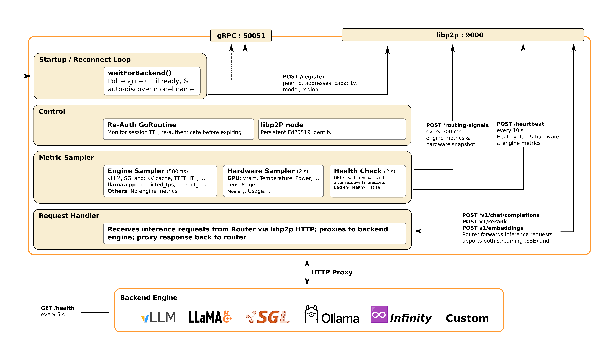

Complete technical reference for Mycoroute's architecture. For a high-level introduction, see [Architecture Overview](/getting-started/architecture-overview).


## Agent Architecture



## System Design
- Hub-and-spoke architecture explanation
- Router as central orchestrator
- Agents as lightweight proxies
- Decoupled design (Kubernetes-agnostic)

## Technology Stack

#### Why Gin over Chi/FastHTTP/Caddy?
- O(log n) radix tree routing
- Native HTTP/2 + SSE support (required for OpenAI streaming)
- Built-in JSON binding/validation
- Direct integration (no process overhead like Caddy)

#### Why BadgerDB over alternatives?
- LSM-tree architecture for high write throughput
- Production-proven (IPFS, Dgraph)
- Fast batch operations for metrics aggregation
- Crash recovery support

#### Why libp2p for agent communication?
- Persistent connections (no connection pooling needed)
- NAT traversal for decentralized deployments
- Built-in HTTP forwarding (NamespacedClient)
- Encrypted streams by default (Noise protocol)

#### Why Prometheus over OpenTelemetry?
- 30x faster counter performance (~7ns vs ~200ns)
- Lower memory overhead
- Native KEDA integration for autoscaling
- Simpler for metrics-only use case

## Protocol Specifications

#### HTTP API (Client → Router)
- Port: `:8080` (default)
- Protocol: HTTP/2 with SSE support
- Endpoints: `/v1/chat/completions`, `/v1/embeddings`, `/v1/rerank`, `/v1/models`
- Authentication: API key (SHA-256 hashed) or none

#### gRPC Auth (Agent → Router)
- Port: `:50051` (default)
- Protocol: gRPC with TLS 1.3
- TLS derivation: HKDF-SHA256 from JWT secret → Ed25519 key pair (deterministic; salt `mycoroute-grpc-tls-v2`)
- Authentication: JWT (HS256) with automatic re-auth

#### libp2p P2P (Router ↔ Agent)
- Port: `:9000` (default)
- Protocol: libp2p with Noise encryption
- HTTP forwarding via NamespacedClient
- NAT traversal support

#### Prometheus (Router Export)
- Port: `:2112` (default)
- Protocol: Prometheus exposition format
- Private registry (allows test parallelism)

## Request Lifecycle

1. **Client Request**: POST to `/v1/chat/completions`
2. **Authentication**: API key validation (if enabled)
3. **Policy Evaluation**:
   - Layer 1: `match` filter (region, engine, tags, organization, machine, gpu_model)
   - Layer 2: `exclude_if` gates (KV cache, GPU temp, success rate, SRTT)
   - Layer 3: `strategy` ranking (least-loaded by default)
4. **Agent Selection**: Best candidate from filtered pool
5. **Slot Acquisition**: Try to acquire slot in agent's capacity queue
6. **Forward via libp2p**: Encrypted stream to agent
7. **Agent Proxy**: Agent forwards to backend (vLLM, Ollama, etc.)
8. **Backend Response**: Inference result flows back
9. **RTT Measurement**: Record success/failure, update SRTT/RTTVAR
10. **Client Response**: Router returns to client

## Storage Architecture

#### Dual BadgerDB Design

| Database | Location | Purpose | TTL |
|----------|----------|---------|-----|
| memDB | In-memory | Ephemeral state | Session-scoped |
| diskDB | `./badger_disk` | Persistent state | 30 days default |

#### Key Schema

```
memDB:
  metadata:{peerID}           - Agent identity, capacity, region
  universalPunctual:{peerID}  - Request counters, success rate
  enginePunctual:{peerID}     - KV cache, TTFT, ITL (vLLM)
  hardwareSnapshot:{peerID}   - GPU temp, VRAM, CPU, memory

diskDB:
  universalHistory:{peerID}   - SRTT/RTTVAR, lifetime counters
  engineHistory:{peerID}      - Lifetime engine metrics (planned)
```

#### Metric Tiers

| Tier | Storage | Resets | Examples |
|------|---------|--------|----------|
| Metadata | memDB | Yes | Agent identity, capacity, region |
| Universal Punctual | memDB | Yes (session) | Request counters, success rate |
| Universal History | diskDB | No (lifetime) | SRTT/RTTVAR, lifetime counters |
| Engine Punctual | memDB | Yes | KV cache, TTFT, ITL (vLLM) |
| Engine History | diskDB (planned) | No | Lifetime engine metrics |
| Hardware | memDB | Yes | GPU temp, VRAM, CPU, memory |

## Memory Layout

#### Domain Structs (`internal/domain/agent.go`)

```go
type AgentMetadata struct {
    PeerID      string
    Region      string
    Engine      string
    Model       string
    Capacity    int
    Tags        []string
    Organization string
    Machine     string
    GPUModel    string
}

type AgentUniversalPunctual struct {
    RequestsTotal   int64
    FailuresTotal   int64
    SuccessRate     float64
    LastSeen        time.Time
}

type AgentUniversalHistory struct {
    SRTT      float64  // Smoothed RTT (RFC 6298)
    RTTVAR    float64  // RTT variance
    SRTTInited bool    // First measurement flag
    LifetimeRequests int64
    LifetimeFailures  int64
}
```

#### RFC 6298 Latency Tracking

- **Asymmetric EWMA**: α=1/2 when `R' < SRTT` (fast downward convergence), α=1/8 when `R' > SRTT` (spike resistance)
- **β=1/4** for RTTVAR update
- **Warm-start**: Persisted to diskDB, loaded on router restart
- **Cold-start fix**: `srttInited` flag gates first-measurement logic (fixes Ollama model loading bias)

## Performance Characteristics

| Metric | Value |
|--------|-------|
| Routing decision latency | Sub-millisecond (target) |
| BadgerDB in-memory read | ~2.3 µs |
| BadgerDB disk read | ~2.3 µs (cached), faster batch writes |
| JWT validation | ~microseconds/request (HMAC-SHA256, no cache) |
| Prometheus counter increment | ~7-8 ns/op |
| Health check interval | 5 seconds |
| Unhealthy threshold | 15 seconds (3 × heartbeat) |
| Remove threshold | 30 seconds (6 × heartbeat) |
| Hardware sample interval | 2 seconds (NVML overhead) |
| Engine sample interval | 500ms (vLLM/SGLang) |
| Routing signal interval | 500ms (push to router) |
| Heartbeat interval | 5 seconds |

## Dual-Channel Metric Push

- **500ms routing signals**: `POST /routing-signals` - Engine + hardware metrics (no health side-effect)
- **5s heartbeat**: `POST /heartbeat` - Health keepalive + fallback
- **Design rationale**: `handleRoutingSignals` intentionally does NOT call `UpdateLastSeen`

## Health Monitoring

- **Backend health check**: Agent runs `engine.WaitForReady()` every 2s
- **BackendHealthy flag**: `atomic.Bool` sent in heartbeat payload
- **Router handling**: `BackendHealthy=false` → `SetHealthy(false)` + `ModelBackendFailure()` counter
- **Health monitor timeout**: `AgentFailure()` counter

#### Common Issues

1. **Agent not registering**: Check JWT secret mismatch, libp2p address reachability
2. **Requests failing**: Inspect routing table, check backend health
3. **High latency**: Review SRTT metrics, check KV cache utilization
4. **GPU metrics missing**: Verify NVML driver installation

#### Debug Logging

```bash
GOLOG_LOG_LEVEL=debug ./bin/mycoroute-router --jwt-secret-file jwt.secret
```

#### Admin Endpoints for Debugging

- `GET /admin/health` - Full health status with agent list
- `GET /admin/routing-table` - Complete routing table snapshot
- `GET /admin/storage` - BadgerDB stats (key counts, disk size)
- `GET /admin/policy` - Current routing policy (JSON)

---

## See Also

- [Architecture Overview](/getting-started/architecture-overview) - High-level introduction
- [Performance Characteristics](/reference/performance-characteristics) - Latency and throughput details
