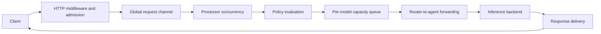

Hivenet Router performance depends on the complete deployment:

- the router host
- the network path between router and agents
- the number of agents serving each model
- routing-policy complexity
- inference-engine behavior
- prompt and output sizes
- streaming behavior
- authentication, quotas, logging, metrics, and tracing

In most LLM workloads, inference is the largest part of end-to-end latency. That does not make router overhead irrelevant, but it means a complete response-time measurement cannot be treated as a routing benchmark.

This page describes the current performance model, architectural limits, and repository benchmark tools. It does not define a universal throughput or latency guarantee.

<Warning>
  Do not treat fixed figures such as “0.5 ms routing,” “7 ns JWT validation,” a specific memory cost per agent, or a particular maximum agent count as Hivenet Router guarantees.

  The repository currently contains benchmark tools but no checked-in result set that establishes those values across environments, commits, workloads, and fleet sizes.
</Warning>

## Request timing model

A client request passes through several independently measurable phases.



The path can include:

1. network and reverse-proxy time between the client and router
2. request parsing, authentication, quota admission, and token estimation
3. time in the router’s global request channel
4. time waiting for a router forwarding slot
5. policy lookup, candidate filtering, and ranking
6. time waiting for model capacity
7. libp2p communication between router and agent
8. agent request parsing and backend proxying
9. backend queueing and inference
10. response transfer through agent, router, proxy, and client

Different observability signals cover different parts of this path.

## Latency signals

| Signal | Boundary | Includes inference? |
| --- | --- | --- |
| Client-observed latency | Client request start to completed response | Yes |
| Audit `latency_ms` | Router middleware entry to handler completion | Yes |
| `http_server_request_duration_seconds` | Complete router HTTP handling | Yes |
| `hivenet_router_tenant_request_duration_seconds` | Successful tenant request through the router | Yes |
| `queue_wait` trace span | Time in the per-model capacity queue | No |
| `dispatch` trace span | Policy selection and router-to-agent forwarding until the processor receives a response | Depends on response mode |
| `forward_to_agent` trace span | Router request to agent response headers or completed non-streaming body | Depends on response mode |
| `forward_to_backend` trace span | Agent request to backend response completion | Yes |
| SRTT | Smoothed router-to-agent-backend response timing | Depends on response mode |
| TTFT | Engine time until the first output token | Partly |
| ITL | Time between generated output tokens | Yes |
| Router capacity-queue histogram | Successful waits for a model slot | No |

These values are not interchangeable.

For example:

- TTFT measures the start of model output.
- A non-streaming client sees no output until the full completion is ready.
- SRTT measures from the router to an agent and backend, not from the original client.
- Audit latency includes router handling and stream delivery.

See [Latency tracking](/observability/latency-tracking) for the SRTT boundary.

## Streaming changes the measurement boundary

Hivenet Router observes streaming and non-streaming requests differently.

| Behavior | Non-streaming | Streaming |
| --- | --- | --- |
| Request body | Buffered | Buffered |
| Backend response | Fully buffered before returning | Forwarded progressively |
| Router SRTT sample | Approximately complete backend request time | Approximately time to response headers |
| `forward_to_agent` span | Ends after the complete agent response | Ends after response headers arrive |
| `forward_to_backend` span | Covers the complete backend response | Covers the complete backend stream |
| Client response | Written after completion | Flushed as chunks arrive |
| Output-token accounting | Before client response is accepted | After the stream is delivered |
| Router request deadline | Covers the complete request | Can terminate an active stream |

A streaming request can therefore have:

- low router SRTT
- low TTFT
- a long total stream duration
- substantial ongoing backend work

Measure all four separately when the user experience depends on progressive output.

## Current streaming-capacity behavior

For a non-streaming response, Hivenet Router holds the selected agent’s declared capacity slot until the complete response has been received and parsed.

For a streaming response, the current implementation releases:

- the selected agent’s declared capacity slot
- the router’s `--max-concurrent` forwarding slot

after response headers arrive and streaming begins.

The backend can continue generating tokens after those slots have been released.

<Warning>
  `active_requests`, `capacity_utilization`, and `--max-concurrent` do not currently represent the complete lifetime of active streaming generations.

  A fleet dominated by long streams can therefore receive more ongoing backend work than the configured agent capacity appears to allow.
</Warning>

For streaming-heavy workloads:

- use a conservative agent `--capacity`
- monitor engine-level running and waiting requests
- monitor KV-cache pressure, TTFT, ITL, GPU use, and preemptions
- test sustained streams rather than only short request bursts
- do not treat Hivenet Router’s active-request counter as the backend’s authoritative concurrency count

The inference engine’s own scheduler metrics provide the clearer view of ongoing streaming work.

## Routing-selection cost

Hivenet Router keeps a model-keyed agent index, so a request does not scan agents serving unrelated models.

A per-model policy is also resolved through a model-keyed map.

The main selection work happens after those lookups.

Let:

```text
A = agents registered for the requested model
S = policy steps evaluated
T = forward attempts
G = configured filters and dynamic gates
```

One selection attempt currently performs work approximately like:

```text
copy and sort A agents by peer ID
+ scan A agents through hard constraints and policy gates
+ scan surviving candidates for least-loaded selection
```

The registry sort makes the rough dominant complexity:

```text
O(A log A + A × G)
```

for one selection attempt.

Retries and fallback steps can repeat that work:

```text
O(S × T × (A log A + A × G))
```

This is a reasoning model rather than a precise runtime formula. Constant costs vary according to:

- the number of tags
- the number of dynamic gates
- how many agents survive each stage
- engine and hardware snapshot reads
- slot-acquisition races
- capacity waits
- failed forwards and redials

### Stable tie behavior

The `least-loaded` strategy compares:

```text
active requests / declared capacity
```

Agents returned by the registry are sorted by peer ID.

When several agents have the same load ratio, the first one in that stable peer-ID order wins.

This is deterministic, but it is not round-robin fairness.

With very short sequential requests, one agent can receive more traffic because its load returns to zero before the next selection and it wins every equal-load tie.

Concurrent requests usually create more natural distribution because selected agents hold different active-load values during later decisions.

## Throughput boundaries

For non-streaming local inference, the number of simultaneous forwards is bounded approximately by:

```text
minimum of:

router --max-concurrent
sum of declared capacity across eligible agents
backend concurrency and scheduler capacity
```

The default values are:

| Limit | Default |
| --- | --: |
| Router global request channel | `100` |
| Router simultaneous forwards | `50` |
| Per-model capacity waiters | `30` |
| Declared capacity per agent | `10` |
| Attempts per policy step | `3` |
| Router request deadline | `60s` |

These are separate controls.

Increasing one does not automatically increase throughput when another layer is already the bottleneck.

### Approximate throughput relationship

For a stable non-streaming workload:

```text
throughput
≈
effective concurrent requests
/
average request duration
```

For example, doubling concurrent capacity does not double throughput when:

- the GPU is already saturated
- the inference engine queues the additional requests
- TTFT or ITL deteriorates
- prompts become larger
- memory pressure causes preemption
- the router or network path becomes the bottleneck

Use measured throughput and latency distributions rather than calculating capacity from declared slots alone.

## Backpressure layers

Hivenet Router has several backpressure mechanisms.

### Global request channel

The HTTP handler submits a pending request to a buffered channel.

The default channel capacity is:

```text
100
```

When the channel stays full for five seconds, Hivenet Router returns:

```text
503 queue_full
```

The request processor drains this channel quickly and starts a goroutine for each accepted request. That goroutine may then wait for the global forwarding semaphore.

<Warning>
  `--queue-size` bounds occupancy of the request channel.

  It is not a strict bound on the total number of accepted requests or goroutines waiting for `--max-concurrent`.
</Warning>

The `queue_length` field returned by:

```text
GET /admin/health
```

also reports only the current request-channel length.

It does not include:

- requests waiting for the forwarding semaphore
- per-model capacity waiters
- requests already forwarded to agents
- ongoing backend streams

Use several signals together when diagnosing load.

### Global forwarding semaphore

```text
--max-concurrent
```

limits the number of request-processor goroutines that have entered the dispatch path.

For non-streaming requests, the slot normally remains occupied until the response completes.

For streaming requests, it is released when streaming begins.

### Per-model capacity queue

When eligible agents exist but all declared slots are full, a request can wait in a model-specific FIFO queue.

The default depth is:

```text
30
```

This queue is separate for every model.

A waiter wakes when:

- an agent frees a slot
- a new agent registers for the model

If the queue is full or the request context expires, the routing session advances to its next fallback step.

### Agent capacity

Each agent advertises:

```text
--capacity
```

The router atomically acquires one slot before forwarding a request.

The value is operator-defined. It is not derived from:

- GPU count
- VRAM
- KV-cache size
- model parameters
- engine scheduler limits

Set it through representative load testing.

## Request and response buffering

### Request bodies

Inference request bodies are read and retained in memory before forwarding.

The router caches the complete JSON body so it can:

- read the top-level model
- estimate tokens
- preserve the original payload
- forward the same bytes to the agent

The agent then reads the complete forwarded body before sending it to the inference backend.

This applies to both streaming and non-streaming responses.

Large requests can therefore exist in memory in more than one process at the same time.

This is particularly relevant for:

- long conversations
- large tool schemas
- document-heavy prompts
- base64 images
- base64 audio
- large embedding batches
- large reranking document arrays

### Request-body limit

Hivenet Router limits request bodies for `/v1/*` endpoints to 10 MiB by default:

```text
10485760 bytes
```

Configure another limit with:

```bash
export HIVENET_ROUTER_MAX_REQUEST_BYTES=<bytes>
```

Set the value to `0` to disable the built-in limit.

A reverse proxy can still enforce a smaller limit before the request reaches Hivenet Router. For example:

```nginx
client_max_body_size 8m;
```

Choose a limit that supports the intended multimodal and document workloads without allowing arbitrary memory consumption. Test the largest expected request shape, including encoded images, audio, tool schemas, embedding batches, and reranking documents.

### Non-streaming responses

A native non-streaming Chat Completions response is buffered:

1. by the agent after reading the backend response
2. by the router after reading the agent response
3. before the client receives the completed body

Large non-streaming outputs increase temporary memory use and time to first client-visible byte.

### Streaming responses

An SSE response is copied progressively through:

```text
backend
→ agent
→ router
→ client
```

Hivenet Router does not intentionally accumulate the complete stream before forwarding it.

The router still observes the stream to estimate or extract token usage.

A slow or disconnected client can create backpressure through the complete stream path. The agent’s rolling stream-write timeout and the router request deadline prevent some stalled streams from remaining open indefinitely.

## Memory characteristics

There is no reliable fixed memory figure per agent or per request.

Router memory can grow with:

- registered agents
- active and waiting requests
- request-body size
- buffered non-streaming responses
- dynamic API keys
- per-tenant and per-model quota state
- policy documents
- model-specific wait queues
- Prometheus time series
- tracing exports awaiting delivery
- Go goroutines and transport connections

Agent memory can grow with:

- request-body size
- backend-response buffering
- streaming state
- hardware and engine snapshots
- libp2p connections
- the inference backend itself

The inference backend normally dominates the complete host’s memory use, but the router should still be tested with the largest accepted payload and expected concurrency.

## Storage and write-path behavior

Hivenet Router avoids a persistent database write for every hot-path counter update.

Per-agent universal counters and latency history are updated in process and flushed to persistent BadgerDB:

- periodically
- when an agent disconnects
- during graceful shutdown

The default periodic interval is:

```text
30 seconds
```

Badger-backed daily token state is also flushed periodically.

Request-per-minute quota buckets remain in memory.

This reduces persistent write pressure, but it creates a normal crash-loss window for recent unflushed history.

### Audit logging

The router writes one structured audit line after each audited HTTP request.

Writes are serialized to prevent concurrent lines from being interleaved.

A slow or blocked audit filesystem can therefore contribute to request-tail latency and delay connection reuse.

Benchmark the intended audit destination rather than assuming local SSD behavior.

### Storage inspection

Inspect the current Badger state through:

```bash
curl \
  -H "Authorization: Bearer <admin-api-key>" \
  http://localhost:8080/admin/storage \
  | jq .
```

Use this endpoint to observe actual key counts and disk use rather than applying a fixed bytes-per-agent estimate.

## Operational-data freshness

Routing decisions can use live values, sampled values, or values that are temporarily stale.

| Signal | Normal freshness |
| --- | --- |
| Active request count | Live atomic value |
| Declared capacity | Agent registration value |
| Success rate | Updated after completed outcomes |
| SRTT and RTTVAR | Updated after recorded request outcomes |
| Engine snapshot | Sampled every `500ms` by default |
| Routing-signal push | Every `500ms` by default |
| Hardware snapshot | Sampled every `2s` by default |
| Heartbeat | Every `5s` by default |
| Prometheus view | Adds the configured Prometheus scrape interval |
| Grafana view | Adds query interval and dashboard refresh delay |

Engine-scrape failures preserve the last successful engine snapshot.

A value can therefore remain present after it has stopped updating.

Missing dynamic metrics pass policy gates rather than excluding the agent.

Performance-sensitive policies should account for:

- sampling delay
- transport delay
- stale snapshots
- missing-value behavior
- threshold headroom

Do not set a threshold so close to normal measurement noise that agents repeatedly enter and leave the candidate pool.

## Observability overhead

Production observability adds work to the request and agent paths.

### Prometheus

Hivenet Router updates several counters, gauges, and histograms per request.

The router also exports Go runtime and process metrics, including series such as:

```text
go_goroutines
go_memstats_heap_alloc_bytes
process_resident_memory_bytes
process_cpu_seconds_total
```

Prometheus cost grows with the number of distinct label combinations.

High-cardinality values in:

- tenant IDs
- key IDs
- peer IDs
- model IDs
- deployment IDs
- organizations
- machines
- regions
- GPU devices

can increase router memory, Prometheus storage, and query cost.

### OpenTelemetry

A traced request can include spans for:

- the router HTTP handler
- dispatch
- capacity waiting
- forwarding to the agent
- agent request handling
- forwarding to the backend

Export and sampling configuration affect overhead.

Benchmark with the same trace-sampling policy intended for production.

### Audit logs

Audit logging performs one structured write for every audited request.

Load tests that redirect the audit path to a different filesystem from production do not measure the same write behavior.

### Engine and hardware collection

Agent polling also adds background work:

- engine metrics every `500ms`
- hardware metrics every `2s`
- routing-signal pushes every `500ms`
- heartbeats every `5s`

Shortening these intervals increases collection, serialization, transport, storage, and Prometheus update activity.

## Scaling boundaries

### One router process

The current router is one coordination and forwarding process.

It owns:

- the live agent registry
- request and capacity queues
- routing-policy state
- active agent sessions
- the dynamic client-key registry
- in-memory quota state
- transport connections
- observability aggregation

There is no active-active replication between router processes.

A second independent router does not automatically share:

- agent registration
- dynamic keys
- queue state
- request history
- rate-limit buckets
- policy changes made through the administration API

Single-router CPU, memory, network, and file-descriptor limits are therefore part of the deployment’s scaling boundary.

### Agents per model

Routing examines only agents registered for the requested model, but it currently copies and sorts that bucket for each selection attempt.

A model with many replicas has a different routing cost from a fleet with the same total agent count spread across many models.

Benchmark both:

```text
total agents
```

and:

```text
maximum agents serving one model
```

### Model and policy count

Per-model policy lookup is indexed.

However:

- policy reload rebuilds the model-to-policy map
- model discovery aggregates registered agents
- administration routing-table responses serialize complete fleet state
- Prometheus series grow with models and agents

Control-plane endpoint latency may therefore increase with fleet and metadata size even when one inference request sees only a small model bucket.

### Connections and shared NAT

Every agent maintains router transport relationships.

Agents behind one egress address also share the router’s:

```text
--p2p-max-conns-per-ip
```

limit.

Connection limits, file descriptors, NAT state, TLS handshakes, reconnect overlap, and network buffers should be included in large-fleet tests.

### No published fleet ceiling

The current repository does not establish one supported maximum such as:

```text
1,000 agents per router
```

through a checked-in benchmark result and test environment.

Determine a safe fleet size through staged tests on the intended router hardware and network.

## Benchmark tools

The repository contains four performance-related scripts.

| Script | Purpose |
| --- | --- |
| `scripts/benchmark-ops.py` | End-to-end operational checks and concurrent request batches through Hivenet Router |
| `scripts/benchmark-model.sh` | Direct vLLM baseline that bypasses Hivenet Router |
| `scripts/sustained-load.py` | Fixed-rate sustained Chat Completions traffic |
| `scripts/benchmark-compare.py` | Compare two JSON benchmark results |

These tools are starting points rather than a complete independent load-testing framework.

## Run the operational benchmark

The main operational benchmark checks:

- public and administration health
- registered and healthy agents
- model discovery
- error handling
- a trivial concurrent workload
- a larger-prompt concurrent workload
- request distribution
- administrator endpoint latency
- slot release after request batches
- trace-derived timing when Tempo is available

Example:

```bash
export ROUTER_URL="https://router.example.com"
export LLM_API_KEY="<client-api-key>"
export ADMIN_API_KEY="<admin-api-key>"
export TEST_MODEL="<registered-model-id>"
export OPS_CONCURRENCY=10

python3 scripts/benchmark-ops.py \
  -o benchmark-results.json \
  -m benchmark-results.md
```

`OPS_CONCURRENCY` controls the number of requests in each concurrent batch.

It does not run that concurrency continuously for a fixed duration.

### Include trace timing

```bash
export TEMPO_URL="https://tempo.example.com"
export TEMPO_BASIC_AUTH="<user>:<password>"

python3 scripts/benchmark-ops.py \
  -o benchmark-results.json \
  -m benchmark-results.md
```

The benchmark collects trace IDs from successful requests and queries Tempo for their spans.

### Strict CI mode

```bash
export STRICT=1
export TEMPO_REQUIRED=1

python3 scripts/benchmark-ops.py \
  -o benchmark-results.json \
  -m benchmark-results.md
```

`STRICT=1` makes the script exit with a nonzero status when one of its checks fails.

`TEMPO_REQUIRED=1` also fails when Tempo or trace data is unavailable.

## Benchmark-harness thresholds

The operational script contains these default evaluation thresholds:

| Variable | Default |
| --- | --: |
| `SLO_SUCCESS_RATE_MIN` | `0.95` |
| `SLO_ADMIN_P95_MS` | `1000` |
| `SLO_ROUTING_OVERHEAD_P95_MS` | `100` |
| `SLO_QUEUE_WAIT_P95_MS` | `50` |
| `SLO_DISPATCH_POLICY_P95_MS` | `20` |

These are script defaults, not Hivenet Router service guarantees.

Override them for the deployment:

```bash
export SLO_SUCCESS_RATE_MIN=0.99
export SLO_ADMIN_P95_MS=250
export SLO_ROUTING_OVERHEAD_P95_MS=50
export SLO_QUEUE_WAIT_P95_MS=20
export SLO_DISPATCH_POLICY_P95_MS=10
```

## Interpret the trace-derived benchmark phases

The benchmark produces several derived measurements.

### Backend processing

The `forward_to_backend` span covers the agent’s backend request.

For a stream, it lasts until the backend stream ends.

### Dispatch and policy

The benchmark approximates policy work as:

```text
dispatch span duration
-
forward_to_agent span duration
```

This is useful for comparing commits under the same instrumentation, but it is not a CPU profiler.

### Routing overhead

The script labels this calculation:

```text
routing overhead
```

and derives it as:

```text
root HTTP span
-
forward_to_backend span
```

This is broader than pure router processing.

It can include:

- client-facing middleware
- authentication and quota checks
- request parsing
- global and per-model waiting
- libp2p transport
- agent request handling
- response transit
- stream proxying outside the backend span

Treat it as:

```text
non-backend path time
```

rather than router CPU time.

### Queue wait

The script’s derived `queue_wait` value measures from the root HTTP span’s start until the dispatch span begins.

That interval can include:

- HTTP middleware
- authentication
- quota admission
- token estimation
- request parsing
- global request-channel delay
- waiting for the forwarding semaphore

It is not the same as the explicit `queue_wait` trace span or:

```text
hivenet_router_queue_wait_seconds
```

Those represent the per-model capacity queue specifically.

<Warning>
  Keep the benchmark’s derived phase names and their actual measurement boundaries together when publishing results.

  Do not describe every value named “queue wait” as the same queue.
</Warning>

## Run the direct-backend benchmark

Use the model benchmark to create a backend baseline without the Hivenet Router router and agent path:

```bash
./scripts/benchmark-model.sh \
  -n <kubernetes-namespace> \
  -o model-results.json \
  -m model-results.md
```

The current script:

- discovers vLLM pods through Kubernetes
- calls vLLM on localhost through `kubectl exec`
- tests several prompt and output sizes
- reports total latency
- reports completion tokens divided by total wall-clock time

This is not a pure decode-throughput measurement.

Its reported tokens per second include:

- `kubectl exec` overhead
- request setup
- prompt prefill
- generation
- response serialization

Use it as an application-level direct-backend baseline under consistent conditions.

For precise TTFT, inter-token latency, prefill throughput, and decode throughput, use the backend’s native metrics or a dedicated inference benchmark.

## Run sustained traffic

The current sustained-load script contains deployment-specific constants.

At the time of this reference, it is configured for:

```text
10 requests per second
600 seconds
model: openai/gpt-oss-20b
maximum output: 300 tokens
```

Review and change these constants before use:

```text
MODEL
DURATION_S
RPS_MIN
RPS_MAX
MAX_TOKENS
```

Then run:

```bash
export ROUTER_URL="https://router.example.com"
export LLM_API_KEY="<client-api-key>"

python3 scripts/sustained-load.py \
  > sustained-results.json
```

The script’s introductory docstring is stale and does not match its current ten-minute, ten-request-per-second constants. Use the code values as the source of truth.

For reusable performance testing, consider parameterizing the script rather than maintaining deployment-specific constants in the source.

## Compare benchmark runs

Compare two operational result files:

```bash
python3 scripts/benchmark-compare.py \
  previous-results.json \
  current-results.json
```

Use the same:

- hardware
- model
- backend configuration
- agent count
- policy
- keys and quotas
- load generator
- network path
- observability settings

A comparison across different environments is not a clean code-regression measurement.

## Recommended benchmark method

<Steps>
  <Step title="Record the complete environment">
    Record:

    - Hivenet Router commit or release
    - router and agent flags
    - routing policy
    - authentication and quotas
    - router CPU and memory
    - network topology
    - agent count and capacity
    - model and quantization
    - inference-engine version and flags
    - GPU model and count
    - tracing and audit configuration
  </Step>
  <Step title="Measure the backend directly">
    Establish direct backend latency and throughput without Hivenet Router.

    This separates model and engine behavior from router, agent, and network overhead.
  </Step>
  <Step title="Warm the deployment">
    Warm:

    - model weights
    - CUDA kernels
    - caches
    - libp2p connections
    - authentication sessions
    - Prometheus and tracing pipelines

    Report cold-start results separately rather than mixing them into the steady-state distribution.
  </Step>
  <Step title="Use representative request shapes">
    Test the prompt, output, tools, modalities, and streaming modes used in production.

    One ten-token completion does not predict a coding agent, RAG application, or long streamed response.
  </Step>
  <Step title="Increase load gradually">
    Increase:

    - request rate
    - concurrent requests
    - active streams
    - agents per model
    - policy steps
    - prompt and output size

    Stop when latency, error rate, queueing, or resource use crosses the deployment objective.
  </Step>
  <Step title="Test failure paths">
    Include:

    - one unhealthy agent
    - one full agent
    - backend HTTP errors
    - agent disconnection
    - policy fallback
    - provider fallback
    - router queue saturation
    - quota rejection
  </Step>
  <Step title="Repeat each run">
    Run several repetitions and report the distribution across runs.

    One result can be affected by transient network, scheduler, filesystem, or backend behavior.
  </Step>
  <Step title="Publish distributions">
    Report:

    - request count
    - success rate
    - throughput
    - p50, p95, and p99
    - minimum and maximum
    - queue depth and wait
    - router CPU and memory
    - backend TTFT and ITL
    - errors by code
  </Step>
</Steps>

## Suggested test matrix

| Dimension | Example values |
| --- | --- |
| Response mode | Streaming, non-streaming |
| Prompt size | Short, typical, large |
| Output size | Short, typical, maximum expected |
| Request type | Chat, tools, embeddings, reranking |
| Concurrency | `1`, `5`, `10`, `25`, `50`, higher where appropriate |
| Agents per model | `1`, `2`, `5`, larger production shape |
| Policy complexity | Primary only, several gates, several fallbacks |
| Fleet state | Healthy, partially degraded, at capacity |
| Observability | Production audit, metrics, and tracing settings |
| Client retry policy | Disabled, then intended bounded retry behavior |

For streaming, also vary:

- number of simultaneous active streams
- stream duration
- client read speed
- generated tokens
- backend running and waiting requests

## Capacity-planning workflow

A practical tuning order is:

1. Benchmark one backend directly.
2. Set a conservative agent capacity.
3. Run one Hivenet Router agent with concurrency below that value.
4. Increase concurrency until engine queueing or latency deteriorates.
5. Reduce capacity to leave operational headroom.
6. Add more agents and test routing distribution.
7. Tune `--max-concurrent`.
8. Tune per-model `--queue-depth`.
9. Tune `--queue-size` only after understanding where requests wait.
10. Repeat with failure and fallback conditions.

Monitor:

```text
hivenet_router_agent_capacity_utilization
hivenet_router_agent_engine_running_requests
hivenet_router_agent_engine_waiting_requests
hivenet_router_agent_engine_kv_cache_utilization
hivenet_router_agent_engine_p90_ttft_seconds
hivenet_router_agent_engine_p90_itl_seconds
hivenet_router_queue_depth
hivenet_router_queue_wait_seconds
hivenet_router_policy_fallback_routed_total
hivenet_router_policy_exhausted_total
```

For streaming workloads, give engine-level concurrency and queue metrics more weight than Hivenet Router’s agent active-request count.

## Useful performance queries

### Router CPU

```promql
rate(
  process_cpu_seconds_total[5m]
)
```

### Router resident memory

```promql
process_resident_memory_bytes
```

### Go heap

```promql
go_memstats_heap_alloc_bytes
```

### Goroutine count

```promql
go_goroutines
```

A growing goroutine count during saturation can indicate many accepted requests waiting for:

- the global forwarding semaphore
- model capacity
- response completion
- blocked stream writes

### Active HTTP requests

```promql
sum by (route) (
  http_server_active_requests
)
```

### P95 router request duration

```promql
histogram_quantile(
  0.95,
  sum by (le, route) (
    rate(
      http_server_request_duration_seconds_bucket[5m]
    )
  )
)
```

### P95 model-capacity wait

```promql
histogram_quantile(
  0.95,
  sum by (le, model) (
    rate(
      hivenet_router_queue_wait_seconds_bucket[5m]
    )
  )
)
```

### Backend queue depth

```promql
sum by (model) (
  hivenet_router_agent_engine_waiting_requests
)
```

### Routing failures

```promql
sum by (model) (
  rate(
    hivenet_router_routing_requests_failed_total[5m]
  )
)
```

### Policy fallback rate

```promql
sum by (model) (
  rate(
    hivenet_router_policy_fallback_routed_total[5m]
  )
)
```

## Diagnose performance problems

| Symptom | Check first | Likely area |
| --- | --- | --- |
| High client latency and high backend span | TTFT, ITL, engine queue, GPU | Model or inference engine |
| High client latency but low backend span | Trace phases, network, audit filesystem | Router-agent path or ingress |
| High per-model queue wait | Agent capacity and engine scheduler | Insufficient eligible capacity |
| High goroutine count with low request-channel length | Forwarding semaphore and request deadlines | Accepted requests waiting outside the channel |
| Increasing `queue_full` | Request channel, processor load, CPU | Router admission pressure |
| High policy-evaluation time | Agents per model, fallback steps, dynamic gates | Candidate-selection cost |
| Uneven traffic at equal load | Peer-ID tie behavior and short sequential requests | `least-loaded` tie handling |
| Low Hivenet Router capacity use but high engine running requests | Active streams | Streaming slot-release behavior |
| Memory growth under large prompts | Request sizes and concurrent buffered bodies | Router or agent request buffering |
| Memory growth with stable traffic | Metric cardinality, dynamic keys, goroutines | Control-plane state |
| Streaming ends at about the same duration | Router request timeout | Deadline truncation |
| Higher latency only with audit enabled | Audit storage latency | Filesystem write path |
| More requests than application actions | Client retries or background tasks | Client behavior |

## Report benchmark results responsibly

A benchmark result should include enough context to be reproduced.

At minimum, publish:

```text
Hivenet Router version or commit
date
router hardware and operating system
agent and backend hardware
model and quantization
inference-engine version and flags
number of agents
agent capacity
router concurrency and queue settings
routing policy
prompt and output distributions
streaming or non-streaming
request count and duration
authentication, quotas, audit, metrics, and tracing state
network path
client retry behavior
```

Avoid claims such as:

```text
Hivenet Router adds 5 ms
```

without stating:

- which percentile
- which request type
- which fleet shape
- which backend baseline
- how that overhead was calculated

A more useful statement is:

```text
For this deployment and workload, the p95 non-backend path time was
X ms across N requests, measured from these trace spans at commit Y.
```

## Next steps

<Columns cols={2}>
  <Card title="Detailed architecture" icon="sitemap" href="/reference/detailed-architecture">
    Review the request, queue, policy, transport, and storage paths behind these characteristics.
  </Card>

  <Card title="Configuration reference" icon="sliders" href="/reference/configuration-reference">
    Tune concurrency, queueing, timeouts, sampling, storage, and agent capacity.
  </Card>

  <Card title="Prometheus metrics" icon="chart-line" href="/observability/prometheus-metrics">
    Query router, process, queue, agent, engine, hardware, and tenant performance.
  </Card>

  <Card title="Engine metrics" icon="microchip" href="/observability/engine-metrics">
    Measure backend queueing, cache pressure, TTFT, ITL, and throughput.
  </Card>

  <Card title="Latency tracking" icon="stopwatch" href="/observability/latency-tracking">
    Understand SRTT, RTTVAR, and the different streaming and non-streaming boundaries.
  </Card>

  <Card title="Error codes" icon="triangle-exclamation" href="/reference/error-codes">
    Diagnose capacity, queue, backend, connection, and timeout failures during load.
  </Card>
</Columns>